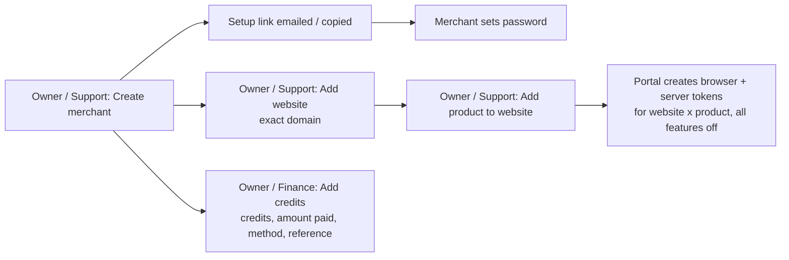
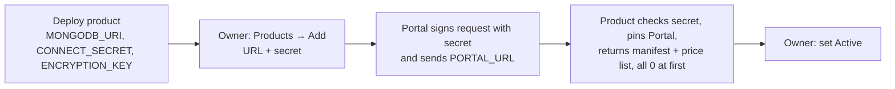
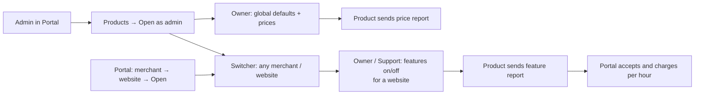
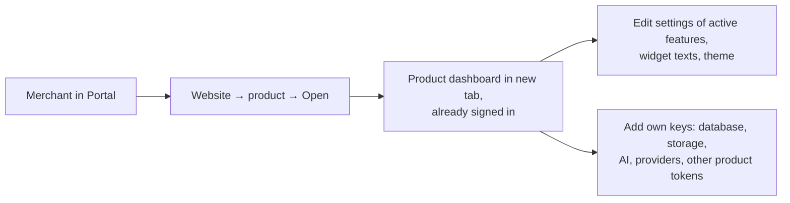
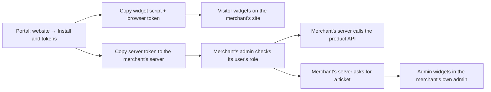
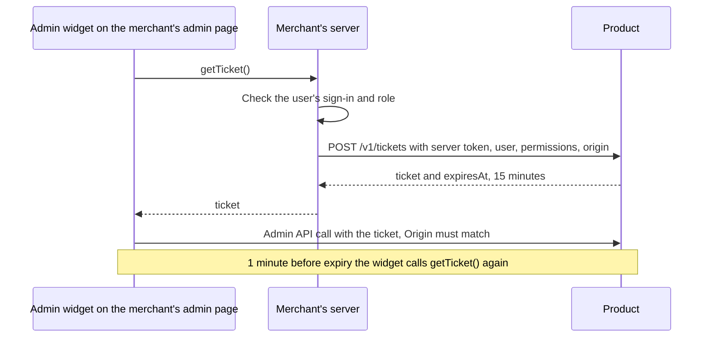
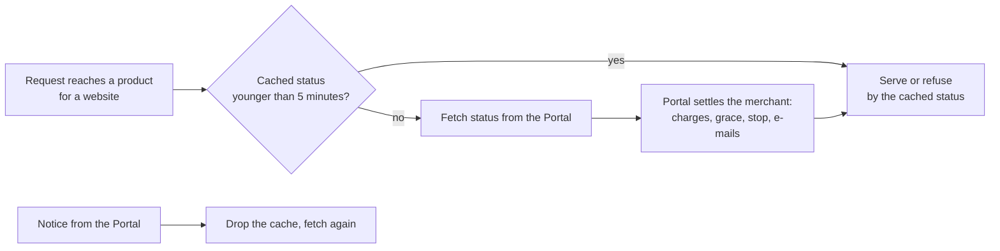
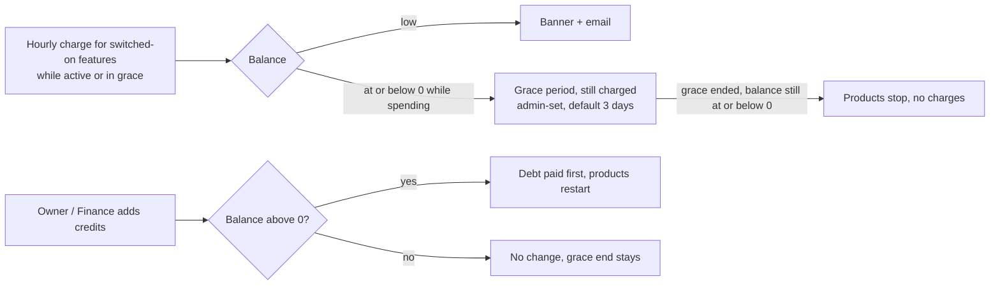
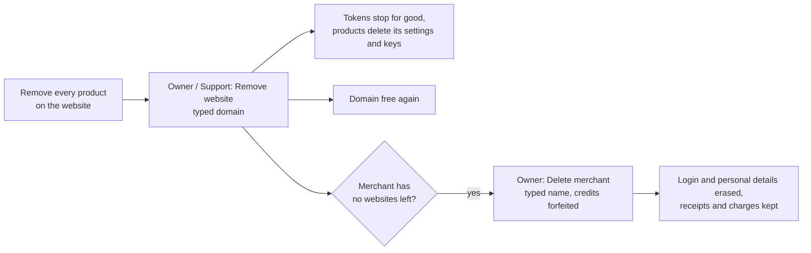

# Single Solution — Platform Plan (single source of truth)

|                  |                                                                                                                                                                                                                  |
| ---------------- | ---------------------------------------------------------------------------------------------------------------------------------------------------------------------------------------------------------------- |
| **Status**       | Part 0 decided 2026-10-07 · not built yet; building starts only when the owner says so · built by changing the existing code in place, with no old-and-new period (0.9 lists what changes; 0.12 gives the order) |
| **Date**         | 2026-10-07 · Owner: Bilal (single-solution)                                                                                                                                                                      |
| **Deliverables** | **A. Portal** · **B. Six products** (0.3) · **C. Shared kit** (`packages/*`, 0.9)                                                                                                                                |
| **Hosting**      | Vercel Hobby + one MongoDB Atlas M0 while testing; move to a commercial host before charging merchants (0.12 step 14)                                                                                            |
| **Language**     | JavaScript (ESM), functional, JSDoc-typed, `tsc --checkJs --strict` in CI                                                                                                                                        |
| **This file**    | The only planning document. **Part 0 is the plan** and overrides everything else in this file, this header included. Everything after Part 0 is history, except the older rules listed in 0.10.                  |

> **Read Part 0 first.** It records the owner's decisions (interviews of 2026-10-07) and is **binding**. Part 0 plus the
> older rules listed in 0.10 are the only things to build from. Everything else in this file (sections 1–16, Appendices
> A–C, Parts D–F) is **history**: a source of ideas, never a requirement, and it loses to Part 0 wherever they differ.
> If a search lands after Part 0, check Part 0 and 0.10 first. If Part 0 and 0.10 say nothing on a point, **ask the
> owner**; do not fill the gap from history or invent an answer. 0.1 is the only summary of what we build, and 0.7 holds
> the only walkthroughs. Nothing in Part 0 is built yet; building starts only when the owner says so.

---

# PART 0 — The plan (owner decisions of 2026-10-07, binding)

**Contents**: 0.0 Words · 0.1 Idea and scope · 0.2 People, roles and logins · 0.3 Products · 0.4 How products work · 0.5
Credits and billing · 0.6 Look and feel · 0.7 Flows · 0.8 Further decisions, Portal screens and Chat · 0.9 Conflicts
with the current build · 0.10 What still applies from older parts · 0.11 Environment variables · 0.12 Build order · 0.13
Rules for building agents.

**Conventions**: "must" and "never" are requirements. Times are UTC unless a rule says otherwise. `<…>` is a
placeholder. References such as "0.4.4" point inside Part 0; references such as "F.5" or "§11" point to the older parts
and bind only as far as 0.10 says.

## 0.0 Words

One meaning per word. New code, screens, APIs and docs use only these words, with these meanings.

**People and access**

- **Admin**: one of our own people, with a Portal login and exactly one role: Owner, Support or Finance.
- **Owner**: the admin role that can do everything (0.2), including Products, prices, global defaults, Admins, Settings
  and deleting merchants.
- **Support**: the admin role for merchants, websites, products on websites, tokens, suspending and resuming, and
  opening product dashboards for a merchant's website. It cannot add credits or change prices, global defaults,
  products, admins or Settings.
- **Finance**: the admin role for Credits and billing (add credits, receipts, charges), with merchants and websites
  read-only. It never sees tokens and never opens product dashboards.
- **Merchant**: one business customer: a single record holding its business details and exactly one login. Only an admin
  creates one. It has no team members.
- **Merchant's users**: the people who use the merchant's own website and admin: visitors and the merchant's staff. They
  never use the Portal or product dashboards.
- **Merchant's staff**: the merchant's users who work in the merchant's own admin (for example answering chats).
  Products learn who they are from tickets (0.4.5). "Staff" never means our admins.
- **Visitor**: a person using a visitor widget or the visitor API on the merchant's website, either signed in through
  Accounts or a guest.
- **Login**: an e-mail address and a password, with optional two-step, belonging to exactly one admin or one merchant.
  The e-mail is unique across the whole Portal.
- **Two-step**: a 6-digit authenticator-app code asked after the password. Optional for everyone; an Owner can require
  it for admins.
- **Recovery codes**: 10 single-use codes shown once when a person turns two-step on. Each one can replace one two-step
  code.
- **Setup link**: a single-use link to set a first password (72 hours for merchants, 24 hours for admins). It works only
  while the login has no password.
- **Typed confirmation**: a confirm dialog whose button works only after the admin types the exact name it shows (the
  business name, the domain or the product name).

**Websites and products**

- **Portal**: the web app we host. Our admins use it to manage merchants, websites, products on websites, credits,
  admins and settings. Merchants use it to see their websites, tokens, install code, usage and credits, and to open
  product dashboards.
- **Deployable**: one separately hosted app with its own database and environment variables: the Portal, or one product.
- **Website**: one exact, normalised domain owned by one merchant (0.2). `shop.com` and `www.shop.com` are two websites.
  A domain belongs to at most one website platform-wide.
- **Product**: one of the six separately hosted apps, with ids `accounts`, `ecommerce`, `chat`, `notifications`,
  `payments` and `growth`. Each offers an API plus widgets and has its own setup dashboard.
- **Connected product**: a product an Owner connected in Portal → Products. It is either active (offered in Add product)
  or inactive (not offered; websites that already have it are unaffected).
- **Product on website**: a website paired with a product, added by an Owner or Support admin, with its own browser
  token and server token. It is either added or removed.
- **Product dashboard**: a product's setup app, opened from the Portal in a new tab. Tabs: Overview, Features, Settings,
  Connections, Developers, plus Defaults and Prices for Owners. It never shows business data.
- **Admin view**: a product dashboard opened by an Owner or Support admin, with the website switcher and an Admin view
  banner.
- **Switcher**: the website picker in a product dashboard. Merchants see their own websites that have the product;
  admins see every website that has it. Removed ones are never listed.
- **Launch**: a single-use, 60-second, Portal-signed token (kind merchant or admin) that opens a product dashboard. The
  product exchanges it for its own session.
- **Widget**: a ready-made piece of UI served by a product's `widget.js`. **Visitor widgets** serve visitors and use the
  browser token. **Admin widgets** run in the merchant's own admin and use tickets.
- **Headless**: building your own UI on a product's API. There is no SDK and there are no framework adapters.
- **API**: a product's `/v1` HTTP routes. Each route belongs to exactly one feature and works only while that feature is
  on.

**Features and settings**

- **Feature**: one on/off switch inside a product, with a permanent key, a name, a description and an hourly price. Only
  Owner or Support admins switch it, and the switches decide what is charged.
- **Feature key**: the permanent identifier of a feature. It never changes, even when the feature is renamed.
- **Setting**: a value, edited in the product dashboard, that changes how a feature behaves on one website.
- **Limit**: a setting that caps use. The merchant sets it within hard maximums fixed in the product's code. Rate limits
  that protect our hosting are code constants, not settings.
- **Global default**: an Owner-set value used by every website that has not saved its own value for that setting.
  Changing it changes those websites at once.
- **Widget texts**: every word a widget shows. Each has an English default in the product's string files, and the
  merchant can overwrite any of them per website (0.4.10).
- **Connections**: the product dashboard tab holding the merchant's own database, storage, AI and provider keys, and
  pasted tokens. Values are encrypted and write-only.
- **Pasted token**: another product's server token for the same website, entered in a product's Connections so that one
  product can call the other.

**Money**

- **Credit**: the only money unit merchants see. 1 credit = 1000 millicredits.
- **Millicredit**: the integer unit every amount is stored in: 1/1000 of a credit.
- **Price**: credits per hour for one feature. The same for every merchant and website, set by an Owner in the product's
  Prices screen, starting at 0, with up to 3 decimals.
- **Receipt**: a ledger entry that adds whole credits, recorded by an Owner or Finance admin with amount paid, payment
  method and reference. It is never edited or reversed.
- **Amount paid**: free text on a receipt (for example `PKR 5,000`), shown exactly as typed, to admins only, and never
  totalled.
- **Charge**: credits the Portal takes for one switched-on feature, for one UTC clock hour, on one product on a website.
- **Day charge**: the stored ledger entry for one product on a website for one UTC day, with per-feature lines (hours,
  credits). Today's charges are computed live and not stored.
- **Charging**: the state in which hours are charged: product-on-website status active or grace.
- **Balance**: a merchant's single credit total, shared by all their websites: receipts minus stored day charges minus
  today's charges so far.
- **Debt**: a negative balance, caused by charged grace hours. The next receipts pay it first.
- **Hourly cost / daily cost**: for one product on one website, the sum of the current hourly prices of its switched-on
  features; daily cost is 24 times that, shown as a projection.
- **Daily spend**: 24 × the sum of the current hourly prices of every switched-on feature on all of a merchant's
  products on websites, removed ones excluded.
- **Days left**: balance ÷ daily spend, rounded down. Shown as — when daily spend is 0.
- **Use**: any request a product receives for a website.
- **Check (settle)**: the Portal working out, for one merchant, the elapsed hours and charges, low balance, grace and
  stop, and any due billing e-mail. It runs when a product fetches a status or a Portal page shows that merchant.

**Statuses**

- **Status**: in Part 0, always a billing or lifecycle state. Never system health or uptime. Other states are always
  named in full: connection state (0.4.3), conversation status (Chat), product Active or Inactive.
- **Merchant status**: exactly one of suspended, stopped, in grace, low balance or active, checked in that order
  (0.5.5). Setup pending is a separate badge.
- **Product-on-website status**: exactly one of removed, suspended, stopped, grace or active, checked in that order
  (0.5.5). It is sent to the product and shown on cards and chips.
- **Low balance**: daily spend > 0 and 0 < balance < threshold days × daily spend.
- **Grace period**: a fixed window that starts at the first moment the balance is ≤ 0 while daily spend > 0, and lasts
  the grace days set when it started. Products keep working and keep being charged. It ends only when a receipt brings
  the balance above 0 or when its end time passes (0.5.6).
- **Stopped**: the state after a grace period ended with the balance still ≤ 0, until a receipt brings the balance
  above 0. Products refuse service and nothing is charged. The merchant can still sign in, open dashboards and see
  usage; only an admin can add credits.
- **Suspended**: a state set by an Owner or Support admin, with an internal reason. The merchant cannot sign in, all
  their products refuse service, and nothing is charged until they are resumed.
- **Removed**: the status of a product on a website after an admin removed it. Its tokens are refused and nothing is
  charged; its settings, connections and tokens are kept for a re-add.
- **Status response**: the Portal's answer to `GET /v1/product/websites/:websiteId/status`, which products cache for at
  most 5 minutes.
- **Notice**: a signed Portal → product message (`status.changed`, `token.revoked`, `sessions.revoked` or
  `website.deleted`) telling the product to drop a cache or delete a website's data.
- **Price report**: the product → Portal message (`PUT /v1/product/prices`) listing every feature with its hourly price.
- **Feature report**: the product → Portal message (`PUT /v1/product/websites/:websiteId/features`) listing the
  switched-on feature keys for one website and the admin who changed them. The switches are saved only after the Portal
  accepts it.

**Tokens**

- **Browser token**: a public, Portal-signed token for one product on one website. Accepted only from https on the exact
  domain and from localhost, and only on visitor routes and widgets.
- **Server token**: a secret, Portal-signed token for one product on one website, for the merchant's server only.
  Refused when sent with an Origin header. Revealed and regenerated only in the Portal.
- **Ticket**: a 15-minute token a product signs for one member of the merchant's staff, one website, one browser origin
  and a set of permissions. The merchant's server requests it with the server token; admin widgets use it.
- **Permission**: a named right inside a product that a ticket can carry (for Chat: `inbox.read`, `inbox.reply`,
  `inbox.manage`, `knowledge.edit`, `reports.read`).
- **Accounts sign-in**: a 15-minute token from Accounts that identifies one of a merchant's users on one website. A
  product trusts it only when the Accounts token is pasted, and it never authorises admin actions.
- **Origin**: scheme + host + port of a web page, as browsers send it in the Origin header (for example
  `https://admin.shop.com`).

**Data**

- **Product database**: a product's own database (its `MONGODB_URI`). It holds switches, settings, connections, prices,
  defaults, sessions, Recent changes and cached status, and no business data.
- **Merchant database**: the merchant's own MongoDB, connected in a product, where all of that product's business data
  for the website lives.
- **Business data**: the records the merchant's business creates or reads day to day (conversations, knowledge entries,
  saved replies, leads, orders, users).
- **Recent changes**: a product's own record of changes made in its dashboard (features, prices, defaults, settings,
  connections), shown on its Overview.
- **Activity log**: a list of actions (who, when, what, target). Portal Activity covers Portal actions and reported
  feature and price changes. Each product also keeps a log of staff actions done through its widgets or API, in the
  merchant database.
- **business.json**: the file at `https://<domain>/.well-known/business.json` giving the business name, logo, e-mail,
  phone, address, country and time zone. Products read it; the Portal never does.
- **Support contact**: the e-mail, phone and optional WhatsApp in Portal Settings, shown to merchants on the welcome
  screen, the suspension message, banners, Features screens and e-mails.
- **Data rights**: every product's export and delete routes for one end user. Accounts calls them using pasted server
  tokens.

**Chat words**

- **Visitor chat**: one Chat feature covering the ready chat widget and the visitor API for a custom chat UI.
- **Inbox**: Chat's admin widget where the merchant's staff read and answer conversations.
- **Handoff**: moving a Chat conversation to a person. The conversation is flagged Waiting for a person and the AI stops
  replying until a staff member replies.
- **Flow**: a short list of scripted chat steps, started by a page rule or a keyword (0.8.3).
- **Lead**: contact details a visitor left in Chat, saved in the merchant database.
- **Back-off checking**: Chat's in-browser schedule for checking new messages: fixed code constants, no websockets, no
  server timers.
- **AI tokens**: the usage units an AI provider reports (input + output), counted by Chat's AI token caps. Never an
  access token.
- **Reports (Chat)**: the Chat feature and widget that show chat numbers. Not the same as price and feature reports.

**Process**

- **Shared kit**: the `packages/*` libraries (app-kit, protocol, contracts, entitlements, net, ui, cli, config, rules,
  web) used by the Portal and the products.
- **Grilling**: the in-depth owner interview held right before a product is built. It decides that product's exact
  feature list and dashboard contents.
- **The switch**: the deploy in 0.12 step 5 that moves the Portal to the new model. The test databases `ss_portal` and
  `ss_chatbot` are reset at it.
- **Parked folder**: an old product folder moved to `parked/` at the repository root: kept for reference, outside the
  pnpm workspace, CI and deployments (0.12 step 4).
- **History**: everything in this file after Part 0, except the rules listed in 0.10. A source of ideas, never a
  requirement.

**Old words.** Do not use these in new code, screens, APIs or docs:

| Old word                                                                  | Use instead                     |
| ------------------------------------------------------------------------- | ------------------------------- |
| element                                                                   | feature                         |
| subscription                                                              | product on website              |
| entitlement document                                                      | status (status response)        |
| staff (our people), superadmin                                            | admin (Owner, Support, Finance) |
| staff (the merchant's people)                                             | merchant's staff                |
| apps                                                                      | products                        |
| connectors, resources                                                     | connections                     |
| website keys `pk_` / `sk_`                                                | browser token / server token    |
| activity (meaning a call into a product)                                  | use                             |
| headless chat, visitor chat widget                                        | visitor chat                    |
| pack, loader, plan, trial, test mode, live/test, Website Graph, Event Hub | nothing: removed (0.10)         |

## 0.1 The idea and the scope

We centralise the code that ibrahimMobiles has, so any merchant can use it. Each **product** is a standalone, separately
hosted app that offers its functionality as an **API** plus **ready-made widgets**. A merchant builds their own website
and their own admin; they drop in our widgets or design their own screens on our API. Our **Portal** is where we
(admins) manage merchants, their websites, which products each website has, and credits; merchants use it to see their
websites, tokens, install code, usage and credits, and to open each product's dashboard. Merchants' users never use the
Portal or our product dashboards: they only use the merchant's own website and admin.

- **Scope rule**: build only what Part 0 names. None of the following is built: health, ready or status endpoints;
  status pages; uptime checks; monitoring, telemetry or diagnostic screens; crons, timers or background loops (0.10);
  extra admin tools, exports, presets or nice-to-haves that Part 0 does not list. If something seems needed but Part 0
  and 0.10 do not cover it, ask the owner instead of building it.
- 0.1 is the only summary of what we build. 0.7 holds the only walkthroughs.

## 0.2 People, roles and logins

| Who                                    | Where they sign in                                                                                                 | What they do                                                                                                                                  |
| -------------------------------------- | ------------------------------------------------------------------------------------------------------------------ | --------------------------------------------------------------------------------------------------------------------------------------------- |
| **Our admins**                         | Portal (the one sign-in page)                                                                                      | One role each: **Owner**, **Support** or **Finance** (rights below).                                                                          |
| **Merchant** (one login each)          | Portal (the same sign-in page)                                                                                     | Sees their websites, products, tokens, install code, usage and credits; opens product dashboards; edits their own details. No team members.   |
| **Merchant's users** (staff, visitors) | The merchant's **own** website and admin (signing in through our **Accounts** product or the merchant's own login) | Whatever the merchant builds. Roles and allowlists from Accounts apply on the merchant's site, never in the Portal or our product dashboards. |

- Admins create every merchant (no self sign-up). The merchant gets a setup link.
- Owner and Support admins add websites and products on websites; Owner and Finance admins add credits. Merchants cannot
  do these themselves.

### Rights per role

The Portal API checks these rights on every request; hiding a button is not enough. Menus hide what a role cannot use.
Each product checks the dashboard rights on its own server for every request.

| Action                                                                              | Owner | Support | Finance     | Merchant                             |
| ----------------------------------------------------------------------------------- | ----- | ------- | ----------- | ------------------------------------ |
| See Overview and Activity                                                           | yes   | yes     | yes         | own only                             |
| Create merchants; edit merchant details                                             | yes   | yes     | view        | edits own (Account)                  |
| Suspend and resume merchants                                                        | yes   | yes     | –           | –                                    |
| Resend or copy merchant setup links                                                 | yes   | yes     | –           | –                                    |
| Turn off another person's two-step                                                  | yes   | –       | –           | –                                    |
| Delete a merchant                                                                   | yes   | –       | –           | –                                    |
| Add and remove websites                                                             | yes   | yes     | view        | views own                            |
| Add and remove products on websites                                                 | yes   | yes     | view        | views own                            |
| Reveal, copy and regenerate server tokens                                           | yes   | yes     | –           | own                                  |
| Open a product dashboard for a website                                              | yes   | yes     | – (refused) | own websites                         |
| Switch features on and off                                                          | yes   | yes     | –           | – (sees them read-only)              |
| Edit settings, widget texts, theme and connections                                  | yes   | yes     | –           | own (settings: active features only) |
| Edit global defaults and prices                                                     | yes   | –       | –           | –                                    |
| Products: connect, reconnect, set active/inactive, Open as admin with no website    | yes   | –       | –           | –                                    |
| Add credits                                                                         | yes   | –       | yes         | –                                    |
| See receipts and charges                                                            | yes   | view    | yes         | own, without amount paid             |
| Admins: invite, resend (or copy) invite, correct invite e-mail, change role, remove | yes   | –       | –           | –                                    |
| Settings (e-mail, billing rules, branding, support contact, security)               | yes   | –       | –           | –                                    |

### Logins

- Every login, admin or merchant, is one e-mail address plus a password. An e-mail belongs to at most one admin or one
  merchant across the whole Portal. Creating or changing a login to an e-mail already in use is refused, so the single
  sign-in page and Forgot password always know which console to open.
- **First admin**: while no admin exists, the sign-in page offers Create admin (name, e-mail, password). It creates an
  Owner. The check is atomic, so only one can ever be created this way. The first visitor wins, so the deployer creates
  the Owner right after deploying, and right after the reset at the switch (0.8.1). Later admins join only by invite
  (0.8.2 Admins).
- **Setup links** (merchants and admins) are single-use and work only while that login has no password. They last 72
  hours for merchants and 24 hours for admins; password-reset links last 30 minutes. Resend creates a new link and
  cancels the previous one. It is offered only until the password is set; after that the person uses Forgot password on
  the sign-in page. The admin may copy the link instead of e-mailing it; a copied link is shown once, only to that
  admin, and the copy is logged in Activity. Until the password is set, the admin can correct the e-mail. No admin can
  get a link that replaces an existing password. A suspended merchant's links never sign them in.
- **Changing a login**: to change the login e-mail or password, or to turn two-step off, a person needs their current
  password, plus a two-step code (or a recovery code) when two-step is on. A new e-mail takes effect only after the
  person clicks the link sent to it; the old address gets a notice. A password change ends all other sessions of that
  login, in the Portal and in product dashboards (`sessions.revoked`, 0.4.12). The same rules apply to admins.
- **Sessions**: a sign-in lasts the Security setting Session length (0.8.2 Settings), the same for admins and merchants.
  Product dashboard sessions never last longer than the Portal session that launched them.

### Two-step sign-in

- Optional for everyone, admins and merchants. Turning it on: scan the QR code with an authenticator app, confirm one
  code, then receive **10 recovery codes**, shown once. Each recovery code works once instead of a two-step code. Making
  a new set (password + code) cancels the old set.
- Turning it off yourself: password + a two-step or recovery code.
- **Lost authenticator and recovery codes**: an Owner turns off two-step for that merchant (merchant page) or that admin
  (Admins page), after a confirm. The person gets an e-mail saying so, the action is logged in Activity, their recovery
  codes are deleted, and they can set two-step up again. An Owner cannot do this for themselves; if the only Owner loses
  both, only direct database access helps, so keep at least two Owners.
- While Settings → Security → Require two-step for admins is on, an admin without two-step must set it up right after
  signing in, before any other page opens.

### Merchants

- A merchant is one record: business details plus one login. There are no users, teams or memberships under it.
- Fields: business name (required); owner name (required); owner e-mail (required; it is the login e-mail); phone
  (optional; free text with country code); address (optional; free text); country (optional; ISO 3166-1 list; stored as
  the ISO 3166-1 alpha-2 code and shown by name). The admin fills them in at creation. The merchant edits all of them in
  Account. Admins edit them on the Details tab, except the login e-mail once the merchant has set a password.
- Deleting a merchant: 0.5.9.

### Suspend and resume

- Suspend (Owner or Support, reason required) takes effect at once. The merchant cannot sign in; the sign-in page shows
  `Your account is suspended. Contact <support contact>.` All their Portal and product dashboard sessions end, the
  Portal refuses their launches, every product on their websites gets status suspended (0.5.5), and charges stop from
  the next hour.
- The reason is internal: admins see it and it is in Activity; the merchant does not.
- Admins can still open those product dashboards. Credits can still be added, but adding them does not resume the
  merchant.
- Resume (Owner or Support) restores everything, and the status is worked out again from the balance (0.5). Suspension
  neither pauses nor extends a running grace period. Nothing is deleted.

### Websites

- A website is one exact domain: lowercase, punycode, with no scheme, path, port or trailing dot. IP addresses,
  localhost, single-label names and wildcards are refused (F.3 normalisation).
- `shop.com` and `www.shop.com` are two websites, with separate tokens and separate charges; the admin adds the host the
  site actually serves.
- A domain belongs to at most one website across all merchants. A domain cannot be edited: to fix a wrong domain, remove
  the website and add the right one (0.5.9).
- Products key everything by website id, never by domain.

## 0.3 Products (all six in the first launch)

| Product           | What it is                                                                                                                                                                                                                                                                                                                                                                                                                                                                                                                                                                                                                                                     |
| ----------------- | -------------------------------------------------------------------------------------------------------------------------------------------------------------------------------------------------------------------------------------------------------------------------------------------------------------------------------------------------------------------------------------------------------------------------------------------------------------------------------------------------------------------------------------------------------------------------------------------------------------------------------------------------------------- |
| **Accounts**      | Sign-up and sign-in for the merchant's users (phone code via Notifications, e-mail + password, e-mail code / magic link, Google/Apple/Facebook with the merchant's keys); full user profiles incl. addresses, notes and a blocked flag; ready-made and custom roles and rules for the merchant's users; coordinates "download my data / delete my account" across products and keeps a copy of every product's activity log (0.4.11). Extras kept as switches: shopper orders tab, risk checks, terms acceptance.                                                                                                                                              |
| **Ecommerce**     | Everything shop: catalog, categories, brands, variants, optional condition grades and serial numbers (IMEI), search, listings and filters, product page, cart, checkout (COD, bank transfer + proof), orders (couriers, invoices, packing slips), returns/warranty, **coupons, deals, loyalty**, reviews, wishlist, back-in-stock/price alerts, catalog SEO (meta, structured data, sitemaps, feeds, llms.txt), policies, shop-only details (payment methods, delivery info, currency), reports. One product because placing an order reserves stock, counts offer use and spends points in **one database transaction**, with no network calls between parts. |
| **Chat**          | Everything the ibrahimMobiles chat does, plus kept extras. Full specification: 0.8.3.                                                                                                                                                                                                                                                                                                                                                                                                                                                                                                                                                                          |
| **Notifications** | Sends WhatsApp, e-mail, SMS, push and webhooks for any product, through the merchant's own provider keys, with retries and a delivery log.                                                                                                                                                                                                                                                                                                                                                                                                                                                                                                                     |
| **Payments**      | Card and online payments with the merchant's own keys: Stripe, PayFast and local Pakistani gateways, PayPal, plus a generic adapter. Usable by non-shop sites too; Ecommerce uses it through a pasted token.                                                                                                                                                                                                                                                                                                                                                                                                                                                   |
| **Growth**        | Tracking pixels, cookie consent, conversion events, first-party analytics, notice bar, site-wide SEO (robots, verification, IndexNow, SEO checklist).                                                                                                                                                                                                                                                                                                                                                                                                                                                                                                          |

- These six products are the whole catalogue. A product's exact feature list comes only from its grilling, right before
  it is built (0.12); Chat's list is already decided (0.8.3). Until a product is grilled, 0.3 is its only scope.
- Nothing outside 0.3 is built: no Automation, Ops Monitor, Files & Drive, Reports builder, Content product, Messaging
  campaigns, Configurator product, booking system, or any other Part D §28 idea. (Chat's book-a-slot tool calls the
  merchant's own booking system, 0.8.3.)
- The existing 17 products are **merged and reshaped** into these six: the 15 shop products → Ecommerce, Signups →
  Accounts, Chatbot → Chat; Notifications, Payments and Growth are new.
- There is no "Admin panel" product: each product offers admin widgets and an API, and the merchant builds their own
  admin.
- **Messaging goes through Notifications.** Only Notifications holds messaging provider keys and talks to messaging
  providers. `packages/app-kit/src/connectors/smtp.js` and the HTTP messaging connector stay in `@ss/app-kit` until step
  6, then move into `products/notifications` and are deleted from the kit. The Portal keeps its own mailer
  (`platform/src/infra/mailer.js`). Every other product sends through Notifications, using the pasted Notifications
  token. Without that token, its sending features show `Notifications not connected`. The Portal's own e-mails use the
  Portal's SMTP settings (0.8.2 Settings), not Notifications. Campaigns and segments are not built unless Notifications'
  grilling adds them.
- **AI**: there is no AI gateway, no platform AI key, no AI usage metering and no AI operator in the Portal. Chat calls
  the AI provider directly, with the merchant's key from Chat's Connections, through `@ss/net`.
- **Nothing regional in code**: region-specific providers (PayFast, Pakistani gateways, local couriers) are optional
  adapters a merchant picks. Code never assumes a country, currency, language or time zone; those come from
  business.json and the product's settings.
- **Payment confirmation**: Ecommerce never marks an order paid because of anything the browser sends back (return URL
  parameters, client callbacks). It marks an order paid only after Payments confirms that payment server-to-server, for
  the same website and the order's exact amount, using the Payments token pasted into Ecommerce. How unconfirmed orders
  are rechecked without timers is decided when Payments and Ecommerce are grilled.
- **Growth inputs**: how Growth learns about orders, carts and item changes in other products is decided when Growth is
  grilled. Until then, no product sends anything to Growth, and no event hub or product-to-product event path is built.

### Where ibrahimMobiles code goes

| ibrahimMobiles area                                                                                                                                                                                                                                                                                                                                                                                                                                                                                | Goes to                                                         |
| -------------------------------------------------------------------------------------------------------------------------------------------------------------------------------------------------------------------------------------------------------------------------------------------------------------------------------------------------------------------------------------------------------------------------------------------------------------------------------------------------- | --------------------------------------------------------------- |
| Assistant chat, inquiries inbox, guest limits, handoff, chat alerts                                                                                                                                                                                                                                                                                                                                                                                                                                | Chat                                                            |
| OTP, sessions, profiles and addresses, account pages, roles and allowlists of the merchant's users, copies of activity logs                                                                                                                                                                                                                                                                                                                                                                        | Accounts                                                        |
| Categories, attributes, brands, products, variants, grades, serials/IMEI, CSV, product page blocks and variant selector, storefront cards/grid/filters, search, cart, checkout (COD, bank transfer + proof), order placement and lifecycle, couriers, invoices, packing slips, risk caps, payments/refunds ledger, returns/warranty, coupons, deals, cart locks, loyalty, reviews, wishlist, stock/price alerts, catalog SEO (meta, structured data, sitemaps, feeds, llms.txt), policies, reports | Ecommerce                                                       |
| Message sending, outbox, SMTP/WhatsApp/SMS providers                                                                                                                                                                                                                                                                                                                                                                                                                                               | Notifications                                                   |
| Card and online gateways                                                                                                                                                                                                                                                                                                                                                                                                                                                                           | Payments (new)                                                  |
| Consent banner, tags/pixels, conversion events, telemetry/vitals/first-party analytics, notice bar, robots, verification, IndexNow, SEO checklist                                                                                                                                                                                                                                                                                                                                                  | Growth                                                          |
| Presigned uploads                                                                                                                                                                                                                                                                                                                                                                                                                                                                                  | Shared kit (each product uploads to the merchant's own storage) |
| Admin roles, two-step and audit for our team                                                                                                                                                                                                                                                                                                                                                                                                                                                       | Portal (Owner, Support, Finance)                                |
| Cron jobs and digests                                                                                                                                                                                                                                                                                                                                                                                                                                                                              | Not ported (0.10)                                               |

Anything not listed is decided in that product's grilling. ibrahimMobiles is never modified.

## 0.4 How products work

These rules are the same in every product. A product's grilling adds its own features and settings, never different
rules.

### 0.4.1 Who hosts what

- We host the **Portal** (to manage merchants) and the **six products** (the functionality, each with its own docs). The
  merchant hosts their **own website, admin, database and storage**.
- A product offers exactly two things: **widgets** and its **API**. Merchants use a product only through them. A feature
  that is off does not work, even if it was used before.
- **Everyday work happens on the merchant's own site and admin** (replying in the chat inbox, adding products, handling
  orders and refunds, approving reviews, managing users and roles), through our widgets or the merchant's own screens on
  our API. The merchant's admin checks its user's role (from Accounts or its own login) before it calls the API with the
  server token or asks for a ticket.
- **One product dashboard per product**, for the merchant and our admins only, opened from the Portal in a new tab (no
  separate product login). It is **setup only**: it holds how the product behaves for a website (switches, settings,
  connections, docs) and shows no business data.
- **Products are independent**: a product calls another product only with a pasted token (0.4.6). Products never find or
  call each other on their own.

### 0.4.2 Features, settings, limits, defaults and prices

- **No plans**: every feature has its own hourly price (0.5.2). There are no per-use charges, locks, plan maxima or
  policy layers.
- **Features** are switched on and off per website only by our admins (Owner, Support); merchants see them read-only.
  The switches decide what is charged. A product added to a website starts with all features off.
- **Settings** of active features, limits included, are edited by the merchant and by our admins. Settings of features
  that are off are hidden from merchants; admins see all settings, so they can prepare a feature before switching it on.
  The settings and data of a feature that is turned off are kept, and work again when it is turned back on.
- **Limits** are settings of the feature they belong to, within hard maximums fixed in the product's code (for example
  Chat's 10 MB attachment cap). Rate limits that protect our hosting (requests per minute per website and per visitor)
  are constants in code, not settings.
- **Global defaults** (Owner only): a global default applies to every website that has not saved its own value for that
  setting, so changing a default changes those websites at once. A website's saved value wins, and Reset to default
  clears it.
- **Prices** (Owner only): global, one hourly price per feature for every merchant and website (0.5.2).
- Every API route and every widget belongs to exactly one feature and works only while that feature is on. The docs show
  the feature next to each route and widget.
- Feature keys are permanent. A feature can be on only when the features it needs are on (0.4.3 Features screen).

### 0.4.3 The product dashboard

- **Tabs**, the same in every product: a left sidebar with **Overview · Features · Settings · Connections ·
  Developers**, plus **Defaults** and **Prices** for Owners only. Long settings are split into sections. It opens for
  the website clicked in the Portal, with a website switcher. Dashboards look the same as the Portal (0.6).
- **Opening**: Open in the Portal makes a single-use launch (60 s, F.5). The product exchanges it for its own session
  cookie (HttpOnly, Secure, SameSite=Lax, host-only), which ends when the launching Portal session ends; the launch
  carries that time as `sessionExpiresAt`.
   - A merchant launch names the merchant, their websites that have this product (not removed) and the website to open.
     The switcher lists only those websites, and the server checks every dashboard request against that list.
   - An admin launch carries the admin's id, name and role: Owner or Support (the Portal refuses Finance). An admin may
     switch to any website that has the product.
   - The launch also carries the branding (name, accent, logo URL) and the support contact.
   - The merchant can open a product whose status is active, grace or stopped, with a banner: `In grace until <time>` or
     `Stopped: out of credits`. Nobody can open a removed product (it has no card in the Portal and is not in the
     switcher). A suspended merchant cannot open any product; admins can, with a `Suspended` banner.
   - The Portal's `sessions.revoked` notice ends dashboard sessions at once when a merchant is suspended or deleted, an
     admin is removed or changes role, or a person changes their password or signs out of the Portal (0.4.12).
   - Product dashboards refuse any write whose Origin is not the product's own address (the base URL it was connected
     with). Neither product dashboards nor the Portal can be shown inside frames.
- **Admin view**: a top bar with the switcher, which is searchable and lists every website that has this product,
  grouped by merchant, including stopped and suspended ones (removed excluded), plus a banner
  `Admin view: <merchant> / <domain>`. Owners also see **Defaults** (the Settings screens, editing global defaults for
  all websites) and **Prices**. Open as admin from Portal → Products opens Defaults with no website picked; the other
  five tabs need a picked website. Support sees the switcher, Features on/off, Settings and Connections, never Prices or
  Defaults. A merchant session can never switch features or open Prices or Defaults, and can edit only the settings of
  active features. Both views have a Back to Portal link.
- **Our admins and business data**: our admins never see business data through a product dashboard. Whether a later
  product gives admins any other help is decided in its grilling (Chat: setup only, 0.8.3).
- **Overview**: a status banner (active / `In grace until <time>` / `Stopped` / `Suspended`); the features that are on;
  today's cost (credits charged so far today, UTC, for this product on this website, from the status response's
  `todayMillicredits`); a setup checklist listing only what switched-on features need (merchant database connected and
  last test passed, the other connections, widget installed, business.json found); and Recent changes. Widget installed
  means a visitor-widget request from the real domain (not localhost) in the last 7 days, shown with its last-seen time.
- **Features screen**: one row per feature with its name, a one-line description, its hourly price in credits, on/off,
  `Needs: <features>` when it depends on others, and a docs link. Merchants see it read-only, with
  `To change features, contact <support contact>` and no request button. Admins tick several features and press Save
  once; this sends one feature report to the Portal (0.4.12), after a confirm that shows the new hourly cost. A feature
  whose dependency is off cannot be ticked: the screen names the dependency and never switches it on automatically.
  Turning a feature off also turns off the features that need it, after a confirm that lists them. A switched-on feature
  is charged even when a connection it needs is missing; it then shows `Not working: connect <X>`.
- **Connections screen**: each item shows `Needed by: <features>`, a status (Connected, Not connected, or Test failed
  with the message) and the actions Test, Replace and Remove. Each item is tested live when saved. Saved secrets are
  write-only: merchants and our admins alike see them masked (last 4 characters). No API, export, log or switcher ever
  returns them.
   - **Database** means a MongoDB connection string only.
   - **Storage** means any S3-compatible bucket (endpoint, region, bucket, access key id, secret). Uploads go from the
     browser straight to the bucket with a short presigned PUT that fixes the type and size, so the merchant must allow
     their site's origin in the bucket's CORS (the docs show the rule).
   - Every address a merchant enters is fetched through `@ss/net` (F.10): storage endpoint, OpenAI-compatible base URL,
     provider endpoints, webhook and booking URLs, knowledge pages and business.json. Merchant database connections use
     its guarded DNS lookup.
- **Recent changes**: every change made in a product dashboard (features, prices, defaults, settings, widget texts,
  theme, connections) is recorded with who, what and when in the product database and shown on Overview. Feature and
  price changes also reach Portal Activity through the reports (0.4.12).
- **Developers**: the product's docs (0.4.10) with features that are off marked, the website's browser token filled in,
  the server token as the placeholder `SS_SERVER_TOKEN`, and a `Manage tokens in the Portal` link.

### 0.4.4 Tokens

- Each product on a website has exactly **two tokens**, created by the Portal when the product is added. Each is
  Portal-signed (EdDSA, F.5) and names one website (id and exact domain), one product (id) and its kind (browser or
  server). Tokens carry no environment, scopes, subdomain option or address. A product accepts only tokens that name it,
  and refuses any other with the same error as an invalid token.
- Each token carries a unique id (`jti`) and has no expiry. Regenerating adds the old token's id to the revocation list,
  and 0.4.12 row 6 returns revoked token ids. Removing a product never revokes its tokens (the status refuses them), so
  re-adding restores the same ids. Removing a website revokes both ids.
- **Browser token**: public, stored and shown in full. Accepted only from `https://<exact domain>` (default port, no
  subdomains) and from `localhost`, `*.localhost`, `127.0.0.1` or `[::1]` on any port over http or https (0.8.1 Local
  testing); nothing else. It reaches only the product's visitor routes, which may do only what a visitor on that site
  could do and are rate-limited per website and per visitor. A browser-token API request without an Origin header is
  refused with the same error as an invalid token. Loading `widget.js` itself needs no Origin.
- **Server token**: secret, for the merchant's server only. It reaches every route of that product for that website.
  Products send no CORS headers on server-token routes and refuse any server-token request that carries an Origin
  header.
- The Portal stores server tokens **encrypted with `ENCRYPTION_KEY`** (0.4.8), not hashed, so they can be revealed. They
  are revealed, copied and regenerated only in the Portal (website → Install and tokens), by the merchant or by an Owner
  or Support admin; Finance never sees tokens. Every reveal and regenerate is logged in Activity, the merchant sees
  admins' reveals in their own activity, and reveal responses are never cached.
- **Regenerating** a token revokes the old one at once: as soon as the `token.revoked` notice arrives, and never more
  than 5 minutes later (0.8.1). Regenerating the server token also ends every ticket made with the old one.
- Products verify tokens offline against the Portal's keys and the revocation list (0.4.12). There is no online token
  check, no test mode and no live/test pair.

### 0.4.5 Tickets for admin widgets

Admin widgets on the merchant's own admin use **tickets**, never the browser token and never the server token.

1. The merchant's server checks its user's sign-in and role (from Accounts or its own login).
2. It calls the product's `POST /v1/tickets` with the server token and
   `{ user: { id, name, email }, permissions, origin }`. `permissions` come from the product's published list. `origin`
   is the origin of the admin page that will use the ticket: any `https://` origin, or `localhost`, `*.localhost`,
   `127.0.0.1` or `[::1]` on any port over http or https. Anything else is refused.
3. The product returns `{ ticket, expiresAt }`: a ticket it signs, valid for exactly 15 minutes, bound to that website,
   product, user and origin, and to only those requested permissions that belong to switched-on features.

- A ticket is accepted only on that product's admin routes for that website, and only on requests whose Origin header
  equals the ticket's origin. Those routes answer CORS only for that origin. The admin page's origin needs no website of
  its own and costs nothing extra.
- The admin widget takes a `getTicket()` function from the merchant's page; it calls the merchant's own server (the
  docs' server snippet), which re-checks the user every time. The widget calls it at start and 1 minute before expiry,
  and shows `Signed out` if it fails.
- A ticket can never be used to get another ticket. It is kept in memory only (never localStorage or cookies). Tickets
  are refused while the product-on-website status is stopped, suspended or removed.
- Regenerating the server token ends every ticket made with it as soon as the product learns of it (0.4.12). The server
  token never reaches a browser.
- **Staff come from tickets**: the user named in a ticket is the member of the merchant's staff doing the action. A
  product records each such user (id, name, e-mail, last seen) in the merchant database, shows their name on what they
  do (for example Chat replies and notes), and offers them wherever it lists staff (for example Chat assignment). This
  works with any login; Accounts is not needed.
- Each product's docs ship a ready server snippet (Node.js fetch, which also works in Next.js route handlers, plus a
  cURL example).

### 0.4.6 Pasted product tokens and Accounts sign-ins

- **Pasted tokens**: a product calls another product only with that product's server token for the same website. The
  merchant pastes the token into the calling product's Connections. The calling product uses it only for the uses its
  Connections page lists, and calls exactly as the merchant's own server would. Examples: Chat ← Ecommerce token for
  shop lookups; Accounts, Ecommerce and Chat ← Notifications token to send; Ecommerce ← Payments token; Accounts ← every
  product's token for data rights.
- A pasted token is checked when it is saved: it must be a Portal-signed server token of the expected product, for the
  same website; anything else is refused. It is stored encrypted, shown only as its last 4 characters, used only
  server-to-server, and sent only to that product's current address, which the calling product gets from the Portal
  (`GET /v1/product/directory/:productId`, 0.4.12). Tokens carry no addresses.
- A call can fail because the token is refused (for example it was regenerated) or because the other product is stopped
  or removed for that website. Then the features that need it act as unavailable (for example the AI says it cannot look
  up orders right now), the Overview checklist shows the connection as broken, and everything else keeps working.
- **Accounts sign-ins**: a product trusts Accounts sign-ins for a website only after the merchant pastes that website's
  Accounts server token into the product's Connections. The product then fetches that website's Accounts public keys
  from Accounts (through `@ss/net`, cached) and verifies each sign-in offline: it must be signed by Accounts, issued for
  the same website and not expired. Accounts sign-ins last 15 minutes and are renewed by Accounts' widget, so a blocked
  or deleted user stops being trusted within 15 minutes.
- An Accounts sign-in only says who the visitor or user is. Whatever roles it carries, it never authorises admin actions
  in any product; those need the server token or a ticket.
- Some products may also accept a merchant's own login for visitors (decided in their grilling; Chat never does). For
  those, the issuer and its public-keys URL are set in that product's Connections, never in the Portal. The Portal's
  identity issuers, the Website → Identity tab and issuer approval are removed.

### 0.4.7 Status of a product on a website: what every product must do

The Portal decides each product-on-website status (0.5.5), and the product obeys it. The product learns it from the
status response and notices (0.4.12) and checks it on use (0.8.1).

| Status    | Charged | Visitor widgets                                                                   | API (browser token, server token, ticket)                                  | Merchant opens dashboard              | Admin opens dashboard             |
| --------- | ------- | --------------------------------------------------------------------------------- | -------------------------------------------------------------------------- | ------------------------------------- | --------------------------------- |
| active    | yes     | work                                                                              | work                                                                       | yes                                   | yes                               |
| grace     | yes     | work; visitors see nothing about grace                                            | work                                                                       | yes, banner `In grace until <time>`   | yes, same banner                  |
| stopped   | no      | render nothing; an already open chat window shows `Chat is unavailable right now` | 403, problem code `product_unavailable`, reason `stopped`; tickets refused | yes, banner `Stopped: out of credits` | yes, same banner                  |
| suspended | no      | render nothing                                                                    | 403 `product_unavailable`, reason `suspended`; tickets refused             | no (cannot sign in)                   | yes, banner `Suspended`           |
| removed   | no      | render nothing                                                                    | 403 `product_unavailable`, reason `removed`; tickets refused               | no                                    | no (no card, not in the switcher) |

- Data and settings are kept in every status. Everything works again, with nothing re-pasted, as soon as the status is
  active or grace again.
- When a feature is off, its widgets render nothing and its routes answer 403 `feature_off`.
- Until the merchant database is connected, widgets render nothing and the API answers 403 `database_not_connected`
  (0.4.8).
- If the Portal cannot be reached, a product keeps the last status for up to 24 hours (F.9 offline grace), then refuses
  with 503, problem code `portal_unreachable`.
- Invalid, revoked or wrong-product tokens and tickets get 401, problem code `invalid_token`.
- The status response carries `graceEndsAt`, so a product treats the website as stopped from that time by itself, unless
  a fresher status says otherwise.

### 0.4.8 Where data lives, the settings store and encrypted keys

- **Business data lives only in the merchant database**, connected in each product's Connections. Each product's
  collections there are prefixed `ss_<product id>_` (Chat: `ss_chat_`). Every query carries `websiteId` (tenant guard,
  0.10). Changing the database never moves old data. There is no Website Graph and no shared customer model.
- **The product database** (its `MONGODB_URI`) holds only: its Portal connection (pinned `PORTAL_URL`, Portal keys,
  product key); per-website feature switches, settings, widget texts and theme (kept when the product is removed,
  deleted when the website is removed, 0.5.9); global defaults and prices; Connections; ticket signing keys; dashboard
  sessions; Recent changes; the cached status, revocation list and business.json copy; widget last-seen time per
  website; rate-limit counters and idempotency records (TTL); the Accounts public-key cache; the last sent and accepted
  price list (version, feature keys) and a pending-report flag.
- Until the merchant database is connected, the product's widgets show nothing, its API answers 403
  `database_not_connected`, and the Overview checklist says what is missing; switched-on features are still charged.
- **Settings store** (shared kit): one value per website × setting, validated against the feature's settings schema
  (0.4.13). Reading a setting returns the website's saved value, else the global default, else the schema default. Reset
  to default deletes the saved value. Every change is written to Recent changes. Widget texts and the theme are stored
  the same way.
- **Encrypted keys**: every stored secret that must be read back is encrypted with the deployable's `ENCRYPTION_KEY`
  (0.11), and that key is used for nothing else.
   - In a product: every Connections value (merchant database URI, storage keys, AI and provider keys, pasted tokens)
     and any secret the product generates for the merchant (for example Chat's tool signing secret).
   - In the Portal: server tokens, the SMTP password and two-step secrets.
   - Signing keys (the Portal's token and launch keys, a product's own key and ticket keys), the session secret and the
     idempotency secret stay generated and stored as today (F.19), not encrypted with `ENCRYPTION_KEY`. Passwords stay
     hashed; recovery codes stay HMAC-hashed.
   - `ENCRYPTION_KEY` is never stored in a database, never logged and never sent anywhere.
   - **If `ENCRYPTION_KEY` is lost or changed**, old values cannot be read. Products show those connections as
     `Not connected`, and merchants re-enter their keys and re-paste tokens. The Portal shows
     `Cannot be shown: regenerate` for server tokens; old tokens keep working at products until they are regenerated,
     because products verify signatures, not stored values. An Owner re-enters the SMTP password. People with two-step
     sign in with a recovery code, or an Owner turns their two-step off, and they set it up again.

### 0.4.9 business.json

- Business basics come from `https://<exact website domain>/.well-known/business.json`, version 1:
  `{ name, logo (https image URL), email, phone, address, country (ISO 3166-1 alpha-2), timeZone (IANA) }`. Only `name`
  is required. Currency and other shop details live in Ecommerce. Every product's docs ship the template.
- A product fetches the file server-side through `@ss/net`, with no redirects to other hosts and a 64 kB cap. It fetches
  it when its dashboard opens for that website, from a Refresh button, and on use when its copy is older than 24 hours
  (right after that request; the old copy is used meanwhile). It validates the file against the template and keeps the
  last good copy. Every value is treated as plain text, never HTML.
- If the file or a field is missing or invalid, the defaults are: name = the domain, time zone = UTC, other fields
  empty. Overview then shows `business.json not found or invalid`, and the product keeps working.
- The Portal never reads the file; the merchant's details in the Portal are account and billing details.

### 0.4.10 Widgets, widget texts, styling and docs

- Each product with widgets serves one script from its own deployment:
  `<script src="<product base URL>/widget.js" data-token="<browser token>" async></script>`. The script mounts the
  visitor widgets of switched-on features and exposes a JS API (`window.SSChat` for Chat). It mounts admin widgets into
  elements the merchant places (for example `<div data-ss-chat="inbox"></div>`), using tickets (0.4.5).
- On an admin page the same `widget.js` is included without `data-token`. Visitor widgets are mounted only when
  `data-token` is present. The page registers its ticket function with `window.SS<Product>.admin({ getTicket })` (for
  Chat, `window.SSChat.admin({ getTicket })`), and admin widgets then mount into their `data-ss-<product>` elements.
- The merchant decides where widgets appear; targeting exists only as a product's own settings (for example Chat's hide
  on pages).
- **Styling**: each product has one theme per website, used by all its widgets, visitor and admin: colours, font family
  (inherit, or a font the site already loads; we host no fonts), corner radius, and Light, Dark or Follow device. There
  is also a custom CSS box. Widgets render inside a Shadow DOM so the site's CSS cannot break them, and the custom CSS
  is injected into that shadow root only.
- **Widget texts: every word is editable.** Every word any widget shows (visitor and admin widgets: buttons, labels,
  placeholders, system messages, errors) has an English default in the product's `strings/` files. The merchant can
  overwrite any of them per website in Settings → Texts, in any language, so the whole widget can be translated. There
  is one version per website; there are no per-language catalogs. A text with placeholders (for example `{position}`) is
  saved only if it keeps the same placeholders. Reset to default restores the English text. Texts are settings, so
  global defaults apply. The Portal and product dashboards themselves are English, with texts in files, and are not
  editable.
- **Docs**: each product serves public docs at `<base>/docs`, with no sign-in and no tokens: per-feature guides, widget
  snippets, the ticket server snippet and an API reference generated from its OpenAPI file. The connect answer gives the
  script and docs URLs (0.4.12), and the Portal shows them in Install and tokens. A product without widgets (for example
  Notifications) shows only its tokens and the docs link.
- There is no Loader, no Edge Injection and no hosted page on merchants' domains. Anything that must appear on the
  merchant's domain (sitemaps, robots.txt, llms.txt, feeds, structured data, policy pages) is served by the merchant's
  site from the product's API, with a ready snippet in the docs.
- There is one environment: `env` (live/test) is removed from tokens, status, stored documents, the tenant guard, routes
  and paths.

### 0.4.11 Data rights and activity-log copies

- Data rights and log copies use pasted tokens only; nothing is automatic.
- Every product, Chat included, ships two kit routes from its first release, for one end user of a website, called with
  that product's own server token: **export**, which returns that user's records, and **delete**, which deletes or
  anonymises them as the product's grilling decides (Chat: 0.8.3 Retention). The user is identified by Accounts user id,
  e-mail and phone. These routes are the exception to F.20's removal of the privacy export and anonymise routes.
- The merchant pastes each other product's server token into Accounts' Connections. When a signed-in user asks, Accounts
  calls each connected product's export or delete route and combines the results. The export is given only to that user,
  through a single-use link valid for 15 minutes.
- A product into which the merchant pasted the Accounts token sends each activity-log entry to Accounts right after the
  action: actor, action, target and time, never message contents. A failed send is retried on that product's next
  request for that website; unsent copies are marked on the activity-log entries in the merchant database. Without the
  token, a product keeps its log only in the merchant database.

### 0.4.12 Product ↔ Portal contract

This replaces the F.9 wire formats. Product → Portal calls are signed with the product key pinned at connect (as today).
The Portal answers them only for websites that have this product (removed ones included where a row says so). The Portal
uses the last accepted price report for feature names, descriptions, dependencies and prices. The manifest's feature
list is used only to build price-list version 1 at connect.

| #   | Call                                                                                                                                                                          | Purpose and rules                                                                                                                                                                                                                                                                                                                                                                                                                                                                                                                                                                                                                                                                                                                   |
| --- | ----------------------------------------------------------------------------------------------------------------------------------------------------------------------------- | ----------------------------------------------------------------------------------------------------------------------------------------------------------------------------------------------------------------------------------------------------------------------------------------------------------------------------------------------------------------------------------------------------------------------------------------------------------------------------------------------------------------------------------------------------------------------------------------------------------------------------------------------------------------------------------------------------------------------------------- |
| 1   | Connect (Portal → product, `/.well-known/ss-connect`)                                                                                                                         | The F.5 handshake, unchanged: HMAC with `CONNECT_SECRET` both ways. The Portal sends its `PORTAL_URL`, which the product pins together with the Portal keys; the product also stores the base URL it was connected with as its own address. The answer carries the product's manifest (0.4.13) and its current price list (all 0 on first connect, stored as price-list version 1). On reconnect, the returned price list is handled as a price report; switch state is not re-sent and charging continues. The connect and reconnect request carries the Portal's last accepted price-list version, and the product continues from it.                                                                                             |
| 2   | `PUT /v1/product/prices` with `{ version, features: [{ key, name, description, dependsOn, millicreditsPerHour }] }`                                                           | Sent when an Owner saves the Prices screen. The product saves the new prices only after the Portal accepts the report. If the Portal refuses or cannot be reached, nothing changes and the Owner sees an error; there is no background retry. It is also sent on the first request after a deploy that changed the feature list, and only that kind of send is retried on the next request when it fails. Refused whole, changing nothing, when a price is not an integer ≥ 0 or the version is not higher than the last accepted one. A feature missing from the list stops being charged everywhere at once. A new feature starts off on every website. Feature keys never change.                                                |
| 3   | `PUT /v1/product/websites/:websiteId/features` with `{ version, on, adminId, adminName }`                                                                                     | Sent when an admin saves the Features screen; `on` lists the switched-on feature keys. The product saves the switches only after the Portal accepts. If the Portal refuses or cannot be reached, nothing changes and the admin sees an error; there is no background retry. Refused whole when a key is unknown, a switched-on feature has no price, a dependency is off, the website × product never existed, the version is not higher, or `adminId` is not a current Owner or Support admin. Accepted for a product that is stopped, suspended or removed (nothing is charged while that lasts). The Portal timestamps it with its own clock and writes it to Activity with the admin, using its own stored name for that admin. |
| 4   | `GET /v1/product/websites/:websiteId/status` returning `{ websiteId, merchantId, merchantName, domain, status, graceEndsAt, todayMillicredits, featuresVersion, validUntil }` | `status` is `active`, `grace`, `stopped`, `suspended` or `removed`. Fetching it is a use (0.8.1): the Portal settles that merchant first. Products cache it until `validUntil`, at most 5 minutes. `todayMillicredits` is an integer. `graceEndsAt` and `validUntil` are ISO-8601 UTC strings; `graceEndsAt` is null outside grace. `featuresVersion` is the last accepted feature-report version for that website × product; the product sends `featuresVersion + 1`. Answers for removed products too (status `removed`). For a deleted website, or a website × product that never existed, it answers 404 with problem code `website_not_found`.                                                                                 |
| 5   | `GET /v1/product/websites?cursor=`                                                                                                                                            | The websites that have this product, removed ones excluded, each as `{ websiteId, domain, merchantId, merchantName, status }`; used by the admin switcher.                                                                                                                                                                                                                                                                                                                                                                                                                                                                                                                                                                          |
| 6   | `GET /v1/product/revocations?since=` returning `{ tokenIds, cursor }`                                                                                                         | As today, but listing revoked token ids (`jti`, 0.4.4); fetched together with the status.                                                                                                                                                                                                                                                                                                                                                                                                                                                                                                                                                                                                                                           |
| 7   | `GET /v1/product/directory/:productId` returning `{ baseUrl }`                                                                                                                | Where to send a pasted token.                                                                                                                                                                                                                                                                                                                                                                                                                                                                                                                                                                                                                                                                                                       |
| 8   | `POST /v1/product/launch/consume` with `{ jti }` returning `{ consumed }`                                                                                                     | As today.                                                                                                                                                                                                                                                                                                                                                                                                                                                                                                                                                                                                                                                                                                                           |

**Notices** (Portal → product) go to `POST <product base>/.well-known/ss-events`, signed with `SS-Signature` as today,
with body `{ type, websiteId?, subject? }`. There are four types:

- `status.changed`: a product on a website was added or removed, or its status changed (credits added, suspend, resume,
  grace started, stop). The product drops its cached status and fetches it again.
- `token.revoked`: a token was regenerated. The product fetches the revocation list again.
- `sessions.revoked`: end one person's dashboard sessions (merchant suspended or deleted, admin removed or role changed,
  password changed, signed out of the Portal).
- `website.deleted`: a website was removed (0.5.9). The product deletes everything it holds for that website in its
  product database (switches, settings, widget texts, theme, connections, Recent changes, cached status). It never
  touches the merchant database.

Notices are sent right after the request that caused them, to every product concerned. A failed notice is kept and
retried right after (`after()`) that product's next call to the Portal, oldest first, and dropped once the product
answers 2xx. Grace-started and stopped notices are sent by the check that finds them. Removed:
`GET /v1/product/entitlements`, `POST /v1/product/usage`, `POST /v1/product/resources/resolve`,
`POST /v1/product/events`, `resource.changed`, and every website, product and shopper event.

### 0.4.13 Product standard

This replaces Part E.

- Every product is one deployable unit (F.17) with these folders: `core/` (pure logic), `api/` (routes), `adapters/`
  (merchant database, storage, providers, Portal), `ui/` (widgets), `app/` (dashboard pages), `strings/` (English
  texts), `schemas/` (settings schemas), `tests/`, `docs/`. Imports go from api to core or adapters, from adapters to
  core, and from ui to core, never the reverse.
- **API rules**: `/v1` paths; RFC 9457 problems with a stable code; cursor pagination; `Idempotency-Key` on routes that
  create things or move money; ISO-8601 UTC times; money as integer minor units plus a currency; an OpenAPI file
  generated from the routes. Every merchant-data query carries `websiteId` (kit tenant guard).
- Browser-token routes serve visitors; server-token and ticket routes serve the merchant's server and admin. Headless
  means building your own UI on that API; there is no headless SDK and there are no React/Vue/Svelte adapters.
- `manifest.json` declares only: `id`, `name`, `version`, `endpoints` (base, dashboard), `widgetScriptUrl` (or null),
  `docsUrl`, `features` (key, name, description, dependsOn, settings schema), `permissions` (key, name, feature) and
  `widgets` (key, feature, visitor or admin). It carries no prices; prices live in the product database, start at 0 and
  are set by an Owner.
- Removed from manifests and code: kind/pack, plans, priceBook, trialHours, prices, metered units, scopes, events,
  placement, hooks, slots, modes A/B/C, the standard routes `/v1/entitlement`, `/v1/config` and `/v1/events`, and TTL
  retention by default.
- `ss app init` and `ss app validate` change to this standard when the shared kit is rebuilt (0.12 step 4).
  `eslint-plugin-ss` is not built.

## 0.5 Credits and billing

Merchants see **credits only**, never money. Only the Portal's clock counts for money.

### 0.5.1 Amounts

- Every credit amount (hourly prices, receipts, charges, balances) is stored as **integer millicredits** (1 credit =
  1000, F.1). The rounding unit is 1 millicredit; no amount is ever stored with a fraction of a millicredit.
- Prices accept up to 3 decimals; receipts accept whole credits of 1 or more.
- Amounts are shown with up to 3 decimals (trailing zeros dropped) and a minus sign when negative.

### 0.5.2 Prices

- One hourly price per feature, global: the same for every merchant and website. Never negative. Every feature starts at
  **0**; an Owner sets prices in each product's Prices screen. There are no per-merchant prices, discounts, price books
  or pins. No e-mail is sent when a price changes.
- A price change takes effect the moment the Portal stores the price report. It applies to every later hour, and to any
  feature first switched on after the change inside the current hour. An hour already charged is never re-priced.

### 0.5.3 Charging

- A product on a website is **charging** while its status is **active or grace**. Hours while it is stopped, suspended
  or removed are never charged.
- Charging at instant t means the status at t is active or grace, and grace covers [start, end). An hour is charged for
  a feature only if that feature was on at some instant of the hour while charging.
- The charging unit is the UTC clock hour [hh:00, hh+1:00). A switched-on feature is charged once for every clock hour
  in which it was on at any moment while charging. The charge uses the price in force at the first moment in that hour
  when the feature was both on and charging, and counts from that moment, so the current hour is in the balance straight
  away. A charge is always the full hourly price; hours are never split.
- Switching a feature off, removing the product, or stopping or suspending the merchant in the middle of an hour never
  gives back the started hour. Switching a feature back on in the same hour never charges that hour again: there is at
  most one charge per website × product × feature × hour. The same feature on two websites is charged twice.
- A report, status change or receipt takes effect when the Portal stores it, never at a time a product sends, and
  nothing is applied to the past.
- Charges follow only the last accepted feature report. They do not depend on traffic, on reaching a limit, on setup
  being finished (database, keys), or on whether the product can be reached; the Portal never checks product health. If
  a product is down, charges continue until an admin removes the product from the website, and removing works even when
  the product cannot be reached.
- The Portal accepts feature reports for a product on a website that is stopped, suspended or removed, and charges
  nothing while that status lasts. When the status is charging again, charging resumes from the stored switches.
  Re-adding a removed product resets its switches to all off (0.5.9). Reports for a website × product that never existed
  are refused.
- This replaces today's `@ss/entitlements` logic, which reads state only at each hour's first active instant and settles
  only finished hours.

### 0.5.4 Balance, daily spend, low balance and days left

- Each merchant has **one balance**, shared by all their websites: all receipts − all stored day charges − today's
  charges so far. It can be negative (debt), because grace hours are charged (0.5.6).
- **Hourly cost** of a product on a website = the sum of the current hourly prices of its switched-on features. **Daily
  cost** = 24 × hourly cost; a projection, shown on product cards.
- **Daily spend** of a merchant = 24 × the sum of the current hourly prices of all switched-on features on all their
  products, on websites where the product is not removed.
- **Low balance** means daily spend > 0 and 0 < balance < threshold days × daily spend, compared on exact values, not
  the rounded display.
- **Days left** = balance ÷ daily spend, rounded down. It shows `less than 1 day` below 1, and — when daily spend is 0.
  In grace it shows `Grace ends <date time>` instead; when stopped, `Stopped since <date time>`.
- Settings bounds (0.8.2 Settings): low-balance threshold 1–30 whole days, default 3; grace 0–30 whole days, default 3
  (0 stops as soon as grace would start).

### 0.5.5 Statuses and their order

- **Merchant status**, first match wins: **suspended** (an admin suspended them) › **stopped** (a grace period ended
  with the balance ≤ 0 and no receipt has since brought it above 0) › **in grace** (a grace period is running) › **low
  balance** › **active**. When daily spend is 0, the merchant is never low balance; a running grace period keeps running
  and a stop stays until the balance is above 0. **Setup pending** (password not set yet) is a separate badge, not a
  status.
- **Product-on-website status**, first match wins: **removed** › **suspended** › **stopped** › **grace** › **active**.
  The merchant's status applies to all their products on websites that are not removed; low balance counts as active.
- Stored and API values: merchant status `active` | `low_balance` | `grace` | `stopped` | `suspended`;
  product-on-website status `active` | `grace` | `stopped` | `suspended` | `removed`. Labels are as in 0.6.

### 0.5.6 Grace period, debt and stop

- A grace period starts at the first moment at which balance ≤ 0 and daily spend > 0 both hold, whatever caused it (a
  charge, a switch-on, a price change, a resume, a re-add), provided no grace period is running and the merchant is not
  stopped. That moment is worked out from the ledger and the histories (0.5.7), never from when someone noticed.
- Grace ends exactly grace-days later, using the setting's value at its start. Later Settings changes apply only to new
  grace periods. Suspension neither pauses nor extends a grace period.
- **During grace, products work normally and their hours are charged**, so the balance goes below zero (debt).
- Warnings during grace: the banner in the merchant console (showing the stop time; it cannot be dismissed), the product
  dashboard banner, and one e-mail when grace starts. There are no reminder e-mails.
- At the end of grace the merchant is **stopped** (one e-mail), and no hour starting at or after the end is charged.
  With 0 grace days only the products-stopped e-mail is sent (0.5.10 past-state rule).
- **Credits pay the debt first.** A receipt that brings the balance above 0 ends grace or a stop at once, and the Portal
  sends `status.changed` so products restart. A receipt that leaves the balance ≤ 0 changes nothing, and the original
  grace end stays.
- A grace period ends only when a receipt brings the balance above 0 or when its end time passes. Daily spend falling to
  0 neither ends nor resets it. After a grace period ends with the balance ≤ 0, the merchant stays stopped until a
  receipt brings the balance above 0. No new grace period starts in the meantime, and switching a priced feature on does
  not restart products. A new grace period starts only when the balance drops to ≤ 0 after having been above 0.

### 0.5.7 Checks on use and money records

- **Checks run only on use** (0.8.1): when a product fetches a status, and when a Portal page shows a merchant. Each
  check replays the time since the merchant was last settled, in order and hour by hour across all their websites. It
  charges each hour, finds the exact moment the balance reached ≤ 0 and the exact grace end, and charges nothing after
  that end, even if the check happens days later.
- Lists, totals, merchant pages and status responses all use the same pure money function, so their numbers always
  match.
- Any view may compute any merchant's balance, charges and status live with the pure function without writing anything.
  Only a check writes day charges, billing-state changes, notices and e-mails.
- **Money records in the Portal**:
   - (a) Append-only histories stamped with Portal time: price lists per product, feature reports per website × product,
     status changes (add, remove, suspend, resume, grace start, stop) and receipts.
   - (b) The **ledger**, append-only and hash-chained, with exactly two kinds of entry: **receipt** (+credits) and **day
     charge** (−credits). There is one day charge per website × product × UTC day, holding per-feature lines (feature
     key, hours, credits), idempotent by website × product × day. A day charge is written by the first check after that
     UTC day ends; quiet days are written in order. Today is worked out live from (a) by the same pure function. Days
     with 0 credits are not written, and views treat a missing day as 0.
   - (c) A cached balance and billing state per merchant.
- This replaces F.1's two entries per subscription-hour and its zero-amount entries.

### 0.5.8 Adding credits (receipts)

- Owner and Finance add credits as a **receipt** with these fields: **credits** (whole number of 1 or more, required);
  **amount paid** (free text, required, up to 60 characters, for example `PKR 5,000`; shown exactly as typed, never
  totalled or converted); **payment method** (free text, required, up to 60 characters); **reference** (free text,
  optional, up to 120 characters).
- A confirm step repeats the merchant, the credits, the amount paid and the new balance before saving. The form carries
  a one-time key, so a double submit saves once.
- Receipts are never edited, voided, refunded or reversed, so a mistaken receipt stays. There are no negative receipts,
  adjustments, refunds, trial credits, spend caps, bundles or discounts, and no minimum balance to add a product.
  Credits are never deducted or corrected by hand.
- The amount paid is shown to admins only; merchants see credits only.

### 0.5.9 Adding and removing products and websites; deleting a merchant

- **Add product to a website** (Owner or Support): website page → Products → Add product. It lists active connected
  products not yet on the website. The chosen product is added with all features off, and the Portal creates its two
  tokens, or restores them if the product was removed from this website before.
- **Remove product from a website** (Owner or Support, typed confirmation with the product name): website page → product
  card menu → Remove. Its status becomes removed: it stops, nothing is charged from the next hour, and its tokens are
  refused. Its settings and connections are kept in the product. Adding it again restores the settings, the connections
  and the same tokens (no re-pasting), with all features off like every add; our admin then switches features on again.
  Removing works even when the product cannot be reached.
- **Remove a website** (Owner or Support, typed confirmation with the domain): allowed only after all its products are
  removed; until then the button is disabled with `Remove its products first`. Then:
   - the website and its tokens stop for good (revoked, never restored);
   - the Portal sends `website.deleted` to every product the website ever had, and each product deletes that website's
     switches, settings, widget texts, theme, connections and Recent changes from its product database; the merchant
     database is never touched;
   - the domain is free again at once, for any merchant; adding it again creates a new website with new tokens and
     nothing restored;
   - past usage, day charges and Activity entries are kept and shown under the domain, marked Removed.
- **Delete a merchant** (Owner only, typed confirmation with the business name): allowed only when the merchant has no
  websites (removed websites do not count), whatever the balance. The dialog shows the leftover credits, which are
  **forfeited** (a debt is dropped). The login and personal details (owner name, e-mail, phone, address, country,
  two-step) are erased, all their sessions end, and the e-mail is free for a new login. Receipts, day charges and
  Activity entries are kept for records under the business name, marked Deleted. In those Activity entries the owner
  name, e-mail addresses, phone and address are replaced by "Deleted merchant". A deleted merchant does not appear in
  Merchants lists and cannot be restored.

### 0.5.10 Portal e-mails

- The complete list: merchant setup link; admin invite; password reset; login e-mail change confirmation (to the new
  address) and notice (to the old address); two-step turned off by an Owner (to the person); low balance; grace started
  (`Credits ran out: products stop on <date>`); products stopped; credits added.
- Low balance, grace started and products stopped go to the merchant's login e-mail and to every Owner and Finance
  admin. All other e-mails go only to the person concerned.
- Each billing-state e-mail is sent once, when the merchant enters that state. An atomic compare-and-set on the stored
  billing state decides this, so two requests at once send one e-mail. It can be sent again only after the merchant has
  left that state. If a check finds the merchant already past a state, only the e-mail for the current state is sent.
  Credits added is sent for every receipt.
- E-mails are sent right after the response of the request that triggered them (F.19 `after()`). Without SMTP settings,
  e-mails are skipped (setup links can still be copied) and admin Overview shows a warning.
- The low-balance banner in the merchant console stays until the state ends and cannot be dismissed. All e-mails and
  banners show the support contact.

### 0.5.11 Usage

- One row per product × website × UTC day × feature, showing hours charged and credits; zero-price features show 0.
  Today's row is live. Feature names come from the current price list; a feature no longer in the price list shows the
  name from the last price list that had it. Removed products and websites keep their past rows.
- All Portal days, months, 30-day charts and this-month totals are UTC and labelled UTC; single timestamps show in the
  viewer's local time.
- Spent this month = the merchant's charges in the current UTC month, today included. Earned this month (Products page)
  = that product's charges in the current UTC month, today included.

### 0.5.12 Activity log

- Each entry records who, when, what and the target, and is kept forever (personal details of a deleted merchant are
  blanked, 0.5.9).
- Logged: sign-ins and failed sign-ins; password, e-mail and two-step changes (including an Owner turning off someone's
  two-step); setup and reset links issued or copied; merchant created, edited, suspended, resumed or deleted; website
  added or removed; product added or removed on a website; token revealed or regenerated; credits added; product
  connected, reconnected, or set active or inactive; admin invited, role changed or removed; Settings changed; product
  dashboard opened; every feature and price change a product reports, with the admin who made it.
- Admins see everything, filterable by merchant, admin and date. A merchant sees the entries about their own account,
  with admins shown under the Branding name (default Single Solution).

## 0.6 Look and feel

- **Brand**: Single Solution, indigo/violet accent, friendly business style (like Stripe / Shopify admin). Name, accent
  and logo can be changed in Settings → Branding.
- **Layout**: main left sidebar plus an **inner sidebar** on list sections (a searchable list of items for quick
  switching; the selected item opens with a **header and tabs**). Full width, spacious, no long scrolls: long settings
  are split into tabs or sections, and lists are paged.
- **Merchant menu**: Overview · Websites · Usage and credits · Account.
- **Admin menu**: Overview · Merchants · Products · Credits and billing · Admins · Settings · Activity, plus My account
  in the user menu. Each role sees only the items it can use (0.2).
- **Website page**: header, tabs (Products · Install and tokens · Usage); the Products tab shows product cards (status,
  daily cost, Open).
- **Merchant page (admin)**: header (name, status, balance, actions) and tabs (Websites · Credits · Details · Activity).
- **Lists**: tables with filters, sorting and search inside each list (no global search). Bulk actions exist only on
  Merchants: Suspend / Resume (one reason for all) and Resend setup link (for merchants without a password). No other
  list has bulk actions, and there is no CSV export. The Merchants search also matches owner e-mail and website domains;
  this is how an admin finds a website.
- **Inner sidebar**: used on admin Merchants and Products and on merchant Websites. With nothing selected, the section
  shows the full table (filters, sort, search, paged at 50). Selecting a row opens its page: the inner sidebar shows the
  searchable list (name + status dot), and the page shows the header and tabs. Credits and billing, Admins and Activity
  are plain tables.
- **Forms**: centred dialogs; a full page only when a form would still scroll a lot after a smarter layout.
- **Home cards**: numbers with small 30-day charts.
- **Visual style (owner pick 2026-10-08, "A + B")**: pages are built from **grid sections**; each section has a clear
  heading with a lighter one-line description under it. **Summary tiles** are colourful: each kind of number has its
  own soft colour tint and a rounded icon badge (e.g. balance indigo, websites teal, products coral, spend pink). The
  most important number on an overview (merchant: credit balance; admin: credits this month) is a **large hero card**
  in solid indigo with a 30-day bar chart inside. Soft rounded surfaces (16–18px radius), **no sharp borders and no
  shadows**, generous spacing, wide layout. Plain "simple" white-on-white is not acceptable. Same style in light and
  dark, and in product dashboards.
- **Product dashboards** look the same as the Portal.
- **Light and dark**, following the device, with a switch. The Portal and product dashboards are English, with texts
  kept in files. Widget texts are editable by merchants (0.4.10).

### Status labels and colours

- Merchant (0.5.5): Active green, Low balance amber, In grace amber, Stopped red, Suspended red; Setup pending is a grey
  badge.
- Product on a website: Active green, In grace amber, Stopped red, Suspended red; an active product with no features on
  shows grey `No features on`. Removed products show no card or chip.
- Opening a Portal page runs the check (0.5.7) for the merchants it shows: the merchant console checks its own merchant,
  and admin pages check the merchants on screen (lists are paged at 50).

### Phones and tablets

- No horizontal page scroll from 360 px wide. Below 1024 px, the main sidebar becomes a menu button, and the inner
  sidebar becomes the list page (tap an item to open it, with a Back link). Tables keep the name, status and amount
  columns and scroll the rest inside the table. Below 640 px, dialogs become full-screen sheets and tabs scroll
  sideways.
- The same applies to product dashboards and admin widgets (the inbox shows the list, then the conversation with Back).

## 0.7 Flows

### Admin sets up a merchant



### Connecting a product to the Portal (once per product)



### Admin works inside a product (the only way charges change)



### Merchant configures a product



### Merchant puts a product on their website



### Admin widget with a ticket



### Status on use



### Credits



### Removing a website and deleting a merchant



## 0.8 Further decisions, Portal screens and Chat

### 0.8.1 Decisions

- **Checks on use, without scheduled jobs.** A use is any request a product receives for a website. A product keeps each
  website's status for at most 5 minutes. A use with no fresh copy makes the product fetch the status again. That fetch
  is the moment the Portal settles that merchant's hours, works out low balance, grace and stop, and sends any due
  billing e-mail (0.5). Opening a Portal page does the same for the merchants it shows. Products never call the Portal
  on every request. Changes made in the Portal (credits added, suspend, resume, product added or removed, token
  regenerated, website removed) reach products at once through notices (0.4.12), and the 5-minute refresh covers a lost
  notice. **Immediately** in this plan means as soon as the notice arrives, and never more than 5 minutes later while
  the product can reach the Portal. While it cannot (offline grace, 0.4.7), the change takes effect on the product's
  first successful fetch, and after 24 hours the product refuses everything with 503.
- **Local testing**: a website's browser token also works on pages served from `localhost`, `*.localhost`, `127.0.0.1`
  or `[::1]`, on any port, over http or https. Localhost is not a website: it cannot be added, has no tokens of its own,
  and costs nothing beyond the normal hourly feature prices. Localhost use never counts as widget installed, and
  business.json is always read from the real domain. Calls from localhost use the website's real database, keys and
  providers, so they make real orders, messages and payments; the docs and snippets say so plainly. No test mode.
  `@ss/protocol` `originAllowed` accepts local origins for every browser token (today it accepts them only for test
  keys).
- **Replace in place**: the old model is replaced in place, with no period where old and new run side by side and no
  compatibility layer (0.12). The 16 old product folders other than `products/chatbot` are parked (0.12 step 4) until
  the product that replaces them ships.
- **Live data**: Atlas holds only test data, so `ss_portal` and `ss_chatbot` are **reset at the switch** (0.12 step 5).
  The deployer creates the first Owner (0.2); products are connected as each one ships (steps 6–11). Product ids are
  `accounts`, `ecommerce`, `chat`, `notifications`, `payments` and `growth`. No old data is moved and no migration code
  is written for old data.
- **Portal address**: the Portal's address is the environment variable `PORTAL_URL` (0.11), its final public address. It
  is used for links in e-mails, as the issuer of the tokens and launches the Portal signs, and as the CSRF origin (the
  Portal refuses writes whose Origin differs). Products pin it at connect. It is never derived from request headers
  (Host, X-Forwarded-Host, X-Forwarded-Proto). Changing it means reconnecting every product (Products → Reconnect).
- **Encryption key**: each deployable has its own `ENCRYPTION_KEY` (0.4.8, 0.11).
- **Prices**: every feature starts at 0; an Owner sets prices in each product's Prices screen (0.5.2).
- **Kept as switchable features**: the Chat extras listed in 0.8.3, and the Accounts extras (shopper orders tab, risk
  checks, terms acceptance). **Dropped**: website transfer, admin notes on merchants, and the Chat items listed as not
  built in 0.8.3.
- **ibrahimMobiles** is connected only after the SaaS is built (0.12 step 14), and is never modified. Its own assistant
  text goes into Chat's AI instructions setting when it connects.
- **Product depth**: each product is grilled in depth right before it is built (Chat is already specified in 0.8.3) and
  finished fully before moving to the next (0.12).

### 0.8.2 Portal screens

**Sign-in**: one sign-in page for admins and merchants; the Portal opens the right console. A two-step code (or a
recovery code) is asked when two-step is on. Forgot password e-mails a reset link to admins and merchants. A suspended
merchant is not let in and sees `Your account is suspended. Contact <support contact>.` While no admin exists, the page
offers Create admin (0.2). While two-step is required for admins, an admin without it must set it up right after signing
in, before any other page opens. A merchant with no websites sees a short welcome
(`Your admin will add your websites and products`) with the support contact.

**Admin**

- **Overview**: totals (merchants, websites, active products, credits added and spent this month), needs attention
  (merchants that are low, in grace or stopped), recent activity, per-product numbers (for each connected product, the
  websites using it and the credits it earned this month); numbers with 30-day charts. Active products = products on
  websites with status active or grace and at least one feature on. A warning shows while SMTP is not set.
- **Merchants** (inner sidebar list + table): columns name + owner e-mail, status, balance + daily spend, websites +
  products; filters, sort, search and bulk actions (0.6). **Add merchant** (Owner, Support) opens a dialog with the
  merchant fields (0.2); saving creates the merchant and e-mails the setup link (or offers to copy it).
   - Merchant page header: name, status, balance; actions **Add credits** (Owner, Finance), **Suspend / Resume** (Owner,
     Support; a reason is required to suspend), **Resend setup link** / **Copy setup link** (Owner, Support; only until
     the password is set), **Turn off two-step** (Owner; only while it is on), **Delete** (Owner; only with no websites;
     removed websites do not count; 0.5.9).
   - Tabs: **Websites** (rows with domain, product chips with status colour, daily cost; a row opens the website page;
     **Add website** dialog with the exact domain, for Owner and Support) · **Credits** (this merchant's receipts and
     day charges) · **Details** (the merchant fields; Owner and Support edit them) · **Activity**.
- **Website page** (admin and merchant): header (domain, merchant) and tabs:
   - **Products**: product cards (status, daily cost, Open). Admin actions (Owner, Support): **Add product** (0.5.9),
     **Remove** in the card menu (0.5.9), **Remove website** in the header menu (0.5.9). Only our admins switch
     features, inside the product dashboard; the merchant sees Features read-only and edits settings of active features.
   - **Install and tokens**: one block per product: the widget script tag with the browser token filled in (only for
     products with widgets); the browser token (copy); the server token (reveal / copy / regenerate; regenerating needs
     a typed confirmation with the product name that explains the old token stops at once); and the docs link. Finance
     does not see this tab.
   - **Usage**: 30-day chart + table by product and feature (0.5.11).
- **Products** (Owner only): the list action **Add product** opens a dialog for the product URL and connect secret; new
  products start inactive. The product page header shows name, Active or Inactive, address and connected date, with the
  actions **Open as admin**, **Set active / inactive** and **Reconnect**. Tabs: Overview (credits earned this month +
  30-day chart, number of websites) and Websites (merchant, domain, features on, daily cost).
   - Inactive means the product is not offered in Add product. Nothing else changes: websites that have it keep working
     and paying, and merchants can still open it.
   - Reconnect runs on the existing product with a new URL and/or secret. The product must answer with the same product
     id, and all websites, tokens, switches and charges stay. The returned price list is handled as a price report.
   - Connected products are never deleted, only set inactive.
- **Credits and billing** (Owner and Finance; Support read-only): all receipts (filter by merchant, date, method),
  charges by day / merchant / product, needs attention. Add credits opens the receipt form (0.5.8).
- **Admins** (Owner only): a list with name, e-mail, role, two-step on/off and last sign-in. Actions: **Invite**
  (e-mail + role; sends a setup link; the invitee sets their name and password), **Resend invite** or **Copy invite
  link** and **Correct invite e-mail** (only until the invite is accepted, as 0.2 Logins), **Change role**, **Turn off
  two-step**, **Remove**. Activity entries keep the removed admin's name. There is always at least one Owner: the last
  Owner cannot be removed or demoted, and no one can remove themselves. A role change or removal takes effect at once
  and ends all that admin's sessions, in the Portal and in product dashboards.
- **Settings** (Owner only):
   - **E-mail sending**: SMTP (host, port, user, password, sender name and address), which works with any provider. Send
     test e-mail sends to the signed-in admin.
   - **Billing rules**: grace days (0–30) and the low-balance threshold in days of spend (1–30), default 3 each (0.5.4).
   - **Branding**: name, accent and logo, default Single Solution, indigo/violet. The logo is PNG, JPEG or WebP, at most
     200 kB, never SVG; it is stored in the Portal database and served by the Portal at `/branding/logo`, because the
     Portal has no file storage. Branding is used by the Portal, its e-mails and product dashboards (passed in the
     launch).
   - **Support contact**: e-mail, phone and optional WhatsApp, shown on the new-merchant welcome, the suspended message,
     billing banners, product Features screens and Portal e-mails.
   - **Security**: Session length (hours, default 12), the same for admins and merchants (product dashboard sessions
     never last longer); Require two-step for admins (off by default).
- **Activity**: every entry (0.5.12), filterable by merchant, admin and date.
- **My account** (every admin, from the user menu): name, login e-mail, password, two-step (on/off, recovery codes), own
  activity.

**Merchant**

- **Overview**: balance + days left at current spend, 30-day spend chart, websites with product chips and Open buttons,
  warnings (low, grace, stopped).
- **Websites**: list → website page (as above, without admin actions).
- **Usage and credits**: spend per product × website × day × feature; credit receipts (date, credits, method, reference;
  the amount paid is shown to admins only).
- **Account**: business details (business name, owner name, phone, address, country), login e-mail (confirmed by e-mail)
  and password, two-step sign-in (on/off, recovery codes), own activity.

### 0.8.3 Chat — full specification

Chat is the rebuild of today's `products/chatbot` on the new shared kit (0.12 step 8). It does everything the
ibrahimMobiles chat does, plus the kept extras below. Every option is managed inside the Chat product (settings per
website; Owners set global defaults and prices). Each feature has its own switch and hourly price, starting at 0. No
owner interview is needed before building it: this section is the specification. "As in ibrahimMobiles" or "as today"
names code to port, not history to follow.

#### Features (final list)

Every feature also needs the merchant database (0.4.8). A needed connection is not a feature: the feature can be on
without it, is charged, and shows `Not working: connect <X>`. Features marked step 10 need Ecommerce: they are added to
Chat when Ecommerce is built (0.12 step 10) and are not in Chat's feature list before that. Feature keys are permanent.

| Feature                                                 | Key                | Needs features                 | Needs connection                             | Step |
| ------------------------------------------------------- | ------------------ | ------------------------------ | -------------------------------------------- | ---- |
| Visitor chat (ready widget + visitor API)               | `visitor_chat`     | —                              | —                                            | 8    |
| Guest chat                                              | `guest_chat`       | `visitor_chat`                 | —                                            | 8    |
| Signed-in chat, with guest-to-account merge             | `signed_in_chat`   | `visitor_chat`                 | Accounts token                               | 8    |
| AI replies                                              | `ai_replies`       | `visitor_chat`                 | AI provider key                              | 8    |
| Backup AI provider                                      | `ai_backup`        | `ai_replies`                   | backup AI provider key                       | 8    |
| AI instructions                                         | `ai_instructions`  | `ai_replies`                   | —                                            | 8    |
| AI token caps                                           | `ai_caps`          | `ai_replies`                   | —                                            | 8    |
| AI cost alerts                                          | `ai_cost_alerts`   | `ai_caps`                      | Notifications token                          | 8    |
| Language lock                                           | `language_lock`    | `ai_replies`                   | —                                            | 8    |
| Knowledge base (FAQ entries, articles)                  | `knowledge_base`   | `ai_replies`                   | —                                            | 8    |
| Website pages as knowledge                              | `knowledge_pages`  | `ai_replies`                   | —                                            | 8    |
| Knowledge editor (widget)                               | `knowledge_editor` | `knowledge_base`               | —                                            | 8    |
| Custom webhook tools                                    | `webhook_tools`    | `ai_replies`                   | —                                            | 8    |
| Book-a-slot tool                                        | `book_slot`        | `ai_replies`                   | — (booking URL is a setting)                 | 8    |
| Shop tools: product search and details                  | `shop_search`      | `ai_replies`                   | Ecommerce token                              | 10   |
| Shop tools: deals and savings quotes                    | `shop_deals`       | `ai_replies`                   | Ecommerce token                              | 10   |
| Shop tools: top and new products                        | `shop_top`         | `ai_replies`                   | Ecommerce token                              | 10   |
| Shop tools: my orders and account                       | `shop_my_orders`   | `ai_replies`, `signed_in_chat` | Ecommerce token                              | 10   |
| Track-shipment tool                                     | `track_shipment`   | `ai_replies`, `signed_in_chat` | Ecommerce token                              | 10   |
| Product cards with add-to-cart                          | `product_cards`    | `shop_search`                  | Ecommerce token                              | 10   |
| Proactive idle nudge                                    | `proactive_idle`   | `visitor_chat`                 | —                                            | 8    |
| Proactive page rules                                    | `proactive_pages`  | `visitor_chat`                 | —                                            | 8    |
| Proactive exit intent                                   | `proactive_exit`   | `visitor_chat`                 | —                                            | 8    |
| Lead capture and flows                                  | `leads_flows`      | `visitor_chat`                 | —                                            | 8    |
| Custom fields                                           | `custom_fields`    | `visitor_chat`                 | —                                            | 8    |
| Attachments                                             | `attachments`      | `visitor_chat`                 | storage                                      | 8    |
| Typing indicator and read receipts                      | `typing_receipts`  | `visitor_chat`                 | —                                            | 8    |
| Ratings                                                 | `ratings`          | `visitor_chat`                 | —                                            | 8    |
| Transcripts by e-mail                                   | `transcripts`      | `visitor_chat`                 | Notifications token                          | 8    |
| Inbox (widget)                                          | `inbox`            | `visitor_chat`                 | —                                            | 8    |
| Human handoff                                           | `handoff`          | `inbox`                        | —                                            | 8    |
| Assignment                                              | `assignment`       | `inbox`                        | —                                            | 8    |
| Staff presence, max concurrent chats and queue position | `presence_queue`   | `handoff`, `assignment`        | —                                            | 8    |
| Internal notes                                          | `internal_notes`   | `inbox`                        | —                                            | 8    |
| Saved replies                                           | `saved_replies`    | `inbox`                        | —                                            | 8    |
| Conversation context panel                              | `context_panel`    | `inbox`                        | Ecommerce token for shop info (from step 10) | 8    |
| AI conversation summary                                 | `ai_summary`       | `inbox`, `ai_replies`          | —                                            | 8    |
| Staff alerts                                            | `staff_alerts`     | `inbox`                        | Notifications token                          | 8    |
| Moderation                                              | `moderation`       | —                              | —                                            | 8    |
| Reports (widget)                                        | `reports`          | —                              | —                                            | 8    |

**Not built** (even where `products/chatbot` or Part D has them): teams and automatic assignment (round-robin, least
loaded, rules); SLA targets and breach alerts; priorities and tags; snooze, merge, transfer and auto-close; channels
other than the website widget (WhatsApp, Messenger, Instagram, e-mail-to-inbox, SMS); today's JSON flow graph and any
visual flow builder; per-language text catalogs; transcript retention days; topic grouping in reports; guest order
lookup by order number; a realtime service or websockets. Tuning knobs (BM25, chunk sizes, timeouts, poll intervals,
retry counts) are constants in code, not settings.

**Rules between features**

- The Features screen warns when visitor chat is on but neither guest chat nor signed-in chat is on (no one can start a
  chat), and when neither AI replies nor the inbox is on (no one answers).
- When a feature is off: AI instructions off → the AI uses Chat's built-in neutral instructions; guest chat off →
  visitors must sign in before their first message; signed-in chat off → everyone chats as a guest; human handoff off →
  there is no talk-to-a-person option and the AI never hands off (staff can still reply in the inbox); AI token caps off
  → no caps; knowledge editor off → knowledge is managed through the API only.

#### Visitor chat and widget look

- One switch covers the ready chat widget and the visitor API (for a custom chat UI). Both use the browser token; Chat
  cannot tell them apart and does not try.
- The widget's JS API is `window.SSChat`, including `identify(token)`, `setPage(context)` and `onUnread(callback)`
  (below).
- **Widget look**: launcher style and position (hide on pages), window style (floating, side panel, full screen on
  mobile), branding (bot name, avatar, header, separate guest and signed-in welcome messages), theme and custom CSS
  (0.4.10). Every word in the widget is editable (0.4.10).

#### AI

- Providers: OpenAI, Anthropic and Google Gemini built in, plus any OpenAI-compatible service (base URL + key). The
  model is free text, with suggestions from a list kept in code per provider; models are not fetched live.
- Answers use Chat's built-in neutral instructions (no store-, country- or language-specific text) plus the name and
  contact from business.json; the merchant's own text when AI instructions is on (up to 12,000 characters, as in
  ibrahimMobiles); and knowledge, website pages and shop data only from features that are on.
- Behaviour on AI failure is a setting: backup provider (when on), a message, and/or handoff.
- **AI label**: the merchant's choice. By default AI replies carry a label (text `AI assistant`, editable in Texts); the
  merchant may hide it. While it is hidden, Settings show a warning: laws in some places (for example the EU AI Act and
  California's bot disclosure law) require telling visitors they are talking to a bot, and the merchant is responsible
  for following the law where they operate.
- **AI token caps** count AI tokens (input + output, as reported by the provider; primary and backup together) per
  website, with daily and monthly windows in the business.json time zone (UTC if missing). At a cap, AI replies stop
  until the window resets, and the on-failure setting applies (message and/or handoff; never the backup provider).
- **AI cost alerts**: when the month's AI tokens cross a set share of the monthly cap (setting, default 80%), one alert
  goes through the Notifications token to the staff alert recipient list, once per monthly window (as today's chatbot
  `cost_alert_percent`).
- AI reply limits per visitor and per IP, and the human-like typing pace, carry over from ibrahimMobiles.
- **Language lock**: as today (`products/chatbot/core/language.js`, from ibrahimMobiles). The visitor's language is
  detected from each message and the AI must answer in it. An answer in another language is retried once; if it still
  fails, the on-failure setting applies. Settings: allowed languages (empty = any) and marker words for Latin-script
  languages.
- **Custom webhook tools**: as today (`products/chatbot/core/tools.js`). The merchant defines tools in Settings → Tools
  (name, description, typed parameters, HTTPS URL, whether to include the signed-in visitor's id and e-mail). The call
  timeout and the maximum response size are constants in code, the same for every tool and for the book-a-slot calls.
  The AI may call them. Chat sends each call as a POST through `@ss/net`, signed (HMAC over timestamp and body) with the
  website's tool signing secret, which the merchant reveals, copies and regenerates in Settings → Tools; it is stored
  encrypted (0.4.8).
- **Book-a-slot tool**: the AI offers free time slots and books one for the visitor through the merchant's own booking
  endpoint (an HTTPS URL in Settings → Tools), called and signed like a webhook tool, with two fixed requests defined in
  Chat's docs: list free slots for a date range, and book a slot with the visitor's name and contact. We build no
  booking system.

#### Shop tools (step 10)

- Shop tools follow ibrahimMobiles' assistant tools (`apps/web/src/lib/chat/assistant/tools.ts`, `offerQuote.ts`):
  `search_catalog`, `get_product_details`, `quote_product_savings` (a product's price after active deals),
  `list_active_deals`, `get_top_products` (top and new), `get_my_orders` and `get_my_account`; `escalate_to_human`
  belongs to handoff. The track-shipment tool adds `track_shipment`.
- Chat's docs define the Ecommerce endpoint each tool calls, and Ecommerce implements exactly those. Shop tools only
  read.
- My orders and account, and track shipment, run only for a visitor whose Accounts sign-in Chat verified on that
  request. Chat forwards that sign-in to Ecommerce, which verifies it itself and returns only that user's data: the last
  5 orders with status and total, loyalty points and the name; for track shipment, the courier, tracking number,
  tracking link and latest status of that user's orders. It never returns full street addresses or phone numbers. The AI
  never chooses or changes the user, website or token, and tool arguments naming another user are ignored.
- **Product cards with add-to-cart**: products returned by shop tools show in the chat as cards (image, name, price,
  link to the product page) with an Add to cart button. How Add to cart reaches the Ecommerce cart is decided in
  Ecommerce's grilling.

#### Guests and signed-in visitors

- **Guests**, with defaults from ibrahimMobiles: a message limit per conversation of 5 (0 = no limit), remembered on the
  device for 90 days, and ibrahimMobiles' guest and signed-in welcome texts. At the limit, the visitor sees
  `Sign in to continue`, linking to the Sign-in page URL setting and returning to the same page, when signed-in chat is
  on. Otherwise they see `Leave your contact and we will reply` when lead capture is on, and otherwise
  `Message limit reached`. Contact capture: never, before the first message, or when handed to a person (setting).
- **Signed-in visitors**: Accounts sign-ins only (0.4.6; needs the Accounts token). The merchant's page passes the
  visitor's Accounts sign-in to the widget with `SSChat.identify(token)`, and calls `SSChat.identify(null)` on sign-out.
  Chat verifies the sign-in offline and uses the Accounts user id as the visitor id. Visitors signed in only to the
  merchant's own login count as guests. A guest's open conversation moves to the account only when the same device
  presents both its guest key and a verified Accounts sign-in for that website.

#### Proactive

- **Idle nudge**: default 7 minutes without activity, as in ibrahimMobiles.
- **Page rules**: a path pattern + a delay in seconds + a message; the first matching rule wins.
- **Exit intent**: the pointer leaves the top of the window; desktop only.
- Each shows at most once per visitor session, never while the chat window is open, and not again for N days after the
  visitor dismisses one (setting, default 7).
- The page can call `SSChat.setPage({ kind, productId, productName })` with `kind` one of `product`, `category`,
  `deals`, `cart` or `other`, so the nudge and the opener can mention what the visitor is viewing, as ibrahimMobiles'
  ProductChatBeacon does. A chat started on a product page sends that page context with the first message. Without
  setPage, Chat uses the page URL and title.
- Path patterns (page rules, flow page rules and hide on pages): an exact path, `*` = one segment, `**` = any (for
  example `/products/**`).

#### Handoff

- As in ibrahimMobiles. Triggers: the visitor asks (button or phrases), the AI decides (escalate tool), a keyword rule
  matches, or N AI failures happen in a row (setting).
- On handoff, the conversation is flagged Waiting for a person, the AI stops replying in it, and a `Chat needs you`
  staff alert goes out (when staff alerts are on). A staff reply clears the flag and lets the AI reply again, unless
  staff paused the AI for that conversation.
- Office hours are a Handoff setting in the business.json time zone (UTC if missing). Outside office hours, the visitor
  is told when staff are back and the message waits in the inbox.
- A guest with no known contact is asked for a name and contact, which are saved on the conversation, and as a lead when
  lead capture is on.

#### Lead capture and flows

- **Lead capture** asks for the fields the merchant picks (name, e-mail, phone, message, and custom fields when that
  feature is on), with an optional consent text. It runs at the guest limit, outside office hours, at handoff for a
  guest with no known contact, and in flows. Each lead is saved in the merchant database with its conversation and page,
  counted in reports and read through the API.
- **Flows** are simple step lists, edited as a form in Settings → Flows. Each flow has a name, a start rule and steps.
  Steps: **message** (text); **question with buttons** (text + buttons; the chosen answer is saved on the conversation);
  **collect a field** (name, e-mail, phone, free text, or a custom field; validated); **hand off** (skipped when handoff
  is off); **end**. Steps run top to bottom; there is no branching.
- A flow starts by a **page rule** (a path pattern and an optional delay in seconds: it starts when the visitor opens
  the chat on a matching page, or when the delay passes, which shows its first message like a proactive message with the
  same once-per-session limits) or by a **keyword** (a visitor message contains one of its keywords or phrases). The
  first matching flow in the list wins. A flow runs at most once per conversation and is not interrupted by another
  flow. If the visitor types instead of tapping a button, the flow ends and the message is handled normally (AI or
  inbox).
- Collected fields are saved on the conversation; contact fields also create a lead.

#### Inbox, staff and assignment

- **Inbox** (admin widget, via tickets). Statuses as in ibrahimMobiles (`packages/shared/src/chat/inquiryStatus.ts`):
  Open, Awaiting visitor, Resolved. A staff reply moves Open to Awaiting visitor, and a visitor message reopens a
  Resolved conversation. Flags: Waiting for a person (after handoff), and AI paused (a per-conversation staff toggle, as
  in ibrahimMobiles). The existing chatbot's Pending, Snoozed and Closed statuses are dropped.
- Filters: status; assigned (me / unassigned / anyone, when assignment is on); waiting for a person; guest or signed in.
  Search covers visitor name, e-mail, phone and message text. Newest activity comes first, with unread counts per
  conversation and in total.
- The inbox shows assignment, internal notes, saved replies (created and edited there), custom fields, the context panel
  and the AI summary only when those features are on.
- **Staff list from tickets** (0.4.5): every user named in a ticket who has opened the inbox is recorded (id, name,
  e-mail, last seen) and offered for assignment. Their name is shown on their replies and notes. It works with any
  login; Accounts is not needed.
- **Assignment** is manual: a user with `inbox.manage` assigns or unassigns a conversation to anyone on the staff list.
  There are no teams and no automatic assignment.
- **Staff presence, max concurrent chats and queue position** (as today's `products/chatbot/core/inbox.js`, without
  teams or automatic assignment):
   - Each staff member sets Online, Away or Offline in the inbox. Someone whose inbox has not checked in for 5 minutes
     is shown as Offline (judged when read). Presence is shown in the staff list and the assignment picker.
   - Max concurrent chats: a default in Settings (empty = no limit, otherwise 1–200), which a user with `inbox.manage`
     can change per staff member. A staff member who has that many Open conversations assigned cannot be given more; the
     picker shows them as Full.
   - Queue position (setting, on by default when the feature is on): after handoff, while the conversation is
     unassigned, the visitor sees their place in the queue (unassigned conversations waiting for a person on that
     website, handed off earlier, + 1), updated on the normal back-off checks.
- **Custom fields**: the merchant defines extra fields for conversations and leads in Settings (label, key, type: text,
  number, yes/no or a choice list). Staff with `inbox.manage` fill conversation fields in the inbox; flows and lead
  capture can collect them; the API returns them.

#### Context panel, unread and typing

- **Context panel**: the visitor's name, e-mail and phone (from the Accounts sign-in or guest capture), the page and
  product the chat started on, the device, and the number of conversations. Then shop info (from step 10), which needs
  the Ecommerce token and a signed-in visitor: the last 5 orders with status and total, and loyalty points. Then the AI
  summary and ratings.
- **Unread and typing**: the visitor's launcher shows replies they have not seen yet. The visitor sees typing while an
  AI reply is being prepared; staff typing is not sent. Staff see Seen once the visitor has opened staff replies, and
  the visitor sees Seen once staff have opened the conversation. Both update on the normal back-off checks.

#### Staff alerts and attachments

- **Staff alerts** go through the Notifications token to the recipient list the merchant sets, plus the assigned staff
  member's e-mail when there is one, as in ibrahimMobiles (`packages/shared/src/notifications/inquiryStaffNotify.ts`).
  New message: sent on a visitor message, at most once per conversation until a staff member replies or opens it. Chat
  needs you: sent on handoff. Each alert links to the Inbox address setting (for example `https://admin.shop.com/inbox`)
  with the conversation id.
- **Unread badge**: the inbox widget's unread count. It is also available to the merchant's own menu through
  `SSChat.onUnread(callback)` and `GET /v1/inbox/unread` (ticket or server token). There is no separate badge widget.
- **Attachments**: staff can always attach. Visitors can attach according to a setting: off, signed-in only or everyone
  (default off). Allowed types are chosen from images (JPEG, PNG, WebP, GIF) and PDF; SVG, HTML and executables are
  never allowed. Max size is a setting, default 5 MB, with a hard cap of 10 MB. Uploads go from the browser straight to
  the merchant's storage with a presigned PUT that fixes type and size, and Chat stores only the object key. Images may
  show inline; PDFs are served only as downloads. Visitor uploads count toward the guest message limit and the rate
  limits. The attach button is hidden while no storage is connected.

#### Ratings, transcripts, moderation, summary and reports

- **Ratings**: as today's chatbot CSAT settings (rating scale, when to ask, optional comment).
- **Transcripts by e-mail**, via the Notifications token: a visitor can ask for a copy at the end of a chat (a signed-in
  visitor's Accounts e-mail is prefilled), and staff can send one from the inbox.
- **Moderation** is the existing chatbot moderation (`products/chatbot/core/moderation.js`): PII redaction (cards, IBAN,
  e-mail, phone, IP), a leak filter on AI answers, a link policy, and the merchant's blocked-terms list.
- **AI conversation summary**: made when a conversation is handed to a person, and on demand (Summarise in the context
  panel). It is saved on the conversation and counted in the AI token caps.
- **Reports widget**: for a date range in the business.json time zone (default the last 30 days), it shows conversations
  per day, visitor messages, conversations answered only by AI vs handed to a person, median first staff reply time,
  resolved count, average rating and number of ratings, leads captured, and AI tokens used. Everything is read from the
  merchant database. There is no topic grouping.

#### Live updates and retention

- **Live updates**: back-off checking from the browser, with fixed constants in code (not settings), as in
  ibrahimMobiles (`packages/shared/src/chat/chatTransport.ts`) and today's chatbot defaults. While the window is open
  and the tab visible, it checks every 10 s; after 5 minutes without activity, every 20 s; after 15 minutes without
  activity it stops. There are no checks while the tab is hidden, and an immediate check when it becomes visible or on
  any visitor input. After a send, while an AI reply is pending, it checks every 3 s for 45 s. With the window closed,
  the launcher checks unread on page load, on tab focus (at most once a minute) and every 5 minutes while visible, as
  ibrahimMobiles' unread store does. The inbox widget uses the same back-off while visible. No websockets and no
  realtime key. These are requests from an open browser, which 0.10 allows: the no-polling rule means no server-side
  timers. The checking code sits behind one small adapter, so another transport can be added if hosting changes.
- **Retention**: Chat never deletes conversations because of their age; there are no retention days. Conversations are
  deleted only when the merchant deletes them through the API, or by a delete request coordinated by Accounts (0.4.11).
  Such a request deletes that user's conversations, messages and attachments, including guest chats merged into the
  account; an export returns them.

#### Chat data

- **In Chat's product database**: switches; settings (AI instructions, tools, booking URL, flows, custom field
  definitions and the rest); widget texts; theme and custom CSS; encrypted connections and the tool signing secret;
  prices; global defaults; cached status; the business.json copy; Recent changes; dashboard sessions.
- **In the merchant database** (prefix `ss_chat_`): conversations, messages, guest records, the staff list (with
  presence and max chats), leads, ratings, internal notes, saved replies, custom field values, knowledge entries, the
  website page list and crawled page text, AI summaries, AI token counts, and Chat's activity log. The activity log
  records staff actions done through widgets and the API (reply, assign, note, status, knowledge edits) and is forwarded
  to Accounts when the Accounts token is pasted (0.4.11).
- Chat neither consumes nor publishes platform events: events and event scopes are removed from its manifest. Shop data
  comes only from Ecommerce lookups made with the pasted token.

#### Widgets and ticket permissions

- **Widgets**: visitor chat (with `window.SSChat`); inbox; knowledge editor (FAQ entries, articles, and the website
  pages to learn from when that feature is on; pages are fetched when added and by a Fetch again button, never on a
  schedule); reports.
- **Ticket permissions**: `inbox.read` (see conversations, set your own presence), `inbox.reply` (reply and attach),
  `inbox.manage` (status, assignment, notes, saved replies, custom field values, per-person max chats),
  `knowledge.edit`, `reports.read`. A widget shows only what its ticket allows.
- `inbox.read`, `inbox.reply` and `inbox.manage` belong to `inbox`; `knowledge.edit` to `knowledge_editor`;
  `reports.read` to `reports`. Actions inside a permission that need another feature (assignment, internal notes, saved
  replies, custom fields) also need that feature on.

#### Our admins and Chat

- Our admins see and change only Chat's setup: features, settings, connections, global defaults and prices. They never
  see conversations, knowledge content, leads or reports. Chat data stays in the merchant database and is used only
  through the merchant's own widgets and API.

#### Chat dashboard

- **Overview**: as 0.4.3. The setup checklist shows only the items needed by switched-on features: database connected
  (last test passed), storage connected (attachments), AI key set (AI replies; the backup key when backup is on),
  booking URL set (book-a-slot), the Ecommerce / Notifications / Accounts tokens (for features that need them), widget
  installed, and business.json found (warning only).
- **Features**: read-only for merchants (0.4.3).
- **Settings**: Assistant (bot name, avatar, AI instructions, AI label on/off with the law warning, on-failure
  behaviour, token caps, cost alert share, the don't-know answer, language lock options); Tools (webhook tools, tool
  signing secret, booking URL); Widget look, theme and custom CSS; Texts (every widget word, welcome messages included);
  Guests; Proactive rules; Flows; Lead capture fields and consent text; Custom fields; Handoff and office hours (queue
  position); Inbox (Inbox address, staff alert recipients, default max concurrent chats); Attachments; Ratings;
  Transcripts; Moderation.
- **Connections**: database, storage, AI provider primary and backup with model, and the Ecommerce / Notifications /
  Accounts tokens.
- **Developers**: as 0.4.3.
- The current chatbot dashboard's Inbox and Knowledge pages (`products/chatbot/app/dashboard/_views/inbox.js`,
  `inbox-id.js`, `knowledge.js`) are removed; their functions are the inbox and knowledge editor widgets.

### 0.8.5 Notifications — owner interview (2026-10-08)

Notifications sends messages for any product **and** for the merchant's own server (send API), through the merchant's
own provider keys. All behaviour below is managed inside the Notifications product (per website; our admin sets
defaults and prices). Features start at price 0.

- **Feature switches**: WhatsApp · Email · SMS · Browser push · Staff push · Outgoing webhooks · Fallback channel ·
  Quiet hours · Send limits · Delayed send · Multi-language templates · Merchant send API.
- **Providers (merchant's own keys)**: WhatsApp — Meta WhatsApp Cloud API, Twilio WhatsApp, Connectivity.pk / local
  gateways, generic HTTP (URL, headers, body template). Email — SMTP, Resend, SendGrid, Mailgun, Amazon SES. SMS —
  Twilio, local gateways and any API via generic HTTP. Browser and staff push use the merchant's own push keys.
- **Templates live in Notifications**: products and the send API say "send `<template key>` to `<recipient>` with
  these values"; the merchant edits every template per event, per channel and **per language** (recipient's language,
  fallback English) in the Notifications dashboard (and the template editor widget).
- **Failures**: retry on the same channel a bounded number of times (on the next uses, no background jobs), then an
  optional **fallback channel** (e.g. WhatsApp → SMS); every attempt is recorded in the delivery log.
- **Opt-out**: required messages (sign-in codes, order and account updates) always send; non-essential messages
  (promotions, alerts) honour a per-recipient unsubscribe (link or keyword).
- **Timing**: quiet hours (non-urgent messages wait for the recipient's morning), send limits per recipient per
  hour/day, delayed send (sent on the first use after its due time; no scheduled jobs, so it can be late on a quiet
  site).
- **Webhooks**: outgoing events to the merchant's own URLs, signed so they can be verified, retried on failure.
- **Push**: browser push to visitors who allow it, and staff push to the merchant's staff browsers.
- **Delivery log**: kept **forever** in the merchant's own database; our admins never see it (setup only).
- **Hosted pages**: Notifications serves the unsubscribe page and the push-permission widget; the merchant can restyle
  them and edit every word.
- **Admin widgets** (via tickets, on the merchant's own admin): delivery log, template editor, send a one-off message.
- **Dashboard**: Overview (what's on, today's cost, setup checklist) · Features (read-only for merchants) · Settings ·
  Connections (database, providers per channel, push keys) · Developers (send API, template keys, widget snippets,
  ticket snippet, webhook signature check).

### 0.8.6 Accounts — owner interview (2026-10-08)

Accounts is the merchant's sign-in and user system for **their own website and admin** (never our Portal). All
behaviour below is managed inside Accounts (per website; our admin sets defaults and prices). Features start at 0.

- **Feature switches**: Phone code · Email + password · Email code / magic link · Google · Apple · Facebook · Roles and
  permissions · Custom fields · Two-step sign-in · Approval / invite sign-up · Risk checks · Terms acceptance · Data
  rights · Activity log copy (plus the Orders tab, which needs the merchant's pasted Ecommerce token).
- **One user list with roles**: shoppers and the merchant's staff are all users of that website; roles decide what each
  can do on the merchant's site.
- **Roles**: ready-made like ibrahimMobiles — Customer, Owner, Business manager, Product manager, Marketing manager,
  Support staff — which the merchant can copy and adjust, plus their own roles.
- **Permissions**: each connected product supplies its permission list when the merchant pastes that product's token
  into Accounts (e.g. Chat: reply to chats; Ecommerce: refund orders); the merchant ticks them per role and may add
  their own permission names for their own site.
- **Sign-up rules (merchant sets)**: open sign-up, invite only, approval required, and which profile fields are
  required.
- **Profile**: standard fields (name, e-mail, phone, addresses, merchant-only notes, blocked flag + reason) plus custom
  fields (text, number, date, choice).
- **Security**: two-step sign-in (optional or required per role), password rules (minimum length, breached-password
  check), login limits (block after repeated wrong attempts), device/session list with sign-out.
- **Sessions**: merchant sets session length and "remember me" per role (defaults 1 day, remember 30 days).
- **Session check**: Accounts issues short signed sign-in tokens; products and the merchant's server verify them with
  Accounts' public keys (no call per check).
- **Extras kept**: terms acceptance (version recorded), risk checks (disposable e-mails, many accounts from one
  device/phone), Orders tab (via the pasted Ecommerce token).
- **Data rights**: "download my data" runs at once; "delete my account" waits for merchant approval (or N days), then
  Accounts asks every connected product (via pasted tokens) to erase that user.
- **Messages** (codes, invites, resets) are sent through Notifications via its pasted token.
- **Widgets**: sign-in / sign-up (all methods), My account (profile, addresses, devices, two-step, data rights), and
  admin widgets via tickets: Users admin (list, search, block, roles, invite, notes) and Roles admin. Every word
  editable.
- **Dashboard**: Overview · Features (read-only for merchants) · Settings · Connections (database, Notifications token,
  Google/Apple/Facebook app keys, other products' tokens) · Developers (token verification, public keys, widget and
  ticket snippets, API).

### 0.8.7 Payments — owner interview (2026-10-08)

Payments takes online payments for the merchant's customers with the **merchant's own gateway keys**. All behaviour is
managed inside Payments (per website; our admin sets defaults and prices). Features start at 0.

- **Feature switches** (same pattern as Notifications/Accounts: per gateway + extras): Stripe · PayPal · PayFast ·
  JazzCash · Easypaisa · Bank transfer (manual) · Generic gateway adapter · Payment links · Merchant payment API ·
  Subscriptions · Refunds.
- **Uses**: shop checkout (Ecommerce sends the total via a pasted Payments token), payment links for any amount
  (invoices, bookings, donations), the merchant's own server via API, and subscriptions.
- **Paying**: on the **gateway's own page or embedded form**; card details never touch our servers.
- **Bank transfer (manual)**: shows the merchant's bank details; optional proof upload to the merchant's own storage;
  the merchant confirms receipt.
- **Currency**: per payment; each gateway lists what it supports.
- **Refunds**: full and partial, by admin widget or API, recorded in the payment's history.
- **Confirmations**: Payments verifies the gateway's signed confirmation, marks the payment paid, and tells the
  merchant's server / Ecommerce via a signed webhook (through Notifications) and the API.
- **Subscriptions**: gateway-managed (Stripe, PayPal); Payments mirrors their status. No scheduled jobs.
- **Widgets**: pay button / checkout, hosted payment-link page (every word editable), admin widgets via tickets:
  Payments admin (list, search, refund, export) and Subscriptions admin (see, cancel).
- **Payment records** live in the merchant's own database. Our admins see setup only.
- **Dashboard**: Overview · Features (read-only for merchants) · Settings · Connections (database, storage, gateway keys,
  Notifications token) · Developers (API, webhook verification, widget and ticket snippets).

### 0.8.8 Ecommerce — owner interview (2026-10-08)

Ecommerce is the whole shop (merging the 15 parked shop products, following ibrahimMobiles, generic for any shop).
Stock, offer use and points change in **one database step** at order placement. All behaviour is managed inside
Ecommerce (per website; our admin sets defaults and prices). Features start at 0.

- **Feature switches (per area + extras)**: Catalog · Variants · Multi-location stock · Grades and serials · Digital
  goods · Bookings · Cart and checkout · Cash on delivery · Delivery zones · Courier APIs · Taxes · Coupons · Deals ·
  Loyalty · Bundles · Reviews · Wishlist · Alerts · Compare · Returns · Invoices · CSV · Bulk actions · Reports · SEO ·
  Feeds · AI copy · llms.txt.
- **Items**: physical goods (including used/graded items with condition grades and serial numbers such as IMEI —
  part of physical goods, not a separate type), digital goods (download/licence after payment), services/bookings
  (**simple slots**: duration, weekly hours, no double booking).
- **Catalog**: nested categories (with SEO text), brands, variants + attributes (own price, stock, SKU), multiple stock
  locations, media in the merchant's own storage.
- **Delivery**: zones and fees (by city/area, free over an amount), store pickup, couriers with tracking-link templates,
  courier booking via courier APIs with the merchant's keys.
- **Taxes**: simple rules (percentage per category/region; prices shown with or without tax).
- **Checkout payment**: cash on delivery, online via the merchant's pasted **Payments** token, bank transfer + proof,
  pay at pickup.
- **COD safety (ibrahimMobiles lessons)**: confirmation step, max COD value and optional advance, blocklist and
  returned-parcel (RTO) flag, open-order cap per customer.
- **Promotions**: coupons, automatic deals, loyalty points (earn, redeem, expiry, history), bundles / buy X get Y.
- **Orders**: **merchant-defined statuses and allowed moves**, defaulting to the ibrahimMobiles flow (placed →
  confirmed → packed with serials → dispatched → delivered; cancel and return-to-origin rules).
- **Returns and warranty**: claims with time windows per item/grade, photos, approval, refund (through Payments when
  paid online) and restock exactly once.
- **Shopper extras**: reviews (only after delivery), wishlist, back-in-stock / price alerts (via Notifications),
  compare.
- **Admin tools**: CSV import/export, invoices and packing slips (serials per line), bulk actions, reports (sales by
  product/category/brand/city, stock age, return rate, margin).
- **Catalog SEO**: meta and structured data, sitemaps and product feeds, AI copy with the merchant's AI key, llms.txt.
- **Shoppers** are Accounts users (pasted Accounts token); Ecommerce keeps only shop records (orders, loyalty,
  blocklist) linked to the Accounts user id. Messages go through Notifications; payments through Payments.
- **Shopper widgets**: product grid + filters + search, product page blocks (gallery, variant picker, price, buy box,
  reviews), cart + checkout + success page, my orders + tracking + invoices + returns. Every word editable.
- **Admin widgets** (via tickets): products and catalog; orders and returns; promotions; customers, reviews moderation,
  reports and CSV.
- **Business details** come from the merchant's business.json; shop-only details (payment methods, delivery info,
  policies) live in Ecommerce settings.
- **Dashboard**: Overview · Features (read-only for merchants) · Settings · Connections (database, storage, Accounts,
  Payments, Notifications tokens, courier keys, AI key) · Developers.
- **Chat's shop tools** (step 8 stubs) use Ecommerce's public lookup API built here.

### 0.8.4 Still open

- **The grilling of each later product** (Notifications, Accounts, Payments, Ecommerce, Growth), held right before it is
  built (0.12). It decides the exact feature list and keys, what goes in each dashboard tab, the settings, the merchant
  database collections, what its export and delete routes return, and these open points:
   - whether the product accepts a merchant's own login for visitors (0.4.6);
   - whether our admins get any help beyond setup (0.4.3);
   - Payments and Ecommerce: how unconfirmed payments are rechecked without timers (0.3);
   - Ecommerce: the endpoints for Chat's shop tools, track shipment and product cards (written in Chat's docs first),
     and how Add to cart works from a chat card;
   - Growth: how it learns about orders, carts and item changes (0.3).
- **Before charging real merchants** (0.12 step 14): which commercial host, the mail setup and the final domains, chosen
  by the owner.
- **Open owner questions** (from the Part 0 review of 2026-10-07). Each is answered by the owner and written into the
  section named before the step that needs it is built:
   - **Start** (0.12): is building authorised now, and must step 1 be finished before step 2?
   - **Deploys during steps 2–4** (0.12): are steps 2–4 deployed to production? If not, the owner turns off automatic
     production deploys from `main` for the Portal and `products/chatbot` before the first step-2 commit, and they stay
     off until the step-5 switch (Portal) and step 8 (Chat); this is then added to 0.12 and to the Deploying owner
     tasks.
   - **Step 5 test product** (0.12 step 5): may step 5 be verified in e2e against a minimal test product generated by
     `ss app init` under `e2e/fixtures/` (test-only, never deployed)?
   - **Session length** (0.2, 0.8.2): is it an absolute lifetime from sign-in with no idle timeout, and what range is
     allowed (for example 1–336 hours)?
   - **Signing out** (0.2, 0.4.12): does signing out of one Portal session end all of that person's dashboard sessions,
     or only the ones it launched? This decides what `subject` in `sessions.revoked` identifies (the admin or merchant
     id, or also a `launchingSessionId`).
   - **Sign-in throttling** (0.2): do we keep today's throttling and lockouts (per account and per IP, progressive), and
     do they also cover two-step codes, recovery codes, Forgot password and setup-link use?
   - **E-mail-change link** (0.2): how long is the confirmation link for a new login e-mail valid? (Proposed:
     single-use, refused if the new e-mail has become a login in the meantime.)
   - **Admin invite links** (0.2, 0.8.2): can an admin invite link be copied, and can its e-mail be corrected before it
     is accepted? (Written as yes, following 0.2 Logins; confirm.)
   - **Require two-step for admins** (0.2): does it apply from each admin's next request (every page redirects to
     two-step setup) or only from their next sign-in, including for an admin whose two-step an Owner turned off while
     the requirement is on?
   - **Merchant field lengths** (0.2): what are the maximum lengths for business name, owner name, phone and address, or
     may the builder choose them?
   - **Suspended merchant links** (0.2): while suspended, may a merchant use a setup or reset link to set a password
     (without being signed in), or are the links refused?
   - **Removed admin's e-mail** (0.8.2): does removing an admin free their e-mail for a new login?
   - **Old billing removal** (0.12 steps 3 and 5): does step 3 remove plan, per-use and price-book billing too, or does
     that wait for step 5? Trials are then removed in only one of the two steps.
   - **Totals for all merchants** (0.5.7, 0.8.2): must admin Overview totals, needs attention and Merchants sort or
     filter by balance or status always be computed live for all merchants, or may they use the cached billing state
     (0.5.7 c) for merchants not on screen?
   - **Grace while suspended** (0.5.6): can a grace period start while the merchant is suspended, or only once they are
     resumed?
   - **Launch delivery** (0.4.3, 0.13): does the launch stay `GET /sso?launch=` as today, or move to an auto-submitted
     form POST?
   - **Settings of several features** (0.4.2): confirm the rule: each widget text belongs to its widget's feature; theme
     and custom CSS are visible while any feature with a widget is on; a setting used by several features is visible
     while any of them is on. Settings schemas would then list each setting's feature or features.
   - **Global Recent changes** (0.4.3): do global changes (prices, defaults) appear on every website's Overview marked
     Global, or only on the Defaults or Prices screens?
   - **Cross-product shapes** (0.4.6, 0.4.11, 0.12 step 4): are the data-rights routes, the activity-copy message and
     Accounts' receiving route, and the Accounts sign-in claims and public-keys path fixed in step 4 (written into
     0.4.11 and 0.4.6 for approval, documented in `@ss/contracts`) or in Accounts' grilling (step 7)? Does an export or
     delete match a user on any of id, e-mail or phone, or only on the Accounts user id, with e-mail and phone for
     guests?
   - **`ss pack build`** (0.9 Shared kit, 0.12 step 4): is it removed, or kept (renamed, for example `ss widget build`)
     to bundle a product's `widget.js`?
   - **Add product ids** (0.8.2 Products): should Add product refuse ids other than the six in 0.3, and ids already
     connected (`use Reconnect`)? This interacts with the step-5 test product question.
   - **Money alerts** (0.9 Portal): is the commerce money-alerts collection (ledger chain breaks, unpriced hours) kept,
     or removed in step 3?
- **Builder choices awaiting owner review.** Where Part 0 and 0.10 were silent or unclear and the owner could not be
  asked, the building agent chose the smallest safe option that contradicts nothing and recorded it here. The owner
  confirms or changes each one; a confirmed choice moves into the section it belongs to.
   - **Step 1, owner items** (0.12 step 1): the building agent did not delete or change the untracked root `.env` (it
     holds the owner's credentials) and cannot set Vercel variables. The owner deletes the file, changes that Atlas
     password, and sets every production variable for Production only (previews get their own database or none). Step
     1's Done line stays empty until then; steps 2 and 3 were built meanwhile, as the owner's instruction to the agent
     asked.
   - **Unit `.gitignore` files** (0.12 step 1): besides the root file, the deployables still in use (`platform`,
     `products/chatbot`) and the `ss app init` template also ignore `.env*` except `.env.example`, so each stays safe
     when split into its own repository.
   - **Step 2, owner items** (0.12 step 2): the Portal now refuses to start without `PORTAL_URL` and `ENCRYPTION_KEY`.
     The owner sets both on the Portal's Vercel project (Production only) before the next deploy: `PORTAL_URL`
     exactly the address the live Chatbot pinned when it connected, `ENCRYPTION_KEY` random and at least 32
     characters. The existing database's staff users, merchant users, memberships and invites are not migrated (no
     migrations, 0.12 step 2): after deploying, the owner creates the first admin at `/login`.
   - **Merchant field lengths**: business name and owner name up to 120 characters, phone up to 40, address up to 300.
   - **Session length** is one absolute lifetime from sign-in (no idle timeout), 1 to 336 hours, default 12.
   - **Require two-step for admins** is checked on every request: until the admin sets it up, every route except the
     two-step setup and sign-out answers `two_step_required` (403) and the console shows only the setup.
   - **Throttling** stays as today (5 failures in 15 minutes lock the e-mail, 50 per address) and also counts wrong
     two-step and recovery codes.
   - **E-mail change**: the confirmation link lasts 24 hours, works once, and is refused if the new address was taken
     meanwhile; the old address gets a notice.
   - **Admin invites** can be resent or copied and their e-mail corrected until accepted.
   - **Suspended merchants**: setup and reset links are refused and Forgot password sends nothing.
   - **Removing an admin** erases the login, so the e-mail can be used again; Activity keeps the name.
   - **Activity** stores no personal details (names of admins only, ids for everything else), so the append-only log
     never needs blanking when a merchant is deleted.
   - **Admin-only routes** answer 401 (not 403) to a merchant session, since the session is not an admin session.
   - **Rights enforced inside products** (0.10.2 rows marked product): since step 5 they are listed as
     product-enforced in the Portal's rights data; the Portal tests its share (feature reports only from a current
     Owner or Support admin, launches carry the role, Finance is never launched, Defaults without a website for Owners
     only) and the kit's dashboard API enforces the rest.
   - **Kept until later steps**: test twins, website keys, product issuers, website settings and the
     `issuer_request` mail were kept until step 5, which removed them.
   - **Two-step QR code**: drawn in the browser with `qrcode-generator` (one small dependency, no network call).
   - **Step 3, histories until step 5**: the price-list and switch histories are written by tests only (service
     functions `recordPriceList`, `recordProductAdded` / `recordProductRemoved`, `recordSwitches`, which step 5 calls
     from reports). Until then today's subscriptions, plans and usage records charge nothing, the live Chatbot keeps
     working unchanged, and the old settlement entries, holds for credits and spend caps, trials and the meter are
     gone. Merchant suspension and resumption are already recorded.
   - **Grace while suspended**: a grace period does not start while the merchant is suspended; it starts on resume if
     the balance is still ≤ 0 with spend (0.5.6 lists a resume as a cause). A running grace period still ends on time.
   - **Ties at one instant**: events stored at the same millisecond apply in the order price lists, then histories
     (in storage order), then receipts.
   - **Grace end kept**: the end of a grace period is stored when the check first finds it (history `grace_started`),
     so a later Settings change or a repeated replay never moves it.
   - **Days written by a check** are those before the current UTC day; the merchant's settled-through day and the grace
     phase at it are stored in `commerce_billing`, with the cached balance, daily spend and state.
   - **Billing e-mails** carry no button (no link); they show the balance, days left or the stop time and end with the
     support contact. Credits added goes to the merchant's login e-mail only.
   - **Receipt limits**: at most 1,000,000,000 credits per receipt (so every amount stays an exact integer); the one-time
     key is the request's Idempotency-Key, created when the form opens.
   - **Charges by day / merchant / product** on Credits and billing list complete UTC days written by checks; today is
     live on each merchant's own pages.
   - **Status changes reach products** (`status.changed`, restart after a receipt) with the notices of 0.4.12 since
     step 5.
   - **`@ss/entitlements`** keeps only money units, UTC hours and hashing (step 4); the pure money function stays in
     the Portal (`commerce/core/money.js`), so the package holds no per-feature lines or grace replay of its own.
   - **Admin Overview** money totals (credits added and spent this month) and the 30-day home charts are left for the
     Overview work; step 3 shows them on Credits and billing, the merchant page and Usage and credits.
   - **Steps 4 and 5 built together** (0.12 step 4: the Portal could not pass its check with the kit removals alone):
     the step-4 commit (parked folders, CI and root exclusions, shared kit) and the step-5 commit (the Portal switch,
     e2e) were pushed together. Both Done lines stay empty until the owner items below are done.
   - **Owner items, steps 4–5**: disconnect the Vercel projects of the 16 parked folders; deploy the Portal with
     `ss_portal` and `ss_chatbot` reset and `PORTAL_URL` + `ENCRYPTION_KEY` set (Production only), then create the
     first Owner at `/login` at once. The live Chatbot stops at this deploy (accepted, 0.12 step 5); its Vercel project
     (root `products/chatbot`) will fail to build on the new kit until step 8, which leaves the last deployment as is.
   - **Step 5 test product**: step 5 is verified in e2e against a test-only product generated by `ss app init` in
     `e2e/fixtures/notes` (part of the e2e unit, never deployed). Add product accepts any id of the right format
     (`^[a-z][a-z0-9-]{1,30}$`), not only the six, and refuses an id already connected (`use Reconnect`).
   - **Launch delivery** stays `GET <product>/sso?launch=`. **Signing out** of the Portal ends all of that person's
     dashboard sessions: `sessions.revoked` carries the admin or merchant id; it is also sent on a password reset.
   - **`ss pack build`** is removed; `ss app assets` writes `openapi.json` from the routes and bundles `ui/` into the
     product's `widget.js` (esbuild stays inside the CLI). `/widget.js` is public and the same for every website; with
     `data-token` it fetches the website's texts, theme and switched-on features from the kit route
     `GET /v1/widget/config` (browser token); admin widgets use `GET /v1/widget/admin/config` with a ticket.
   - **Cross-product shapes** are fixed provisionally in `@ss/contracts` (step 4) and finalised in Accounts' grilling:
     data rights `POST /v1/data-rights/export|delete` with `{ user: { id?, email?, phone? } }` (each product decides
     how it matches), answers `{ records }` and `{ deleted, anonymised }`; activity copies `{ websiteId, productId,
actor, action, target, at }` sent to Accounts at `POST /v1/activity-copies`.
   - **Developers tab browser token**: products never receive tokens, so the dashboard's Developers tab shows a
     placeholder with `Manage tokens in the Portal`; 0.4.3 says the website's browser token is filled in. How the
     product learns it (for example in the launch) needs an owner decision.
   - **Re-add while unreachable**: if a product cannot be reached across both the removal and the re-add of itself on
     a website, it never sees `removed` and keeps its old switches on while the Portal charges nothing. A fix needs
     the Portal to raise `featuresVersion` on re-add (a contract change; owner decision).
   - **Products menu**: Owner only (0.8.2); Support can still read the active product list, which Add product needs,
     and the product cards. The merchant console opens on `/overview`.
   - **Tokens**: the Portal signs tokens with its own token key (generated on first start, as today); the revocation
     list a product reads holds only its own token ids, and its cursor may repeat ids within 30 s but never skips
     any; regenerate exists for the server token in the screens (the API also regenerates a browser token); removing
     a website revokes the tokens of every product it ever had and sends only `website.deleted`.
   - **Notices**: stored before sending, sent oldest first right after the cause and after the product's next Portal
     call, at most 50 per call, 5 s timeout, no redirects; an identical waiting notice is not stored twice. They are
     signed under the label `ss-notice.v1`. Resume also sends `status.changed`; "credits added that restart" means
     the merchant was in grace or stopped before the receipt and is not after it.
   - **Reports**: Add product takes the first price list the product answers (connect sends version 0); Reconnect
     ignores an equal version and refuses a lower one. Feature reports are refused with 422 for an unknown key, a key
     without a price, a dependency off or an unknown admin, 403 for a Finance admin, 404 `website_not_found`, 409 for an
     old version; `featuresVersion` keeps rising across remove and re-add.
   - **Outbound to products**: outside production the Portal may reach products on `localhost`, `127.0.0.1` and
     `[::1]`; in production only public https addresses.
   - **Kit details** (`@ss/app-kit`): one generic store in the product database; the price report after a deploy that
     changed the feature list is sent after the response and retried at most once a minute per instance while
     pending; `status.changed` marks the cached status stale and fetches it again right after answering (offline
     grace keeps working); a fetched `removed` status turns that website's switches off; unknown Portal key ids
     refetch the keys at most once a minute; one ticket key per product; widget last-seen is written at most hourly
     and staff records at most every 10 minutes per instance; a merchant writing a setting of a feature that is off
     gets 403 `feature_off`; a failed connection test is saved as `Test failed`; pasted tokens that do not verify are
     refused; Recent changes keep the newest 50 on screen; a misconfigured product answers 503 naming the variables.
     Theme defaults: no colours, inherited font, radius 8, follow device. Settings schemas allow `type`, `title`,
     `default`, `description`, `minimum`/`maximum`, `maxLength`, `enum`, `format`, `items` and `x-ui`.
   - **Protocol details**: launches are refused once `sessionExpiresAt` has passed; a token issued more than 5 minutes
     in the future is refused; ticket users need id, name and e-mail; business.json without a valid `name` counts as
     not found (defaults apply), other invalid fields are dropped.
   - **Shared kit trims**: `@ss/web` keeps the renderer and widget helpers (`defineWidget`, `createApiClient` with a
     browser token or ticket); `@ss/ui` lost the placement field and plan/lock bits, and its status badge colours
     follow 0.5.5.
   - **Step 6, Notifications** (0.8.5; each item open for owner review):
      - **Feature keys**: `whatsapp`, `email`, `sms`, `browser_push`, `staff_push`, `webhooks`, `fallback`,
        `quiet_hours`, `send_limits`, `delayed_send`, `multi_language`, `send_api`; none depends on another.
      - **Send API and features**: one route per channel, `POST /v1/messages/{email,sms,whatsapp,push,staff-push}`,
        each in its channel's feature (0.4.2). Products and the merchant's server both use the server token, so they
        are told apart by template key: keys starting `accounts.`, `ecommerce.`, `chat.`, `payments.` or `growth.`
        are those products' events and need only the channel; every other key is the merchant's own and needs
        `send_api`. The admin widgets (delivery log, template editor, send a message), their permissions
        (`log.read`, `templates.edit`, `messages.send`) and the server log routes belong to `send_api`; staff push
        (`push.subscribe`, widget `staff_push_permission`) to `staff_push`.
      - **Templates** live in the merchant database (`ss_notifications_templates`, at most 1000 per website), edited
        in the dashboard (Settings → Templates; Recent changes) and in the template editor widget (activity log).
        Each key × channel has a default version plus language versions; "fallback English" is the default version,
        written in whatever language the merchant chooses (code assumes none). Two flags per template: required
        (ignores unsubscribes) and urgent (ignores quiet hours). Send limits apply to every message, required ones
        too, and skip it as `limited`. A one-off message from the send-message widget (e-mail, SMS or WhatsApp) is
        required and urgent.
      - **Retries**: 3 attempts per channel (1 and 5 minutes apart); a final provider error skips the rest. Then, once,
        the fallback channel of the settings (between e-mail, SMS and WhatsApp), when its feature is on, the
        recipient has that address and a template exists for it. Webhook events: 5 attempts (1 min, 5 min, 30 min,
        2 h). Waiting work is sent right after every Notifications route for that website (website routes, the
        unsubscribe page, replies), at most 5 messages and 5 events per request.
      - **Unsubscribe**: per address (an e-mail address, or a phone number for both SMS and WhatsApp). The link is
        `/unsubscribe/<websiteId>/<code>` with a random code per address kept in the merchant database (no personal
        data in the URL); opening it asks, its button (and e-mail one-click `List-Unsubscribe-Post`) unsubscribes.
        Keywords: replies forwarded by Twilio (checked with the auth token) and the WhatsApp Cloud API (app secret and
        verify token in the WhatsApp connection) to `/v1/inbound/<websiteId>/<sms|whatsapp>`; the keywords are a
        setting of `sms` and `whatsapp` (default STOP, UNSUBSCRIBE). Generic gateways unsubscribe by link only.
      - **Providers**: the generic HTTP adapter (address, json or form, headers as a JSON object, a body template
        with `{to}`, `{toDigits}`, `{text}`, `{secret}`) covers Connectivity.pk and local gateways. Connection tests
        are read-only account calls (SMTP signs in); a generic gateway is only checked for its address. The SMTP
        adapter moved from the kit into `products/notifications` (with its tests); the kit's HTTP messaging client is
        removed (the gateway adapter replaces it) and `nodemailer` left the kit.
      - **Push**: the merchant's VAPID keys in Connections; the merchant hosts the service worker at
        `/ss-notifications-sw.js` (the docs give it). A visitor is addressed by the opaque `subscriberId` the widget
        announces (`ss-notifications:subscribed` event and localStorage), which the merchant links to its user; staff
        by the ticket's user id. Push services answering 404/410 remove the subscription.
      - **Webhooks**: the merchant enters the signing secret in Connections (at least 24 characters, write-only); the
        product does not generate one. Header `SS-Signature: t=<unix>,v1=<hex HMAC-SHA256 of "<t>.<body>">`.
      - **Data rights**: matched by e-mail and phone; delete removes the person's messages, unsubscribes and
        unsubscribe codes (push subscriptions name no person).
      - **Overview**: today's cost is a colour tile, not a hero card (a product has no 30-day numbers to chart).
      - **Owner items, step 6**: create the Vercel project with root `products/notifications`, set `MONGODB_URI`
        (its own database, for example `ss_notifications`), `CONNECT_SECRET` and `ENCRYPTION_KEY` for Production,
        deploy, then Portal → Products → Add product (its address and `CONNECT_SECRET`) and set it Active. Step 6's
        Done line stays empty until then.
   - **Step 7, Accounts** (0.8.6; each item open for owner review):
      - **Feature keys**: `phone_code`, `email_password`, `email_code`, `google`, `apple`, `facebook`, `roles`,
        `custom_fields`, `two_step`, `approval`, `risk_checks`, `terms`, `data_rights`, `activity_copies`,
        `orders_tab`; none depends on another.
      - **Routes and widgets of several features**: the routes of a signed-in user (session renew and sign-out, My
        account, devices) and the `sign_in` and `my_account` widgets work while **any** sign-in method is on. The kit
        (`defineRoute` `feature: [..]`), `@ss/contracts` (a manifest widget's `feature` may be a list) and `ss app
validate` / `openapi.json` (`x-ss-feature` a list) accept a list meaning "any of"; every other route keeps one
        feature. The user list, block, notes, roles, the Users and Roles widgets and their routes belong to `roles`;
        invites and approvals to `approval`; deletion approvals to `data_rights`.
      - **Cross-product shapes, final**: sign-ins are EdDSA JWTs of 15 minutes with `iss` = Accounts' address, `aud` =
        the website id, `sub` = the user id, `sid`, `name`, `email`/`email_verified`, `phone`/`phone_verified` and,
        with `roles` on, `role` and `permissions` (`<product>:<key>`, `site:<key>` for the merchant's own, `*` for
        Owner). Public keys: `GET /v1/websites/:websiteId/keys` → `{ issuer, keys }` (no token). The kit verifies them
        for any product as `product.accounts.verify({ websiteId, token })` with the pasted Accounts token (keys cached
        10 minutes). A signed-in visitor request sends the sign-in in the `SS-Sign-In` header (added to the kit's CORS
        headers). Each product serves its permissions at the kit route `GET /v1/permissions` (server token), which
        Accounts reads live (cached 5 minutes) for the Roles widget. Data rights and activity copies keep the step-4
        shapes; Accounts matches a user on id, e-mail or phone.
      - **One role per user**; new sign-ups get Customer. Ready-made roles get default permissions only for the
        published Accounts, Chat and Notifications keys (Owner `*`; Product manager none until Ecommerce publishes its
        list); they can be edited but not deleted. Deleting an own role moves its users to Customer. Session length
        (1–720 h, default 24) and remember me (0–365 days, default 30) and two-step optional/required live on the role.
      - **Sign-up rules** (mode open / invite / approval, required standard fields, invite page and days) are settings
        of `approval`; without it sign-up is open. Required fields apply to form sign-ups (password, phone code, e-mail
        code); a social sign-up is created with what the provider gives and the user completes the rest in My account.
        Custom field definitions (at most 50) are kept in the merchant database and edited in the dashboard (Settings
        → Custom fields, Recent changes), not in a settings schema (schemas allow no object lists).
      - **Sessions**: an absolute end (role length, or remember-me days), a refresh token rotated on every renew whose
        reuse ends the session; the widget keeps it in localStorage with remember me, else sessionStorage. Blocking a
        user, a password reset and Sign out everywhere end their sessions at once; issued sign-ins end within 15
        minutes.
      - **Codes and limits** (code constants): 5 wrong tries per code, 30 s between codes to one address, 6 codes per
        address per hour; per-visitor rate limits on sign-in routes. Login limits (wrong passwords before a lock, lock
        minutes) are `email_password` settings. The breached-password check uses the Have I Been Pwned range API
        (k-anonymity) and lets the password through when the list cannot be reached.
      - **Secrets**: the website's Ed25519 signing key and two-step secrets are kept in the merchant database,
        encrypted with `ENCRYPTION_KEY` (0.4.8); a lost key makes a new signing key (everyone signs in again).
        Passwords use scrypt; codes, links and refresh tokens are kept as SHA-256 hashes. One-time records, social
        sign-ins in progress and risk counters use MongoDB TTL indexes (no background jobs).
      - **Social sign-in**: authorization code (Google with PKCE, Apple `form_post` with an ES256 client secret,
        Facebook with `appsecret_proof`); the provider returns to `<Accounts>/oauth/<provider>/callback`, which sends
        the browser back to the page with a 5-minute single-use code in the fragment for the widget to exchange. An
        existing user with the same verified e-mail is linked. Connection tests: Facebook asks for an app token; Google
        and Apple are checked for their shape (Apple's key must sign).
      - **Messages** go through Notifications with template keys `accounts.phone_code`, `accounts.email_code`,
        `accounts.password_reset` and `accounts.invite` (values in the docs); links point to the page the widget gives
        (`returnTo`, the website's domain or local only) or to the invite page setting.
      - **Data rights**: the export (Accounts' profile and devices, never notes, passwords or secrets, plus each
        connected product's records) is one single-use link for 15 minutes. Deletion requests wait for approval in
        the Users widget or the server API, or run on the first request after `deleteAfterDays` (default 30; 0 =
        approval only); a declined request is dropped. Products that do not confirm an erasure are asked again right
        after later requests. There is no "cancel my request" for the user.
      - **Risk checks**: disposable domains (a built-in short list plus the merchant's), accounts per browser device id
        (kept by the widget) and sign-ups per network (IP) per day, counted on hashes.
      - **Orders tab** calls Ecommerce `GET /v1/customers/<userId>/orders?limit=20` and shows `items` as given
        (provisional until Ecommerce is grilled). E-mail and phone are not edited in My account (they are sign-in
        addresses).
      - **Owner items, step 7**: create the Vercel project with root `products/accounts`, set `MONGODB_URI` (its own
        database, for example `ss_accounts`), `CONNECT_SECRET` and `ENCRYPTION_KEY` for Production, deploy, then
        Portal → Products → Add product and set it Active. Step 7's Done line stays empty until then.

   - **Step 8, Chat** (0.8.3; each item open for owner review):
      - **Features**: the 34 step-8 keys of 0.8.3. The step-10 keys are not in the manifest yet; the `ecommerce` token
        connection is listed (needed by no feature until step 10), and the Ecommerce routes the shop tools will call
        are written in Chat's docs and `products/chat/core/shop.js` (`GET /v1/chat/products?q=`, `/v1/chat/products/:id`,
        `/v1/chat/products/:id/quote`, `/v1/chat/deals`, `/v1/chat/products/top?kind=top|new`, and with the forwarded
        sign-in `/v1/chat/me/orders`, `/v1/chat/me/account`, `/v1/chat/me/shipments`), provisional until Ecommerce's
        grilling.
      - **List settings** (webhook tools, flows, custom field definitions, proactive page rules) are kept per website in
        the product database, edited in Settings (`/v1/dashboard/websites/:id/lists/:list`) with Recent changes, and
        have no global defaults (settings schemas allow no object lists). The tool signing secret is sealed with
        `ENCRYPTION_KEY` and made on first use.
      - **Guests**: a random guest key per device, answered by the first message, kept by the widget in localStorage
        and sent in an `SS-Guest` header (added to the kit's CORS headers); stored only as a hash, removed after the
        remember days. One ongoing conversation per visitor: a message reopens a resolved one; the visitor can End chat
        (Resolved). Contact capture also saves a lead when lead capture is on.
      - **Routes**: server-token routes `/v1/conversations…`, `/v1/inbox/unread`, `/v1/leads`, `/v1/knowledge/…` and
        `/v1/reports`; ticket routes under `/v1/admin/…` (the unread count at `/v1/admin/inbox/unread`). A server-token
        reply is signed `Team` in the conversation and the activity log.
      - **AI**: the reply runs right after the response (`after()`), the widget checks every 3 s meanwhile. AI replies
        per visitor and per network (IP) per day are `ai_replies` settings with ibrahimMobiles' defaults (40 and 60;
        0 = no limit), counted in the product database; temperature and longest answer are settings; deadlines, tool
        rounds, history length and retrieval constants are code. AI tokens are always counted per day and month (for
        Reports); the caps apply only with AI token caps on. On failure: `message`, `handoff` or both (default both);
        AI failures before a handoff default 2. Ask-for-a-person phrases default to a few English words (editable). The
        credential leak check of AI answers always runs; the old "present as human" check is dropped.
      - **Settings placement**: bot name, avatar, launcher, window and the proactive quiet days are `visitor_chat`
        settings; the sign-in page URL is `signed_in_chat`'s; the Inbox address and alert recipients are
        `staff_alerts`'; the default max chats and queue position are `presence_queue`'s. Rating scales are 2, 3 or 5
        (asked on resolve, only after staff took part, or only when staff ask).
      - **Notifications templates** (e-mail): `chat.new_message`, `chat.needs_you`, `chat.transcript`,
        `chat.cost_alert` (values in the docs). A transcript carries the most recent 1,000 characters of the chat,
        because Notifications caps a value at 1,000 characters; a longer transcript needs a Notifications change
        (owner decision).
      - **Booking endpoint**: two signed POSTs, `{ action: "list_slots", from, to, timeZone }` → `{ slots }` and
        `{ action: "book", slotId, name, email, phone, conversationId }` → `{ booked }`; tools and booking share the
        `ss-chat-signature` header (`t=…,v1=` HMAC-SHA256 of `<t>.<body>`), an 8 s timeout and a 64 kB answer cap.
      - **Data rights** match the Accounts user id (guest chats merged into the account included) and the e-mail or
        phone captured on conversations and leads; delete also removes the attachments from storage and the guest
        records. The language lock's marker words apply to languages written in Latin letters.
      - **Owner items, step 8**: in the existing Chatbot Vercel project change the Root Directory to `products/chat`,
        keep `MONGODB_URI` and `CONNECT_SECRET`, add `ENCRYPTION_KEY` (random, at least 32 characters, Production
        only), and reset or rename its database (it was `ss_chatbot`; Chat starts empty, for example `ss_chat`); deploy,
        then Portal → Products → Add product (its address and `CONNECT_SECRET`) and set it Active. Step 8's Done line
        stays empty until then.

   - **Step 9, Payments** (0.8.7; each item open for owner review):
      - **Feature keys**: `stripe`, `paypal`, `payfast`, `jazzcash`, `easypaisa`, `bank_transfer`, `generic_gateway`,
        `payment_links`, `payment_api`, `subscriptions`, `refunds`; none depends on another (a subscription also needs
        Stripe or PayPal on; the route checks it, because `dependsOn` cannot say "one of").
      - **Routes and widgets per feature**: creating, listing, reading and verifying payments and the event list
        (`/v1/payments…`, `/v1/events`), the pay button with `data-payment` and the Payments admin widget
        (`payments.read`) belong to `payment_api`, which the merchant's server and Ecommerce (through the pasted Payments
        token) use alike; links (`/v1/links…`, created by API only, as 0.8.7 lists no links widget), the hosted link page
        and the pay button with `data-link` to `payment_links`; refunds (`payments.refund`) to `refunds`; confirming a
        transfer and its proof (`payments.confirm`) to `bank_transfer`; `subscriptions.read` and `subscriptions.cancel`
        to `subscriptions`. The pay button widget belongs to `payment_links` or `payment_api` (either on).
      - **Money**: integer minor units plus an ISO 4217 code per payment, at most 10^12 minor units; the zero- and
        three-decimal currencies are a code list. Currencies per gateway: Stripe any (Stripe refuses the few it does not
        take when the payment starts), PayPal its REST list, PayFast ZAR, JazzCash and Easypaisa PKR, bank transfer any,
        the generic adapter its connection's list (else any). Payers are offered only switched-on, connected gateways
        that take the currency (bank transfer: account number or IBAN set).
      - **Gateway APIs** (the smallest documented choice each): Stripe Checkout Sessions (`Stripe-Version: 2024-06-20`),
        the Refunds API and subscriptions as Checkout Sessions in `subscription` mode on the merchant's own price id;
        webhooks checked with `Stripe-Signature` (5 minutes). PayPal Orders v2 (`CAPTURE`, captured server to server when
        the payer returns), captures refunded, Subscriptions v1 on the merchant's plan id; webhooks verified by PayPal's
        `verify-webhook-signature` with the webhook id in the connection. PayFast custom integration (MD5 signature over
        the fields in order plus the passphrase); the ITN is trusted after the signature, the merchant id, the amount
        and PayFast's `/eng/query/validate`; refunds and the connection test use `api.payfast.co.za` (MD5 over the sorted
        headers, fields and passphrase; form body; amount in cents), so the passphrase is required. JazzCash page
        redirection 1.1 (`pp_SecureHash` HMAC-SHA256 with the integrity salt, times in Pakistan time, a 20-character
        reference); its signed answer posted back to the return address is the confirmation (no IPN), `000` paid,
        `124`/`157` pending. Easypaisa Easypay hosted checkout in two steps (`merchantHashedReq` AES-128-ECB with the
        hash key), confirmed only by its REST `inquire-transaction` v4 call with the store's API credentials. The
        generic adapter: signed form fields, a signed JSON notice (`SS-Signature`) and an optional refund address.
      - **Sandbox**: the PayPal, PayFast, JazzCash and Easypaisa connections have a Sandbox box that sends calls to the
        gateway's own test environment (Stripe uses test keys). It is the gateway's environment, not a Payments test
        mode (0.8.1); the owner confirms or removes it.
      - **Refunds**: Stripe, PayPal, PayFast and a generic gateway with a refund address refund at the gateway; JazzCash,
        Easypaisa, bank transfer and a generic gateway without one are recorded (`manual`) and the merchant returns the
        money in the gateway's portal (no documented refund API was taken for them). Refund ids `rfd_<payment>_<n>`
        are the idempotency keys sent to the gateways.
      - **Confirmations and rechecks** (the open point "how unconfirmed payments are rechecked without timers"): a payment
        becomes paid only from a gateway's signed notice or a server-to-server answer, for exactly its amount and
        currency (a mismatch is recorded in its history and changes nothing); a pending payment is asked of its gateway
        again when it is read (API, verify, pay page), at most every 30 seconds (Stripe, PayPal, Easypaisa).
        `POST /v1/payments/:id/verify` with `{ amount, currency }` answers `verified` for Ecommerce and the merchant's
        server. A payer who cancels on the gateway marks the payment cancelled; a later confirmation still pays it, and
        the payer can try again (failed or cancelled → pick a gateway again).
      - **Events and Notifications**: `payment.paid`, `payment.failed`, `payment.refunded` and `subscription.updated` are
        kept in the merchant database, listed by `GET /v1/events` and sent as `payments.<event>` through a new
        Notifications route, `POST /v1/events` (Notifications server token, feature `webhooks`, `{ type, data }` with a
        type `<product id>.<event>` and at most 16 kB of data), which signs them with the merchant's webhook secret and
        sends them to every webhook URL (its Events setting picks among Notifications' own events only). 5 attempts
        (1 min, 5 min, 30 min, 2 h) right after later requests; without the token an event stays `not_connected`.
      - **Hosted pages**: `/l/<websiteId>/<linkId>`, `/pay/<websiteId>/<paymentId>` and `/return/<gateway>/<websiteId>/<id>`
        carry only random ids (no personal data); the payer goes back with `?ss_payment=<id>` (`ss_subscription`) to
        return and cancel addresses on the website's exact https domain or a local address. The pages run only
        `/pay.js` (posting a gateway form, uploading a proof) and allow form posts to https gateways.
      - **Bank transfer**: the bank details are `bank_transfer` settings (account title, bank, account number, IBAN,
        instructions, proof upload on/off, largest proof 1–10 MB, default 5). Proofs (JPEG, PNG, WebP, PDF) go to
        `payments/proofs/<paymentId>.<ext>` in the merchant's storage with a 5-minute presigned PUT; proof links last 5
        minutes.
      - **Data rights**: matched on the Accounts user id, e-mail or phone; export lists payments (without metadata and
        history) and subscriptions; delete removes the person's details and keeps the amounts (the merchant's money
        records): `{ deleted: 0, anonymised }`.
      - **Payments admin export**: a CSV built in the browser from the filtered list (at most 2,000 rows).
      - **Overview**: today's cost, features on, connections ready and gateways ready as colour tiles (no hero card).
      - **Owner items, step 9**: create the Vercel project with root `products/payments`, set `MONGODB_URI` (its own
        database, for example `ss_payments`), `CONNECT_SECRET` and `ENCRYPTION_KEY` for Production, deploy, then
        Portal → Products → Add product and set it Active; redeploy Notifications (its new `POST /v1/events`). Merchants
        register the gateway addresses in `products/payments/README.md` (Stripe and PayPal webhooks; PayFast, JazzCash,
        Easypaisa and the generic adapter get theirs with each payment); final domains come before charging (step 14).
        Step 9's Done line stays empty until then.

   - **Step 10, Ecommerce** (0.8.8; each item open for owner review):
      - **Feature keys**: `catalog`, `variants`, `multi_location`, `grades_serials`, `digital_goods`, `bookings`,
        `checkout`, `cod`, `delivery_zones`, `courier_apis`, `taxes`, `coupons`, `deals`, `loyalty`, `bundles`,
        `reviews`, `wishlist`, `alerts`, `compare`, `returns`, `invoices`, `csv`, `bulk_actions`, `reports`, `seo`,
        `feeds`, `ai_copy`, `llms_txt`. `catalog` needs nothing; `variants`, `multi_location`, `grades_serials`,
        `checkout`, `deals`, `wishlist`, `alerts`, `compare`, `csv`, `bulk_actions`, `seo`, `feeds`, `ai_copy` and
        `llms_txt` need `catalog`; every other feature needs `checkout`. Orders, customers and the blocklist belong to
        `checkout`. Permissions: `catalog.edit`, `orders.read`, `orders.manage`, `orders.refund`, `customers.manage`,
        `returns.manage`, `coupons.edit`, `deals.edit`, `bundles.edit`, `loyalty.manage`, `reviews.moderate`,
        `reports.read`, `csv.run`, `bulk.run`. Widgets: `product_grid`, `product_page`, `cart` (cart, checkout and
        success page), `my_orders`, `wishlist`, `compare`; admin `catalog_admin`, `orders_admin`, `promotions_admin`
        (any of coupons, deals, bundles, loyalty) and `customers_admin` (customers, reviews, reports, CSV).
      - **One transaction**: placing an order numbers it, holds its stock (and booked slots), counts its coupon, deal
        and bundle uses and spends its points, then inserts it, in one MongoDB transaction (`adapters/ledger.js`; Atlas
        M0 and every replica set support it). Giving them back (cancel, an ended waiting window, return to origin, a
        claim's restock) is guarded so it happens exactly once. Merchant databases must be replica sets (Atlas is).
      - **Shoppers**: placing orders, reviews, the wishlist, alerts and return claims need an Accounts sign-in
        (`SS-Sign-In`, the pasted Accounts token); browsing, the cart and quotes work for guests. The cart lives in the
        shopper's browser (localStorage) and is priced by the server on every quote and again at placement. Ecommerce
        keeps only shop records per Accounts user id (orders, customer record with blocklist and RTO count, loyalty).
        A missing sign-in answers 403 `sign_in_required` (a 401 would make a calling product's kit treat its pasted
        token as refused).
      - **Payments**: online payments and bank transfers both go through Payments (bank transfer = Payments'
        `bank_transfer` gateway with its proof upload and the merchant's confirmation); a COD advance is a Payments
        payment for the advance. Online, bank transfer and COD with an advance start in the flow's `awaiting_payment`
        status; plain COD and pay at pickup in `awaiting_confirmation`. **Rechecks without timers** (the 0.3 open
        point): an order is marked paid only after `POST /v1/payments/:id/verify` answers verified for its exact amount
        (or advance) and currency; a waiting payment is asked again when the order is read (at most every 30 s) and by
        the work on use (at most 10 per request) before a waiting order whose window ended (payment window, default 60
        minutes; confirmation window, default 24 hours) is cancelled; if Payments cannot be reached the order waits for
        a later request. Refunds of online-paid money go through Payments; cash refunds are recorded.
      - **Work on use**: expired waiting orders, payment rechecks and unsent alerts run right after requests for that
        website, at most once a minute per website and instance (`service.whenUsed`). Loyalty lots expire when the
        account is read or changed. Courier tracking is refreshed when a shipped order is read (at most every 30 min).
      - **Order flow**: the merchant's statuses and moves are a list setting (`order_flow`) with roles
        (`awaiting_payment`, `awaiting_confirmation`, `open`, `packed`, `shipped`, `delivered`, `cancelled`,
        `returned_to_origin`, `refunded`) whose rules hold whatever the flow (exactly one waiting status of each kind,
        cancel only before shipping, RTO only from shipped, refunded only after delivered or RTO). The default is the
        ibrahimMobiles flow. Packing captures serials of serialized lines; shipping takes a courier of the `couriers`
        list and a tracking number, or books through the courier API; delivered marks COD and pickup orders paid,
        counts sales and earns points; cancelled gives everything back and refunds online money.
      - **List settings** (product database, like Chat's): `order_flow`, `couriers` (name, tracking link with
        `{tracking}`), `delivery_zones`, `tax_rules`, `grades` (with return and warranty days) and `booking_hours`,
        edited in the dashboard with Recent changes, no global defaults.
      - **Couriers**: no named couriers in code: the tracking-link list, plus one generic courier API adapter (booking
        and tracking addresses, headers, a body template, answer paths) for `courier_apis`. **AI copy**: the merchant's
        OpenAI-compatible key (base URL, key, model); suggestions are returned, never saved by themselves.
      - **Media**: images, digital files and return photos go to the merchant's storage with short presigned PUTs;
        images are shown from the `catalog` setting `mediaBaseUrl` (the bucket's or CDN's public address) or, when it
        is empty, through signed links of one hour.
      - **Bookings**: weekly hours in the business.json time zone, slots of the product's duration, no double booking
        (unique index per product and start). **Digital goods**: licence keys and files are given once the order is
        paid; downloads are 5-minute signed links, limited per line.
      - **Promotions**: each line takes its best deal; bundles and buy-X-get-Y compete with deals per unit; a coupon
        applies last on what is left. Loyalty earns a percentage of the goods paid as points (ibrahimMobiles), redeemed
        up to a share of the order, expiring after the set days (0 = never).
      - **Returns**: claims within the item's, else the grade's, else the setting's window from delivery; approve,
        receive, refund (through Payments when paid online, else recorded), restock exactly once, close; points earned
        on the returned part are taken back.
      - **Things on the merchant's domain** are served by the merchant's site from server-token routes, with snippets
        in `/docs`: `GET /v1/seo/products/:ref`, `/v1/seo/categories/:ref`, `/v1/seo/sitemap.xml`,
        `/v1/feeds/products.xml` (Google Merchant), `/v1/feeds/products.csv` (Meta), `/v1/llms.txt`, `/v1/policies`.
        Policies are four `checkout` texts.
      - **Chat's shop tools** (the 0.8.4 open point): Ecommerce implements exactly the routes in
        `products/chat/core/shop.js` (`/v1/chat/…`, server token; the `me` routes take the visitor's forwarded
        sign-in and return no addresses or phone numbers). **Add to cart from a chat card**: the card dispatches the
        cancelable window event `ss-ecommerce:add-to-cart` with `{ productId, variantId, quantity }`; Ecommerce's
        widget adds it to the browser cart and calls `preventDefault()`; without Ecommerce's widget on the page the card
        opens the product page. Chat's context panel and Accounts' Orders tab call
        `GET /v1/customers/:userId/orders?limit=` → `{ items: [{ id, number, status, statusLabel, total, totalText,
currency, createdAt }], loyaltyPoints }`. `context_panel` is not marked Not working without the Ecommerce
        token (its shop info just stays empty). Accounts' ready-made roles got Ecommerce permissions (Business manager
        all; Product manager catalog, CSV, bulk, reviews; Marketing manager promotions and reports; Support staff
        orders, returns, customers); roles already created keep theirs.
      - **Notifications templates**: `ecommerce.order_placed`, `ecommerce.order_status` (statuses listed in the
        `checkout` setting `notifyStatuses`), `ecommerce.return_status`, `ecommerce.back_in_stock`,
        `ecommerce.price_drop` (values in the docs); alerts are non-essential (unsubscribes apply).
      - **Data rights** match the Accounts user id, e-mail or phone: the export lists orders (without staff notes),
        the customer record, loyalty, claims, reviews, wishlist and alerts; delete anonymises orders and claims (amounts
        kept: the merchant's money records), deletes the customer record, loyalty, wishlist, alerts and reviews.
      - **Limits** (code constants): 50 cart lines and 99 of one item, 250 variants and 20 images per product, 500 ids
        per bulk product action and 200 per bulk order move, 5,000 rows per CSV import, 4 products compared.
      - **Parked folders**: the 15 shop folders and `parked/e2e` (tests of the deleted parked products only) are
        deleted, so `parked/` is gone.
      - **Owner items, step 10**: create the Vercel project with root `products/ecommerce`, set `MONGODB_URI` (its own
        database, for example `ss_ecommerce`), `CONNECT_SECRET` and `ENCRYPTION_KEY` for Production, deploy, then
        Portal → Products → Add product and set it Active; redeploy Chat and Accounts (shop tools, Orders tab, role
        defaults). Merchants paste the Accounts, Payments and Notifications tokens into Ecommerce and the Ecommerce
        token into Chat and Accounts; their sites serve the sitemap, feeds, llms.txt and policies from the routes above;
        storage CORS allows `PUT` from the website and admin origins. No courier or gateway address needs registering
        for Ecommerce. Step 10's Done line stays empty until then.

Everything else in Part 0 is decided. A point that is not decided in Part 0 or 0.10 is asked, not guessed (0.13).

## 0.9 Conflicts with the current build and deployment

From a read-only audit of the whole repository (2026-10-07, every conflict checked against the code). **Part 0 changes
almost every part of today's build.** The Portal keeps its sign-in, credit ledger, product connection and dashboard
sign-on; plans, per-use billing, settings, merchants' keys, the event hub and the widget loader leave the Portal (moved
into products or dropped). The 17 products become 6 (Notifications, Payments and Growth are new). Everything is changed
in place, in the order of 0.12.

### Portal

| Area                                             | Today                                                                        | Change                                                                                                                                                                                                                                                      |
| ------------------------------------------------ | ---------------------------------------------------------------------------- | ----------------------------------------------------------------------------------------------------------------------------------------------------------------------------------------------------------------------------------------------------------- |
| Merchant sign-up                                 | Public sign-up page (live)                                                   | Remove; admins create every merchant (setup link exists)                                                                                                                                                                                                    |
| Team members                                     | Invites, roles, per-website grants, ownership transfer                       | Remove; one login per merchant                                                                                                                                                                                                                              |
| One login, many merchants                        | One e-mail can own several merchants (switcher)                              | One login = one merchant; e-mail unique across admins and merchants (0.2)                                                                                                                                                                                   |
| First admin                                      | Superadmin `admin` without an e-mail, first visitor wins (F.19)              | Owner with name, e-mail and password, first visitor wins (0.2)                                                                                                                                                                                              |
| Portal address                                   | Each request's origin (Host, X-Forwarded-Proto)                              | `PORTAL_URL` environment variable; never from request headers (0.8.1)                                                                                                                                                                                       |
| Encryption keys                                  | Generated into the Portal database                                           | `ENCRYPTION_KEY` environment variable (0.4.8)                                                                                                                                                                                                               |
| Suspend                                          | Only pauses billing/products; merchant can still sign in and open dashboards | Block sign-in and launches, revoke sessions (0.2)                                                                                                                                                                                                           |
| Merchant details                                 | Business name only                                                           | Add owner name, e-mail, phone, address, country; merchant can edit                                                                                                                                                                                          |
| Websites and products                            | Merchants add websites and subscribe themselves                              | Owner and Support only                                                                                                                                                                                                                                      |
| Removing a website                               | Domain held for 30 days                                                      | Only after its products are removed; domain free at once; products delete its settings and keys (0.5.9)                                                                                                                                                     |
| Test websites                                    | Every website has a test twin; test keys work on localhost                   | Remove; browser tokens also work on localhost (0.8.1)                                                                                                                                                                                                       |
| Website settings (time zone, language, currency) | Stored in the Portal, sent to products                                       | Remove (business.json + Ecommerce), and remove the Overview/Keys/Resources/Identity website tabs; the website page has only Products, Install and tokens, Usage                                                                                             |
| Tokens                                           | Per website, scoped by hand, subdomains allowed, secret shown once           | Per website × product; exact domain; revealable secret, encrypted with `ENCRYPTION_KEY` (0.4.4)                                                                                                                                                             |
| Install code                                     | Portal stores widget files in a bucket and builds one script per website     | Each product serves its own script; remove the loader, bucket, `STORAGE_*`                                                                                                                                                                                  |
| Feature switches and settings                    | In the Portal (layers, overrides, policy)                                    | Move into product dashboards                                                                                                                                                                                                                                |
| Signed document to products                      | Big document (settings, prices, key status, limits)                          | Small status per website × product (active, grace, stopped, suspended, removed; 0.4.12)                                                                                                                                                                     |
| Merchant's own keys                              | Portal vault; products fetch at runtime                                      | Move into each product's Connections (encrypted with that product's `ENCRYPTION_KEY`)                                                                                                                                                                       |
| Sign-in provider approval                        | Products ask, merchant approves in Portal                                    | Remove; products trust Accounts through the pasted Accounts token (0.4.6)                                                                                                                                                                                   |
| Plans, trials, per-use charges, spend cap        | All present                                                                  | Remove; per-feature hourly prices reported by products                                                                                                                                                                                                      |
| Running out of credits                           | Stops at zero, no grace, no warnings                                         | Charged grace period (admin setting) + banner + e-mails; credits pay the debt first (0.5.6)                                                                                                                                                                 |
| Adding credits                                   | Add / adjustment / refund with a note                                        | One receipt-style Add credits (credits, amount paid as free text, method, reference)                                                                                                                                                                        |
| Removing a product                               | Final; settings lost                                                         | Keep settings and tokens so re-adding restores them                                                                                                                                                                                                         |
| Usage view                                       | Per website, per-use units                                                   | Per product × website × day × feature                                                                                                                                                                                                                       |
| Event hub, shopper events                        | Products send events through the Portal                                      | Remove; shopper events are decided when Growth is grilled; Portal → product notices are kept as 0.4.12 defines                                                                                                                                              |
| Admin roles                                      | superadmin, admin, support, finance                                          | Owner, Support, Finance only; the superadmin and admin names are removed from code; the code knows only owner, support and finance; no mapping code is written, because development and test databases are recreated and `ss_portal` is reset at the switch |
| Two-step sign-in                                 | Cannot be turned off once on                                                 | Optional for everyone, with a turn-off; recovery codes for everyone; an Owner can turn off someone else's (0.2)                                                                                                                                             |
| Opening a product                                | Same tab, from a subscription page                                           | New tab, from the website page; admin Open as admin + switcher                                                                                                                                                                                              |
| Website transfer, merchant notes                 | Exist                                                                        | Remove (dropped, 0.8.1)                                                                                                                                                                                                                                     |
| Menus, wording, texts                            | Old menus, "staff", texts inline                                             | New menus, the words in 0.0, texts in files                                                                                                                                                                                                                 |

### Products

| Area                                         | Today                                                            | Change                                                                                                                                                                                                                                                               |
| -------------------------------------------- | ---------------------------------------------------------------- | -------------------------------------------------------------------------------------------------------------------------------------------------------------------------------------------------------------------------------------------------------------------- |
| 15 shop products and Signups                 | 13 apps + 2 packs (~94k lines) plus Signups, separate databases  | Parked (0.12 step 4); the shop products are merged into one Ecommerce (one catalog, one order record, one API; step 10) and Signups becomes Accounts (step 7)                                                                                                        |
| Placing an order                             | Checkout calls Coupons/Deals/Loyalty/Catalog over the internet   | One database transaction inside Ecommerce                                                                                                                                                                                                                            |
| Duplicates                                   | Item data copied up to 10 times; rules built 2–3 times           | One of each                                                                                                                                                                                                                                                          |
| Sending messages                             | Orders, after-sales, reviews, alerts, Signups send directly      | Through Notifications                                                                                                                                                                                                                                                |
| Settings and keys                            | Read-only, from the Portal                                       | Editable in each product dashboard; keys encrypted with `ENCRYPTION_KEY`                                                                                                                                                                                             |
| Plans, trials, test mode, per-use            | In all 17 product files                                          | Remove; add a Prices screen (Owner) and price and feature reports                                                                                                                                                                                                    |
| Chat                                         | Chatbot: no shop tools, text only, polling only, no staff alerts | Rebuilt on the new kit (step 8): staff alerts, transcripts and cost alerts (Notifications token), signed-in chat (Accounts token), attachments, kept extras as switches (0.8.3); shop tools and product cards added with Ecommerce (step 10); back-off checking only |
| Accounts                                     | Signups: codes and magic links, shoppers only                    | Add password and Google/Apple/Facebook, users' roles and rules, notes, addresses                                                                                                                                                                                     |
| Notifications, Payments, Growth              | Do not exist (pieces scattered)                                  | Build new                                                                                                                                                                                                                                                            |
| Product dashboards                           | Top tabs, no global defaults or prices, no admin switcher        | Left sidebar, Overview · Features · Settings · Connections · Developers, Owner Defaults and Prices, admin switcher                                                                                                                                                   |
| Admin widgets for merchant admins            | None (all widgets are shopper-facing)                            | Add, using tickets (0.4.5)                                                                                                                                                                                                                                           |
| Renames (Chatbot → Chat, Signups → Accounts) | Names built into IDs and data names                              | New ids (`accounts`, `ecommerce`, `chat`, `notifications`, `payments`, `growth`); data is reset, so no old names are kept; `products/chatbot` becomes `products/chat` in step 8                                                                                      |

### Shared kit

- **Portal modules after Part 0.** `identity`: admins, merchants, websites, tokens per website × product; no teams,
  issuers, test twins, transfer, notes or multi-merchant logins. `catalog`: connect, active/inactive, launches, price
  and feature reports, notices; no packs or widget uploads. `commerce`: receipts, hourly charges from feature reports,
  grace and stop, usage views; no plans, trials, spend cap, metered usage or price books. `system`: Settings, activity
  log, mail. Removed entirely: `config`, `connectors`, `delivery` and `integration`.
- **Packages.** `@ss/entitlements` keeps only the hourly charge maths (millicredits, UTC hours, per-feature lines, grace
  replay) and loses plans, quotas, spend, resolve and the document. `@ss/web` loses the loader, placement, audience,
  frequency, the events client and consent; a product may still bundle its own widget script. `@ss/contracts` and
  `@ss/protocol` lose manifest plans, prices, scopes and events, entitlement documents, event catalogues, env and
  allowSubdomains, and gain the 0.4.12 shapes and the 0.4.4 token claims. `@ss/cli` loses `--kind pack` and the upload
  output of `ss pack build`. `@ss/app-kit` loses usage, events and the outbox, Portal-resolved connectors, Portal
  identity issuers and env. It keeps `identity.verify`, fed from the product's own Connections. It gains the settings
  store, the encrypted connection store, the pasted-token client, the business.json reader, the status cache and notice
  handler, the price and feature reporters, tickets, the data-rights and log-forwarding routes, the Shadow DOM widget
  mount, widget texts, the Recent changes record, and the admin switcher and roles.
- Rename "element" → "feature" and "subscription" → "product on website" everywhere (0.0).

### Live deployment and data

- **Environment**: the Portal's becomes `MONGODB_URI` + `PORTAL_URL` + `ENCRYPTION_KEY` (remove `STORAGE_*` and delete
  the bucket); each product's becomes `MONGODB_URI` + `CONNECT_SECRET` + `ENCRYPTION_KEY` (0.11). Function counts are
  unchanged (Portal 5, each product 2).
- **At the switch** (0.12 step 5) every existing key stops working, the old `/w/<website>/loader.js` stops, and the live
  Chatbot stops working. This is accepted because all data is test data. Chat comes back in step 8.
- **Data**: `ss_portal` and `ss_chatbot` are reset at the switch; the first Owner is created again, and products are
  connected as each one ships (steps 6–11). The ledger stays hash-chained.
- Preview deploys must not share the production database. An old untracked root `.env` holds a `MONGODB_URI`: change
  that password if it is live, and delete the file (0.12 step 1).
- Vercel Hobby is for non-commercial use: move hosting before charging merchants (0.12 step 14).

## 0.10 What still applies from older parts

Everything after Part 0 is history except the rules below, which bind wherever Part 0 does not change them.

### Still binding

- **Language** (header, F.6): JavaScript ESM, functional, JSDoc + `tsc --checkJs --strict`; no classes, no `console`, no
  `.ts` files. ibrahimMobiles is TypeScript and is rewritten in JavaScript, not copied.
- **Splittable units** (F.17) and the F.6 repository layout; tests that need two or more deployables live in `e2e/`.
- **No background work** (F.19): no crons, timers, timed queue drains or background loops. Work happens inside, or right
  after (`after()`), the request that caused it. Time-based state is judged when read; data that can simply disappear
  uses TTL indexes; work a merchant must start is a dashboard button. Also from F.19: Vercel Hobby + Atlas M0 while
  testing, and the connection budget. F.19's "no polling" is about servers; a browser checking its own conversation is
  allowed.
- **Outbound calls** (F.10): `@ss/net` for every outbound call to an address a merchant or admin entered.
- **Connect and signing** (F.5, F.9): the connect handshake (`CONNECT_SECRET`, HMAC both ways,
  `/.well-known/ss-connect`, pinned Portal URL and keys); EdDSA-signed tokens and the JWS rules; single-use launches of
  kinds merchant and admin; the persisted Portal JWKS and the launch-to-session exchange; revocation lists.
- **Money units** (F.1): integer millicredits and UTC hours. Its metered, price-book, finished-hour and spend-cap parts
  are void (0.5).
- **Formats** (F.3): ids, domain normalisation and the RFC 9457 problem format. `rules@1` (F.4) may be used inside a
  product but is not required.
- **Tenant guard** (F.9): `websiteId` on every merchant-data query, with no `$in` and no cross-collection stages;
  inserts are stamped with `websiteId` and `merchantId`, with no env.
- **Offline grace** (F.9, F.20): a fixed 24 hours while the Portal cannot be reached.
- **F.20 removals** stay removed, except the per-user export and delete routes that Part 0 brings back (0.4.11).

### Replaced — do not build

- Plans, layers, locks and the `config` module (§9, F.2, F.11).
- Entitlement documents and every F.9 wire format except launch/consume and revocations (replaced by 0.4.12).
- F.5 `pk_`/`sk_` website keys with HMAC-only storage, env and allowSubdomains, and §11's secret shown once (replaced by
  0.4.4).
- Usage metering and per-use units; price books and pins; trials and the subscribe-needs-credits rule; the monthly spend
  cap; settling only finished hours; zero-amount hourly ledger entries; pausing at zero with no grace and
  hours-remaining alerts; adjustments, refunds and trial credits; prices in manifests (§1, §6.2, §7, §16, F.1, F.11,
  F.19, F.20; replaced by 0.5).
- Resources/resolve and the `connectors` module (§1a, F.9, F.11).
- The Event Hub, product events, event scopes, the outbox and the `integration` module (§5.2, Part E §9, F.11, F.15,
  F.19).
- The Loader, packs, `delivery`, `/w/*`, widget upload, `STORAGE_*`, the placement engine and per-language text
  overrides (§4, F.7, F.13, F.18, F.20).
- Edge Injection and hosted pages (§4.2, §4.3), and the preview proxy (§4.4).
- The Website Graph (§5.1).
- Identity issuers and website settings in the Portal (F.14, F.16).
- Live/test twins and test mode (F.11, F.12, Part E §7).
- Teams, website transfer and staff notes (F.11, A.27); the F.12 website tabs.
- F.19's first admin without an e-mail, its "Mail is the only admin setting", its Portal address from the request, its
  encryption keys generated into the database, and its session lifetimes as constants (replaced by 0.2, 0.8.1, 0.8.2 and
  0.11).
- Part D §0 levels L0–L8; Part E's manifest, modes A/B/C, React/Vue/Svelte adapters and standard routes (replaced by
  0.4.13).
- The AI gateway (§10); Appendix A pricing and bundles; the §14 roadmap and §16 launch set.
- Anything else in the older parts that Part 0 does not name.

### How the older parts are handled

- They stay in this file unchanged, as history. Part D §1–§29 are reference only, used when a product is grilled.
- Appendix B (source map), Appendix C (glossary) and the §13 porting paragraph are replaced by 0.3 (Where ibrahimMobiles
  code goes), 0.0 and 0.13.
- Code docs (every `README.md`, `packages/app-kit/API.md`, `platform/src/modules/INTERFACES.md`,
  `products/*/docs/guide.md`, `packages/cli/templates/*`) describe the build before Part 0; where they disagree with
  Part 0, Part 0 wins. Each is rewritten in the build step that changes its unit. Until then, the first build step that
  touches the unit adds this first line:
  `Describes the build before PLAN.md Part 0 (2026-10-07); where they differ, Part 0 wins.`
- Once the owner confirms Part 0 is built, everything after Part 0 moves to `docs/history/PLAN-v1.md`, leaving PLAN.md
  as Part 0 only. This happens only when the owner says so.

## 0.11 Environment variables

| Deployable   | Variable         | What it is                                                                                                                                                                                                                                                                                                                                                                   |
| ------------ | ---------------- | ---------------------------------------------------------------------------------------------------------------------------------------------------------------------------------------------------------------------------------------------------------------------------------------------------------------------------------------------------------------------------- |
| Portal       | `MONGODB_URI`    | The Portal's own database (`ss_portal`). Never a merchant database.                                                                                                                                                                                                                                                                                                          |
| Portal       | `PORTAL_URL`     | The Portal's final public address, scheme + host (+ port if not default), no path and no trailing slash, for example `https://portal.example.com`. Used for e-mail links, as token and launch issuer and as the CSRF origin; products pin it at connect (0.8.1). https is required, except for `localhost`, `*.localhost`, `127.0.0.1` and `[::1]` in development and tests. |
| Portal       | `ENCRYPTION_KEY` | Random, at least 32 characters. Encrypts the Portal's stored secrets (0.4.8).                                                                                                                                                                                                                                                                                                |
| Each product | `MONGODB_URI`    | The product database (0.4.8). Never a merchant database.                                                                                                                                                                                                                                                                                                                     |
| Each product | `CONNECT_SECRET` | Random, at least 32 characters. Typed once into Portal → Products → Add; the Portal never stores it. Changing it locks the old binding out until Reconnect.                                                                                                                                                                                                                  |
| Each product | `ENCRYPTION_KEY` | Random, at least 32 characters, different for each deployable. Encrypts the product's stored secrets (0.4.8).                                                                                                                                                                                                                                                                |

- Nothing else is read in production. `STORAGE_*` is removed with the loader. There are no host-specific variables, no
  tuning variables, no product URL variable and no cron secret.
- A deployable fails at start with a clear error naming the missing or invalid variable (never its value).
- The deployable's own source reads only the three variables listed, in every environment. Only test and e2e harness
  code (for example a test database URI) may read other variables, and they never appear in `.env.example`.
- Secrets not in this list (signing keys, session secret, idempotency secret) are generated on first start into the
  deployable's own database, as today (F.19).
- Each deployable keeps a `.env.example` listing exactly these names. No `.env` file with real values is ever committed.

## 0.12 Build order

- **Order**: the Portal first (steps 1–5), then **Notifications → Accounts → Chat → Payments → Ecommerce → Growth**
  (steps 6–11). Chat comes after Accounts and Notifications so the Chat features that need them work when Chat ships.
  Steps 12 and 13 run alongside; step 14 comes before charging real merchants.
- **Replace in place**: there is no old-and-new period, no compatibility layer and no migration of old data. Steps 2, 3
  and 5 all change the Portal; nothing from before the switch (step 5) is kept, so between steps the Portal only has to
  keep passing CI.
- **One step at a time.** A step is done only when every "done when" item is true and verified (0.13). `main` passes CI
  at the end of every step. Each step heading is followed by a line `Done: <date>, verified by <who>`, empty until then.
  A step starts only after the previous step's Done line is filled.
- **Screens in every step**: each step's done-when includes that the Portal and dashboard screens it adds or changes
  match 0.6 and 0.8.2 (dashboards 0.4.3), in light and dark and from 360 px, with texts in files. Step 12 is a final
  sweep before step 13 closes.
- **Every product step except Chat starts with an in-depth owner interview (grilling).** Its decisions are written into
  Part 0 as a new section of 0.8 (like 0.8.3 for Chat) and approved by the owner before any code is written. Chat is
  already specified (0.8.3).
- **Deploying** (Vercel projects, environment variables, Atlas users and domains) is done by the owner; the building
  agent prepares everything and lists exactly what to set.

**Done when, for every product (steps 6–11)**, besides the step's own items:

- It is built to 0.4 and to the product standard (0.4.13), passes `ss app validate`, and uses only the words in 0.0.
- It connects to the Portal and sends price and feature reports; every feature starts at price 0 and off.
- It obeys every status (0.4.7), tested for active, grace, stopped, suspended and removed, and handles all four notices.
- It accepts its browser token only from the exact domain and localhost, refuses server tokens with an Origin header,
  and (if it has admin widgets) issues origin-bound tickets (0.4.5).
- It ships the export and delete routes and Accounts log forwarding (0.4.11). If it has widgets: the Texts settings with
  every widget word editable (0.4.10), and the theme and custom CSS. If it has admin widgets: origin-bound tickets and
  the ticket snippet in `/docs`. Every product: public docs at `/docs`.
- Its dashboard has the 0.4.3 tabs, admin view and Recent changes, and shows no business data.
- The e2e suite runs it against the real Portal (connect, reports, statuses, tokens, tickets, notices, data rights).
- `.env.example` lists exactly `MONGODB_URI`, `CONNECT_SECRET`, `ENCRYPTION_KEY`.
- For a product built before Accounts (step 6), the export and delete routes and the log-forwarding client are tested
  against the kit's test double. The e2e tests against the real Accounts are added in step 7, which is not done until
  they pass for every product already shipped.

#### Step 1 — Protect the live system

Done: <date>, verified by <who>

- Production deployments have their own database variables; preview deployments use their own databases or none, never
  production's.
- The untracked root `.env` is deleted.
- `.gitignore` ignores `.env*` everywhere except `.env.example` (patterns: `.env*`, `**/.env*`, `!.env.example`,
  `!**/.env.example`).
- The owner confirms the Atlas password from that file is changed, or was never live.

#### Step 2 — Portal: people and access

Done: <date>, verified by <who>

- No public sign-up; admins create merchants; setup links, password resets and login changes work as 0.2 says.
- No teams, merchant invites, per-website grants, ownership transfer or multi-merchant logins; one login = one merchant;
  e-mails unique across admins and merchants.
- Roles are Owner, Support and Finance; old role names are gone from code and data (0.9); the rights table (0.2) is
  enforced by the API, with one API test per row and per role column (Owner, Support, Finance, Merchant) asserting
  allowed or 403, plus 401 for a caller who is not signed in; merchant tests also assert that another merchant's records
  are refused.
- First admin: Create admin makes an Owner with name, e-mail and password; the superadmin without an e-mail is gone.
- Two-step is optional for everyone, with 10 recovery codes; an Owner can turn off someone else's two-step (e-mail sent,
  Activity logged); Require two-step for admins works.
- Suspend blocks sign-in and launches and ends sessions; Resume restores.
- Merchant fields, the Details tab and the merchant Account page match 0.2 and 0.8.2; My account exists for admins.
- Websites follow 0.2 (exact, unique domains; added and removed only by Owner and Support). Remove website (0.5.9) frees
  the domain (its `website.deleted` notice is added in step 5). Delete merchant works as 0.5.9.
- Website transfer and merchant notes are removed.
- `PORTAL_URL` and `ENCRYPTION_KEY` are read (0.11) and used as 0.8.1 and 0.4.8 say; nothing derives the Portal address
  from request headers; the SMTP password and two-step secrets are encrypted with `ENCRYPTION_KEY`.
- Settings → E-mail sending, Branding, Support contact and Security work as 0.8.2. The Admins page works as 0.8.2
  (invite, resend, change role, turn off two-step, remove, last-Owner rule, no self-removal). Every people-and-access
  event in 0.5.12 is written to Activity, and the Activity screen filters by merchant, admin and date. The setup,
  invite, reset, e-mail-change and two-step-off e-mails of 0.5.10 are sent, or skipped with the Overview warning when
  SMTP is not set.

#### Step 3 — Portal: credits and billing

Done: <date>, verified by <who>

- The receipt form matches 0.5.8 (free-text amount paid); adjustments, refunds, trial credits, trials, the spend cap and
  hours-remaining alerts are removed.
- One pure money function implements 0.5.1–0.5.7: hourly charging with the mid-hour rules, charged grace and debt, stop,
  restart only above 0, both status orders, low balance and days left. Tests cover every rule.
- The money function, receipts, ledger and screens are built and tested on price-list and switch histories written by
  tests; step 5 fills those histories from real reports.
- The ledger holds only receipts and day charges. In step 3, checks run when Portal pages show merchants; the status
  route adds checks in step 5. Billing e-mails are sent once per state (0.5.10).
- Usage (0.5.11), banners, status labels (0.6), Credits and billing, and Settings → Billing rules match Part 0.

#### Step 4 — New shared kit, in place

Done: <date>, verified by <who>

- First, the 16 old product folders other than `products/chatbot` (`aftersales`, `alerts`, `catalog`, `checkout`,
  `configurator`, `coupons`, `deals`, `grades`, `loyalty`, `orders`, `pdp`, `reviews`, `search`, `signups`,
  `storefront`, `wishlist`) are moved from `products/` to `parked/`, unchanged. `parked/` is outside the pnpm workspace
  globs, root scripts, CI and the e2e workspace; e2e tests that need a parked product are parked with it. The owner
  disconnects their deployments. Each parked folder is deleted when the product that replaces it ships (`signups` in
  step 7, the other 15 in step 10).
- `products/chatbot` stays in the workspace as the starting point for Chat, but from this step until step 8 it is left
  out of CI and root checks, and its live deployment is left alone:
   - CI's unit list excludes `products/chatbot` (`ls … | grep -v '^products/chatbot$'`), and root scripts add
     `--filter '!./products/chatbot'`.
   - `e2e/tests/chatbot-portal.test.js` and e2e's dependency on `@ss/product-chatbot` are removed (Chat's e2e is
     rewritten in step 8). Parked e2e tests go to `parked/e2e/<file>`. Until step 5 adds tests, the e2e config sets
     `passWithNoTests`.
   - Step 8 removes these exclusions.
- `packages/*` match 0.9 Shared kit: the removals are done and the additions exist with tests (settings store, encrypted
  connection store, pasted-token client, business.json reader, status cache and notice handler, price and feature
  reporters, origin-bound tickets, data-rights and log-forwarding routes, Shadow DOM widget mount, widget texts, Recent
  changes, admin switcher and roles, tenant guard without env).
- `ss app init` generates the 0.4.13 layout and `ss app validate` checks it.
- Every package passes its own `check` (F.17 coverage thresholds: 90 % lines, 90 % functions, 85 % branches) and the
  splittable-unit test.
- The Portal still passes its `check`; if it cannot without step 5, steps 4 and 5 are done together.

#### Step 5 — Portal on the new model (the switch)

Done: <date>, verified by <who>

- Tokens per website × product (0.4.4): EdDSA-signed, encrypted with `ENCRYPTION_KEY`, revealed, copied and regenerated
  with Activity entries; revocation list; the Install and tokens tab.
- The whole contract in 0.4.12 works: connect with `PORTAL_URL` pinning, price reports, feature reports, status, the
  websites list, revocations, the directory, launch consume, and the four notices with retry.
- Launches carry the 0.4.3 claims; Finance launches are refused; `sessions.revoked` is sent in every case 0.4.3 lists.
- Billing runs from the reports through step 3's money function.
- Removed from the Portal: the loader, packs, widget uploads, the `delivery` module, the bucket and `STORAGE_*`, the key
  vault and the `connectors` module, the Event Hub and the `integration` module, the `config` module (settings, layers,
  overrides, policy), website settings and the Overview/Keys/Resources/Identity tabs, identity issuers, test twins,
  plans, trials, per-use billing, price books, and the entitlement document and its routes.
- The Portal's modules are `identity`, `catalog`, `commerce` and `system` only (0.9).
- Portal → Products (0.8.2: Add product, Active/Inactive, Reconnect with the same id, Open as admin, Overview and
  Websites tabs), the website page Products tab (0.5.9 add, remove and restore; cards with status and daily cost; Remove
  website disabled until products are removed), Install and tokens (0.8.2) and the per-product numbers on admin Overview
  work and are tested.
- The owner deploys it with `ss_portal` and `ss_chatbot` reset and `PORTAL_URL` and `ENCRYPTION_KEY` set, and creates
  the first Owner. The live Chatbot stops (accepted).

#### Step 6 — Notifications

Done: <date>, verified by <who>

- Grilled first; decisions written into Part 0 and approved.
- Meets the every-product list above.
- Holds all messaging provider keys; the kit's SMTP and HTTP messaging adapters have moved here; other products can send
  through a pasted Notifications token.
- Deployed by the owner and connected.

#### Step 7 — Accounts

Done: <date>, verified by <who>

- Grilled first; decisions written into Part 0 and approved.
- Meets the every-product list above.
- Other products verify Accounts sign-ins offline through a pasted Accounts token (0.4.6); sign-ins last 15 minutes and
  are renewed by Accounts' widget.
- Data-rights coordination and activity-log copies work across connected products (0.4.11); the Accounts extras are
  switches.
- `parked/signups` is deleted.
- Deployed by the owner and connected.

#### Step 8 — Chat

Done: <date>, verified by <who>

- No grilling: 0.8.3 is the specification.
- `products/chatbot` is rebuilt on the new kit, renamed `products/chat` with product id `chat`, and is back in CI and
  root checks.
- Meets the every-product list above.
- Every 0.8.3 feature marked step 8 works end to end; signed-in chat is tested with the real Accounts, and staff alerts,
  transcripts and AI cost alerts with the real Notifications.
- Nothing from the 0.8.3 "Not built" list remains in the code; the old dashboard Inbox and Knowledge pages and the
  manifest events are removed.
- Deployed by the owner (its product database starts empty) and connected.

#### Step 9 — Payments

Done: <date>, verified by <who>

- Grilled first; decisions written into Part 0 and approved.
- Meets the every-product list above.
- Ecommerce (and non-shop sites) can confirm a payment server-to-server for the same website and the exact amount (0.3).
- Deployed by the owner and connected.

#### Step 10 — Ecommerce

Done: <date>, verified by <who>

- Grilled first; decisions written into Part 0 and approved.
- Meets the every-product list above. Built from the 15 parked shop folders and ibrahimMobiles as references.
- Placing an order is one database transaction (stock, offer use, points) with no network calls between parts; orders
  are marked paid only after Payments confirms (0.3).
- Implements the endpoints Chat's docs define for shop tools, track shipment and product cards. Chat gains the step-10
  features (`shop_search`, `shop_deals`, `shop_top`, `shop_my_orders`, `track_shipment`, `product_cards`) and the
  context panel's shop info, with e2e tests against the real Ecommerce.
- The 15 parked shop folders are deleted, and `parked/` with them once it is empty.
- Deployed by the owner and connected.

#### Step 11 — Growth

Done: <date>, verified by <who>

- Grilled first (including how it learns about orders, carts and item changes); decisions written into Part 0 and
  approved.
- Meets the every-product list above.
- Deployed by the owner and connected.

#### Step 12 — Screens and wording (alongside every step)

Done: <date>, verified by <who>

- Portal screens match 0.6 and 0.8.2; product dashboards match 0.4.3; light and dark; phones and tablets as 0.6 says.
- Every Portal and dashboard text is in files; every widget word is editable (0.4.10).
- Only the words in 0.0 are used in code, screens, APIs and docs.

#### Step 13 — Tests, CI and docs (alongside, finished last)

Done: <date>, verified by <who>

- Every unit passes its own `check` (F.17 coverage thresholds: 90 % lines, 90 % functions, 85 % branches).
- The e2e suite covers every product against the real Portal.
- The CI matrix lists exactly the units in the workspace (no parked folders); no `vercel.json` has crons.
- Every code doc is rewritten for Part 0 (0.10); each deployable's `.env.example` matches 0.11.

#### Step 14 — Before charging real merchants (owner)

Done: <date>, verified by <who>

- Hosting is moved off Vercel Hobby to a commercial host (no code change needed).
- Portal SMTP is set up and a test e-mail arrives.
- Final domains are set for the Portal (`PORTAL_URL`; products reconnected if it changed) and every product, especially
  Payments and Accounts (payment callbacks and sign-in providers need final domains).
- Then ibrahimMobiles is connected, as a separate piece of work (0.8.1).

## 0.13 Rules for building agents

- **Read Part 0 first**, all of it, before writing code, then the keep list in 0.10. Use the words in 0.0.
- **Ask, don't guess.** When Part 0 and 0.10 are silent or unclear on a point, ask the owner. Do not fill the gap from
  history (sections 1–16, Appendices, Parts D–F), from old code, from code docs or from your own ideas. Old code and
  ibrahimMobiles are sources of behaviour only where Part 0 says "as today" or "as in ibrahimMobiles".
- **No extras.** Build only what Part 0 names (0.1 scope rule): no health, ready or status endpoints, status pages,
  uptime checks, monitoring, telemetry or diagnostic screens; no crons, timers, timed queue drains or background loops;
  no extra admin tools, exports, presets or nice-to-haves.
- **Keep units splittable** (F.17): the Portal, each product and each package builds and checks as if it were its own
  repository; no path imports between units; system tests live in `e2e/`.
- **Nothing store-specific in code**: no ibrahimMobiles names, texts, prices, currencies, countries, languages, time
  zones, couriers or gateways hardcoded. They come from business.json, settings, widget texts or the merchant's
  connections. Region-specific providers are optional adapters.
- **JavaScript only** (0.10). ibrahimMobiles is rewritten, not copied, and is never modified.
- **Porting from ibrahimMobiles**: port logic and tests, rewritten in JavaScript. Its constants become product settings
  with safe bounds, or code constants. Its data model becomes the product's own collections in the merchant database.
  Messaging goes through Notifications, and card payments through Payments.
- **Follow the build order** (0.12): one step at a time; grill before each product except Chat; write the grilling's
  decisions into Part 0 for the owner to approve before building.
- **Work on `main` only** in the singleSolutionSaas repository: no branches and no pull requests unless the owner asks.
  Commit in small, working steps. End every commit message with a `Co-Authored-By:` trailer naming the agent's model,
  for example `Co-Authored-By: Claude Opus 5.5 <noreply@anthropic.com>`.
- **Verify before claiming done**: run the touched units' `check` and the e2e suite, try the flow in the running app
  where there is a screen, and tick each "done when" item only after checking it. Report what was verified and what was
  not. Never call a step done with failing checks.
- **Secrets**: never commit real secrets or `.env` files; never log secrets or token values; never put tokens or
  personal data in URLs, except single-use, short-lived links that are the token's only delivery: setup, reset, e-mail
  confirmation, data-export download, and the 60-second launch while it stays `GET /sso?launch=` (open question, 0.8.4).
- **Part 0 changes only with the owner**: if building shows that Part 0 is wrong or incomplete, stop and ask; change
  Part 0 only after the owner decides.

---

---

## 1. What we are building, and why it wins

**One line.** A website adds a domain, switches on the elements it wants, and they appear on the site within seconds — fast, on-brand, configurable to the field, billed by the hour per element, without the site's developer touching code.

The previous plans described a marketplace of apps behind a billing portal. That is table stakes. The product wins on eight things competitors don't do together:

| #   | Differentiator                              | What it means                                                                                                                                                                                                                                                                                                                                           |
| --- | ------------------------------------------- | ------------------------------------------------------------------------------------------------------------------------------------------------------------------------------------------------------------------------------------------------------------------------------------------------------------------------------------------------------- |
| 1   | **One Loader per website**                  | A single tiny `<script>` (or nothing at all, see #2). The platform **compiles a per-website bundle** of exactly the enabled elements + their signed config and serves it from the edge. One request, cached globally, no per-product scripts, no config round-trips.                                                                                    |
| 2   | **Edge Injection (zero-code integration)**  | Point the domain through the platform edge (optional). Elements, SEO fixes, structured data, redirects, hosted pages and widgets are injected into the site's HTML at the edge. Works for sites the merchant cannot modify or whose developer is gone.                                                                                                  |
| 3   | **Copy-paste install**                      | The website page in the merchant console shows the install code ("Copy install code"); it is pasted once before `</head>` and every later change ships without touching the site again.                                                                                                                                                                 |
| 4   | **Website Graph**                           | One per-website data model (customers, items, orders, events, files) owned by the merchant. Products read/write the same graph through scoped contracts, so loyalty, chat, reviews and analytics agree on who the customer is and what happened — without integrating with each other. Bring-your-own identity: the site's existing login federates in. |
| 5   | **Elements, not apps**                      | The unit merchants see, switch, configure and pay for is the element (a gallery, a coupon engine, an AI reply, a sitemap). Products are just how elements are built and shipped. Two product kinds: **service products** (own backend) and **element packs** (pure front-end, no server — served by the Loader).                                        |
| 6   | **Performance and design as constraints**   | Elements lazy-mount only where their placement matches and use the website's design tokens; the Loader reports Core Web Vitals per element. Elements look native, not bolted on.                                                                                                                                                                        |
| 7   | **AI operator in the console**              | "Give 2 % points on completed orders, expire after 12 months, message customers in their language." The assistant edits configuration through the same schemas, explains the effect on cost, audits SEO, drafts campaigns — with a diff and an undo, never silently.                                                                                    |
| 8   | **Transparent, safe money, sovereign data** | Live meter (credits/hour now, projected month), one optional monthly spend cap per merchant, hourly idempotent settlement, statements that reconcile to the credit. **All client data lives in the client's own database and storage; all providers run on the client's own keys** (§1a).                                                               |

Everything below exists to make those eight true while staying **fast, secure, reliable, standalone and consumable**.

## 1a. Ownership model: clients bring everything, we bring the methods

We do **not** provide storage, hosting, databases, AI, messaging or payment capacity to clients. We provide the software (products, elements, methods) and the control plane. Every client resource is the client's own, connected with the client's own credentials:

| Resource                                                                          | Who provides                     | How it's connected                                                                                                                                            |
| --------------------------------------------------------------------------------- | -------------------------------- | ------------------------------------------------------------------------------------------------------------------------------------------------------------- |
| Website hosting                                                                   | client                           | untouched; we integrate via Loader script, Edge Injection (their DNS) or API                                                                                  |
| **Database for all product and data-plane data** (Graph, events, product records) | client (their own MongoDB/Atlas) | connection string per merchant (or per website) registered in the Portal; products open connections to _that_ database; all documents still carry `websiteId` |
| Object storage (files, media)                                                     | client (their S3/R2/GCS bucket)  | credentials registered; products sign uploads directly to it                                                                                                  |
| AI providers                                                                      | client's own API keys            | AI connector uses the client's key; we meter our usage units, they pay the provider                                                                           |
| Messaging providers (WhatsApp/SMS/email)                                          | client's own accounts            | connector with their credentials                                                                                                                              |
| Payment gateways                                                                  | client's own merchant accounts   | gateway adapters with their keys                                                                                                                              |
| Analytics/tag accounts                                                            | client's own                     | ids/keys in config                                                                                                                                            |

Consequences (binding):

- **Two data domains.** _Control plane_ data (accounts, websites, subscriptions, entitlements, credits, ledger, audit, keys, delivery metadata) lives in our database. _Data plane_ content (Graph, events payloads, product data, files, messages, AI logs) lives **only** in the client's resources. If a client leaves, their data is already theirs; we hold nothing but control-plane records.
- **Shared services become connectors.** Messaging, AI, Storage and Payments are adapter layers that execute with the client's credentials; metering counts our method usage for credits, never resells capacity.
- **Credentials custody.** Client credentials are stored envelope-encrypted per merchant in the Secrets module, used only at runtime by products the client enabled, never shown back, replaceable (edit with new credentials) and removable in one click (which immediately stops every product for that resource). Customer-managed keys are a later option.
- **Onboarding gate.** A product that stores data cannot be enabled for a website until the merchant's database connection passes the **connection check** (reachability, least-privilege role, index creation rights, size/plan sanity). Same for storage/provider connectors the product requires. The Portal shows exactly what is missing.
- **Per-client schema management.** Products own their collections _inside the client's database_ under a product prefix, with `schemaVersion` on every document and lazy, idempotent migrations on connect; the app-kit provides connection caching per merchant with pool limits suited to serverless.
- **Element packs** with state (e.g. wishlist) store through the Graph API, which writes to the client's database.
- **Isolation stays.** Even inside a client's own database, every query carries `websiteId`; a merchant with several websites may use one database with website-scoped collections or one database per website.

---

## 2. Experience walkthroughs

**Merchant with a site built by someone else.** Sign up → type `shop.example.com` → subscribe to a product and switch on its elements → copy the install code from the website page (one script tag before `</head>`, sent to the developer once) → elements are live; every option is editable with a dry-run preview of the resolved values; the meter shows 3.4 credits/hour.

**Developer integrating deeply.** Website keys (test + live) → `npm i @ss/web` → `ss.track('order.placed', …)`; products react (points, messages, alerts) with no product-specific integration → server SDK for headless use (checkout API, entitlements).

**Product developer (us).** `ss app init` → manifest with elements, prices, schemas → `ss app validate` and the product's own tests (app-kit `createFakePortal`) → deploy, staff connect it with its `CONNECT_SECRET` → staff switch it active → listed. Element packs need no backend at all: `ss pack build`, staff upload the folder, the Loader serves them; service products upload their widgets the same way.

**Platform staff.** Connect and activate products, upload packs and widgets, add credits, book on behalf, override/lock any field, open any product as admin scoped to a merchant/website, retry failed event deliveries, run reconciliation.

---

## 3. Architecture: five planes

```
 ┌──────────────── Control plane (Portal) ─────────────────┐   identity · catalog · entitlements · credits · config · audit
 ├──────────────── Delivery plane ──────────────────────────┤   Loader compiler · edge injection · hosted pages · CDN
 ├──────────────── Data plane (Website Graph + Event Hub) ──┤   per-website graph · events · files · consent · identity federation
 ├──────────────── Runtime plane (Products) ────────────────┤   service products (own repo/deploy/DB) · element packs (static)
 └──────────────── Intelligence plane ──────────────────────┘   AI Gateway · console operator · audits · content
```

Coupling between planes is only through **signed contracts** (§8). Every plane is a separate deployable (or set of them); the control plane's modules are separately extractable.

ADRs (kept as a numbered list here; each becomes a section when implementation starts): 001 planes & contract-only coupling · 002 per-website compiled Loader bundles · 003 edge injection as optional integration mode · 004 Website Graph as shared data model with scoped access · 005 elements as unit of switching/pricing · 006 signed offline entitlements · 007 hourly idempotent settlement · 008 JS functional core · 009 one deployable = one Vercel project + one Atlas DB · 010 public-key App Protocol.

---

## 4. Delivery plane

### 4.1 Loader (compiled per website)

- On any change (element enabled, config saved, product version accepted) the compiler produces a **website bundle**: element code from element packs + service-product widget bundles + signed config document → immutable versioned artefact on the CDN (`/w/<websiteId>/<version>/loader.js`), with an alias `/w/<websiteId>/loader.js` that flips atomically.
- Only enabled elements are included; nothing loads for disabled ones.
- Runtime: one script, `defer`, < 15 KB core; elements lazy-mount by page conditions declared in config (path, selector, event); consent-aware; CSP-friendly (nonce or hash published per version).
- The live and test twin of a website each have their own alias.

### 4.2 Edge Injection (optional, zero-code)

- Merchant points DNS at the platform edge (CNAME); the edge proxies to the origin and **rewrites HTML on the fly**: injects the Loader, SEO metadata and structured data, canonical/redirect rules, hosted pages under merchant paths (`/policies/*`, `/sitemap.xml`, `/checkout`), cache headers. TLS issued automatically.
- Guardrails: per-rule enable/disable, dry-run diff view, bypass header for the site developer, instant off switch, origin health checks, no caching of authenticated pages by default.
- Implemented as edge functions with rules compiled from configuration; portable to Cloudflare Workers/Vercel Edge/Deno.

### 4.3 Hosted pages

Products may publish server-rendered pages (checkout, account, policies, PDP) that appear under the merchant's domain via Edge Injection, or under `pages.<platform>/<domain>/…` with a `<link rel=canonical>` when injection is off.

### 4.4 Preview proxy

Removed (F.20). The configuration editor previews the resolved values (dry-run), not the live site.

### 4.5 Performance

CDN caching with immutable versions, Brotli, edge compute for injection, minified bundles from `ss pack build`, RUM (Core Web Vitals) collected by the Loader and shown per element.

---

## 5. Data plane: Website Graph, Event Hub, identity federation

### 5.1 Website Graph

Per website, merchant-owned, schema-versioned entities: **Customer** (identities: email/phone/external id; consent; attributes; tags), **Item** (id, type, attributes, variants, media refs, price), **Order/Transaction** (lines, amounts, status), **Session/Visit**, **File**, **Event** (timeline). Products declare **scopes** (`graph.customer.read`, `graph.order.write`, …) in their manifest; merchants approve scopes on subscribe; every access is audited. The graph is populated by events, by product writes, and by imports/connectors (CSV, storefront platforms later).

### 5.2 Event Hub

Standard events v1 (`customer.*`, `page.viewed`, `item.viewed`, `cart.updated`, `order.*`, `inventory.changed`, `price.changed`, `file.uploaded`, `custom.*`) plus product events. Immutable, deduplicated by `(websiteId, idempotencyKey)`, fanned out to subscribed products with signed deliveries retried with backoff for about 24 h, then marked failed (staff can "Retry deliveries now"). Schemas in `@ss/contracts` (`type@v`).

### 5.3 Bring-your-own identity

A website can register its own issuer (JWKS URL or shared secret). Tokens from the site's login are accepted by the Loader and products as the end-customer identity (mapped into the Graph). Our Signups product is optional, not required.

### 5.4 Files & consent

Files are graph nodes backed by Storage; consent categories are graph attributes evaluated by the Loader before any element loads a tag or collects data.

---

## 6. Runtime plane: products and elements

### 6.1 Two product kinds

| Kind                | Has                                                  | Deployed as                                                                             | Examples                                               |
| ------------------- | ---------------------------------------------------- | --------------------------------------------------------------------------------------- | ------------------------------------------------------ |
| **Service product** | backend, own DB, dashboard, REST, jobs, hosted pages | own repo → own Vercel project + Atlas DB                                                | Chatbot, Checkout, Order Manager, SEO Suite            |
| **Element pack**    | front-end elements only, config schemas, no server   | static bundle uploaded by staff, served by the Loader; state lives in the Graph via SDK | PDP blocks, Storefront blocks, Notice bar, Wishlist UI |

Both are independent; service products are connected and pack bundles uploaded by staff, both start inactive until staff activate them, and both are priced the same way. A service product may also ship widgets (its mode-A UI) built with `ss pack build` and uploaded by staff.

### 6.2 Elements

Switchable, individually priced (per hour and/or per use), field-level configurable (typed features: flag/quota/limit/rate/config with JSON Schema), optional dependencies within the product, declared surfaces (Loader element, REST, hosted page, dashboard screen, console extension) and Graph scopes.

### 6.3 Quality checks

`ss app validate` (manifest, OpenAPI, imports, strings, package wiring), each product's own tests (unit, isolation, app-kit `createFakePortal`) and the e2e suite against the real Portal. There is no certification pipeline, Portal emulator or listing level (removed in F.20); staff activation decides what merchants see.

### 6.4 Independence rules

No product imports another; no product reads another's database; cooperation only via the Graph and Event Hub; every product must run with the Portal unreachable (cached entitlements).

---

## 7. Commercial model

- **Unit**: subscription = website × product; inside it, elements on/off.
- **Price**: from the product's versioned price book only — element hourly price (0 allowed), metered units with included quotas and overage, optional product base; plans are optional presets with feature bounds. Subscriptions pin the accepted price-book version.
- **Settlement**: per started hour, one ledger entry per subscription per hour bucket with a unique `periodKey`; batch-resumable; computed when read (F.19, no cron); reconciliation (admin operation) compares expected vs settled hours and alerts on drift.
- **Credits**: merchant-level, append-only ledger in integer credits, cached balance verified nightly; staff add credits (offline payment); gateways later add deposits only; credits shown only.
- **Safety**: live meter, projected month, one optional monthly spend cap per merchant (UTC month), low-balance alerts in hours-remaining, balance ≤ 0 pauses everything, paused time never billed, auto-resume on top-up, trials as adjustments.
- **Bundles & promotions**: Portal-defined discounts as adjustments; products stay independent.

---

## 8. Contracts & kit

> Binding rules for every product are in Part E (Product Standard, below). Product depth is in Part D (Product Specifications, below).

- **App Protocol**: shared-secret connect (`POST <product>/.well-known/ss-connect`, HMAC with the product's `CONNECT_SECRET`, pinned Portal URL and product base URL) → per-app Ed25519 keys; SSO launches (EdDSA JWT, 60 s, single-use; kinds `merchant | admin(scope)`); product→Portal calls via client-assertion JWT with replay store; Portal→product signed events; pull-with-cache authoritative.
- **Entitlement document**: signed, versioned; elements on/off, features, config, domain binding, `validUntil`; verified offline.
- **Website keys**: `pk_` (domain-locked, browser) and `sk_` (server), scoped, signed, offline-verifiable, revocable; test-mode twins.
- **Manifest**: product kind, elements (price, scopes, surfaces, dependencies), features/schemas, plans, price book, events, capabilities, `trialHours`.
- **Event & Graph schemas**: versioned in `@ss/contracts`.
- **API standards**: OpenAPI 3.1, `/v1`, idempotency keys on routes that move money or create things, cursor pagination, uniform error envelope, rate-limit headers.
- **Kit**: `@ss/app-kit` (Node, functional): registration, launch/key verification, origin checks, signed client, entitlement cache, usage reporter, event verification, Graph client, shared-service clients, audit, `createFakePortal` for tests. `@ss/web` (browser): events, identity federation, element runtime API. `@ss/cli`: `app init | app validate | app assets | pack build`.

---

## 9. Control plane modules (Portal)

Identity & Access (staff 2FA, merchants, website-scoped RBAC, sessions, keys) · Catalog (apps, connect, manifest versions, active/inactive, packs and widgets) · Commerce (subscriptions, elements, precedence & locks, entitlement docs, usage/quotas, ledger, settlement, caps, statements) · Configuration (schemas, versions, rollback, locks, dry-run) · Delivery (compiler, aliases, injection rules, install snippet) · Data (Graph, Event Hub, consent, federation) · Shared services (Messaging, AI Gateway, Storage, Secrets, Scheduler, Notifications) · Observability & Audit · Consoles (Merchant, Admin, Marketplace/Docs). Each module owns its collections, exposes an API, and has stated invariants .

**Precedence** (entitlements and configuration alike): product default → plan default → platform policy → website override (≤ plan max) → admin override (may exceed, may lock) → runtime state.

---

## 10. Intelligence plane

- **AI Gateway**: provider adapters, platform or merchant keys, budgets, metering, redaction, logging policy — the only way products call LLMs.
- **Console operator**: converts natural-language requests into configuration diffs validated against schemas, shows cost impact via the meter, applies with undo; runs audits (SEO, performance, conversion) and proposes changes; drafts copy and campaigns; never acts without an explicit apply.
- **Product intelligence**: products expose "insights" endpoints (e.g. chat topics, coupon impact) aggregated in the merchant console.

---

## 11. Security architecture

Threat model (to be expanded in this file before M1) (assets, adversaries incl. compromised product and injected edge). Controls: Ed25519 signatures and JWKS with `kid`; single-use launches; replay stores; identity only from crypto; data-access guards requiring tenant keys; isolation suites in CI; keys hashed at rest and shown once; envelope-encrypted secrets; scrypt/argon2id passwords; mandatory staff 2FA; progressive lockouts; shared-store rate limits; CSP with per-version nonces/hashes for the Loader; strict CORS; CSRF on console writes; product scopes and per-product DB users; edge injection guardrails (allow-listed rules, bypass, dry-run, instant off); dependency/secret scanning; append-only audit log; encrypted backups.

---

## 12. Reliability, performance, data

**SLOs**: Portal API 99.9 % availability, p95 < 200 ms; Loader availability 99.99 % (CDN); entitlement freshness ≤ 5 min; event fan-out p95 < 30 s; settlement within 10 min of the hour; product runtime unaffected by Portal outage.

**Failure behaviour**: Portal down → Loader keeps serving last compiled bundle, products use cached entitlements, usage queues locally; Atlas degraded → writes 503 with retry-after, jobs resume from cursors; product down → flagged, merchants notified, injection rule for that element auto-disabled; provider down → queued/retried, product degrades; failed event deliveries → retried with backoff, then marked failed (staff retry).

**Capacity**: 100k websites, 1M events/day, 10k subscriptions settled hourly, bundles compiled within 10 s of a change.

**Data**: per-module collections with tenant keys, `schemaVersion`; append-only ledger/audit/events; indexes declared and synced by script; versioned migrations with dry-run; retention per data type; rollups for analytics. DR: encrypted daily backups, 30-day retention, quarterly restore drill, RPO 24 h (1 h on Atlas continuous backup), RTO 4 h.

---

## 13. Engineering system & hosting

- **Repos**: `platform` (control + delivery + data + intelligence planes as modules), `contracts`, `app-kit`, `web-sdk`, `cli`, `product-template`, `element-pack-template`, one repo per product.
- **Standards**: JS ESM functional core with JSDoc + `checkJs --strict`; adapters injected; ESLint/Prettier; conventional commits; ADRs.
- **Testing**: unit + property (idempotency, precedence, settlement) → adapter (`mongodb-memory-server`) → contract → isolation → Playwright (consoles, product dashboards, Loader on a sample site, injection on a sample origin) → load (settlement, fan-out, compile).
- **CI/CD**: per PR all suites + preview deploy + scans; main → production with migration gate; products deploy independently; Portal keeps N-1 contract compatibility.
- **Hosting**: one Vercel project per deployable; one Atlas DB/user per deployable (one shared M0 cluster, F.19); no crons or background processing (F.19): work runs on the request or event that causes it, time-based state on read, maintenance as admin/merchant buttons; Atlas-backed queues with leases; edge functions for injection; CDN for bundles; Dockerfiles + compose as the portability proof.
- **Porting from ibrahimMobiles**: logic and tests only; constants → element features with schemas and bounds; store data → Graph/Event contracts; providers → shared-service adapters; per-website keys everywhere.

---

## 14. Roadmap

| Milestone                                         | Scope                                                                                                                                                                                                                                       | Exit                                               |
| ------------------------------------------------- | ------------------------------------------------------------------------------------------------------------------------------------------------------------------------------------------------------------------------------------------- | -------------------------------------------------- |
| **M0 Specs** (1 wk)                               | ADRs 001–010, protocol, entitlement/element model, Graph & event schemas, manifest schema, data model, OpenAPI skeleton, threat model, delivery-plane design, hosting topology                                                              | sign-off                                           |
| **M1 Contracts, kit, CLI** (2 wks)                | `@ss/contracts`, `@ss/app-kit` (with `createFakePortal`), `@ss/web`, CLI, product + element-pack templates                                                                                                                                  | template products pass contract tests locally      |
| **M2 Control plane** (5 wks)                      | Identity, Catalog/Lifecycle, Commerce, Configuration, Observability, Admin + Merchant consoles, isolation suite, CI, Docker                                                                                                                 | security/isolation green; OpenAPI published        |
| **M3 Delivery + data planes** (4 wks)             | Loader compiler + CDN, Website Graph v1, Event Hub v1, identity federation, Notifications; Loyalty reference product + one element pack                                                                                                     | first merchant live via Loader in < 10 min         |
| **M4 Launch set** (4 wks)                         | In priority order: **Chatbot, Coupons, Loyalty, Signups & Identity, Deals, Reviews, Alerts** (+ Consent & Tags pack, Notice/Storefront basics pack). Chosen for merchant value, small data footprint, and independence from a store backend | listed                                             |
| **M5 Edge Injection + commerce products** (6 wks) | Edge injection with guardrails, hosted pages; Catalog, Configurator, Grades, PDP pack, Storefront pack, Checkout, Order Manager, After-sales, Search                                                                                        | zero-code site live; sample store on products only |
| **M6 Intelligence + visibility** (4 wks)          | AI Gateway, console operator, SEO Suite, Analytics, Consent, Content, Files, Automation, Reports, Ops Monitor                                                                                                                               | operator applies audited diffs                     |
| **M7 Marketplace** (3 wks)                        | marketplace, docs site, WordPress plugin, deposit-request flow                                                                                                                                                                              | third-party product listed end-to-end              |
| **M8 Scale**                                      | sovereign mode (BYO DB), white-label, gateways, revenue share, locales, status page, load tests                                                                                                                                             | —                                                  |

---

## 15. Risks

| Risk                          | Mitigation                                                                                                              |
| ----------------------------- | ----------------------------------------------------------------------------------------------------------------------- |
| Edge injection breaking sites | opt-in, dry-run diffs, per-rule switches, bypass header, auto-disable on origin errors, never cache authenticated pages |
| Loader weight creep           | lazy mount by placement; minified bundles from `ss pack build`; RUM feedback per element                                |
| Contract churn                | semver, N-1 compatibility, contract tests in every product CI                                                           |
| Settlement errors             | pure core, property tests, reconciliation, merchant-visible statements                                                  |
| Scope                         | elements ship incrementally; each product defines a launch element set                                                  |
| Third-party quality           | `ss app validate`, staff activation, scopes, key revocation                                                             |

---

## 16. Decisions log

**Launch set (decided 2026-10-01):** Chatbot → Coupons → Loyalty → Signups & Identity → Deals → Reviews → Alerts, plus the Consent & Tags and basic Storefront packs. Reasoning: highest demand for any website type, no dependency on a store backend, smallest data footprint, fastest to ship; the commerce set follows once the Loader, Graph and Event Hub are proven.

Greenfield · **clients bring their own database, storage, AI/messaging/payment keys; we provide methods only (§1a)** · four deliverables (control, delivery, products, contracts) · elements as unit of switching/pricing · hourly idempotent settlement from product price books only · merchant credits added by staff, shown only · website = domain, globally unique, no verification, hard-bound · self-service signup, subscribe with ≥ 1 h credits · shared-secret connect + pinned URLs → key trust · admin has full powers incl. scoped SSO (admin launch; demo, preview and impersonation removed in F.20) · international, English default, nothing regional in code · initial products ported from ibrahimMobiles and generalised, store repos untouched · JS ESM functional · Vercel Hobby + Atlas M0 (F.19), one project/DB per deployable, portable.

---

## Appendix A — Initial product catalog (elements, configurability, pricing)

> Full product depth is in Part D. This appendix is the pricing summary only.

Kinds: products marked _pack_ are element packs (no backend); others are service products. PDP, Storefront Blocks, Wishlist UI, Consent banner and Content pages ship as packs; Chatbot, Checkout, Order Manager, SEO Suite, Files, Messaging, Auth, Loyalty, Reviews, Alerts, Catalog, Configurator, Grades, Search, Analytics, Automation, Reports, Ops are service products (several also ship a pack for their UI).

Columns: **Element** · what it is · **configurable** (every field is editable per website; only highlights listed) · **pricing** (H = hourly add-on, M = metered, 0 = free element).

### Category: Commerce

#### A.1 Catalog & PIM (`catalog`) — headless item data for any store

| Element                                                 | What                                  | Configurable                                                           | Pricing        |
| ------------------------------------------------------- | ------------------------------------- | ---------------------------------------------------------------------- | -------------- |
| `items`                                                 | items with media, description, status | fields, custom fields, statuses, scheduled publish                     | H + L items    |
| `variants`                                              | variant matrix per item               | uniqueness rules, option pools, price/qty per variant, private cost    | H              |
| `attributes`                                            | attribute definitions & options       | types, options, filter visibility, card position, per-collection scope | H              |
| `collections`                                           | categories/collections tree           | depth, marketing copy, visibility cascade                              | H              |
| `brands`                                                | brand registry                        | scoping per collection, logos                                          | 0              |
| `media`                                                 | images/videos per item via Files      | count limits, ladder, alt templates                                    | 0 (uses Files) |
| `import_export`                                         | CSV templates, dry-run bulk updates   | columns, validation, conflict policy                                   | H              |
| `feeds`                                                 | shopping/marketing feeds              | field mapping, condition mapping, tokened URLs                         | H              |
| `api`                                                   | REST read/write                       | scopes, rate (R)                                                       | M requests     |
| Events: `item.*`, `inventory.changed`, `price.changed`. |

#### A.2 Configurator Builder (`configurator`) — option/variant configurator for anything configurable

| Element        | What                                         | Configurable                                           | Pricing       |
| -------------- | -------------------------------------------- | ------------------------------------------------------ | ------------- |
| `schema`       | option groups, dependencies, exclusions      | groups, order, required, defaults                      | H             |
| `resolver`     | picks a valid combination from partial input | closest-match strategy, fallbacks, in-stock preference | H             |
| `price_deltas` | price per option/combination                 | delta rules, rounding                                  | H             |
| `url_sync`     | selection ↔ URL params                       | param names, canonical rules                           | 0             |
| `widget`       | embeddable selector UI                       | layout (pills/dropdowns/swatches), copy, theme         | H             |
| `api`          | evaluate/resolve endpoint                    | rate (R)                                               | M evaluations |

#### A.3 Grade & Condition System (`grades`) — condition tiers for used/refurbished or any quality tiers

| Element      | What                                               | Configurable                      | Pricing |
| ------------ | -------------------------------------------------- | --------------------------------- | ------- |
| `tiers`      | tiers with badge, colour, notes                    | count (L), labels, colours, order | H       |
| `showcase`   | tier explainer block with video/images             | media, copy per tier              | H       |
| `filters`    | tier filter on listings                            | visibility rules                  | 0       |
| `warranty`   | warranty text/days per tier                        | days, text templates              | 0       |
| `mapping`    | tier → external condition (feeds, structured data) | mapping table                     | 0       |
| `inspection` | inspection checklist/report per unit               | checklist items, required photos  | H       |

#### A.4 Product Detail Page (`pdp`) — composable detail page or embeddable blocks

| Element              | What                                    | Configurable                                  | Pricing       |
| -------------------- | --------------------------------------- | --------------------------------------------- | ------------- |
| `gallery`            | responsive gallery, zoom, video         | thumbnails, lazy strategy, priority image     | H             |
| `price_block`        | price, savings, availability            | formats, availability copy                    | 0             |
| `configurator_embed` | uses Configurator product if subscribed | —                                             | 0             |
| `deal_pill`          | active deal hint from Deal System       | placement, copy                               | 0             |
| `grade_showcase`     | uses Grade System                       | placement                                     | 0             |
| `related`            | related items rail                      | strategy (same collection/brand/attrs), count | H             |
| `faq`                | per-item FAQ                            | source (manual/AI), count                     | H             |
| `structured_data`    | Product/Offer JSON-LD                   | field mapping, condition mapping              | 0             |
| `sticky_buy_bar`     | mobile CTA bar                          | show rules                                    | H             |
| `share`              | share buttons                           | channels                                      | 0             |
| `reviews_block`      | uses Reviews product                    | placement                                     | 0             |
| `alerts_block`       | uses Alerts product                     | placement                                     | 0             |
| `hosted_page`        | Portal-rendered page on a subpath       | route pattern, metadata                       | H + M renders |

#### A.5 Storefront Blocks (`storefront`) — listing and layout blocks for any site

| Element                          | What                                        | Configurable                                  | Pricing        |
| -------------------------------- | ------------------------------------------- | --------------------------------------------- | -------------- |
| `grid`                           | item grid with infinite scroll / pagination | page size, sort options, crawlable pagination | H              |
| `cards`                          | item cards with rotating attribute chips    | fields shown, chip cycling, badges            | H              |
| `filters`                        | facets/filters with URL sync                | facet list, layout (sidebar/sheet), counts    | H              |
| `search_overlay`                 | uses Site Search                            | placement                                     | 0              |
| `hero`                           | hero with media (image/video policies)      | media rules incl. data-saver, headline, CTA   | H              |
| `trending_band`                  | trending/featured items strip               | source, count                                 | H              |
| `category_cards` / `brand_cards` | navigation cards                            | layout                                        | 0              |
| `deals_page`                     | page listing deals                          | layout                                        | 0 (uses Deals) |
| `notice_bar`                     | dismissible announcement bar                | text, schedule, dismiss memory                | 0              |
| `mobile_tab_bar`                 | bottom navigation                           | tabs, icons                                   | 0              |
| `contact_footer`                 | hours, contacts, socials, policies links    | fields                                        | 0              |
| `theme`                          | tokens, fonts, motion                       | all                                           | 0              |

#### A.6 Cart & Checkout System (`checkout`)

| Element           | What                                                                                          | Configurable                                        | Pricing      |
| ----------------- | --------------------------------------------------------------------------------------------- | --------------------------------------------------- | ------------ |
| `cart`            | cart with reconciliation & guest merge                                                        | max qty/lines, stale handling                       | H            |
| `checkout_form`   | address/contact/delivery/payment steps                                                        | field schema, required fields, labels, autocomplete | H            |
| `payment_manual`  | bank transfer (proof upload) / cash on delivery (surcharge, caps, confirmation step) / pickup | all rules                                           | H            |
| `payment_gateway` | gateway adapters (later)                                                                      | provider                                            | H + M        |
| `offer_apply`     | applies Coupon/Deal products                                                                  | —                                                   | 0            |
| `loyalty_redeem`  | applies Loyalty product                                                                       | —                                                   | 0            |
| `place_order`     | atomic placement (idempotent)                                                                 | reservation policy, expiry hours                    | H + M orders |
| `success_page`    | confirmation with next steps                                                                  | steps by method, SLA text                           | 0            |
| `policies_notice` | links to Content policies                                                                     | which                                               | 0            |
| `signin_gate`     | uses Signups product for identity                                                             | when required                                       | 0            |

#### A.7 Coupon System (`coupons`)

| Element      | What                                    | Configurable                                    | Pricing       |
| ------------ | --------------------------------------- | ----------------------------------------------- | ------------- |
| `codes`      | single/multi-use codes, bulk generation | pattern, count (L), expiry                      | H             |
| `rules`      | who/what/when conditions                | segments, items, totals, first-order, schedules | H             |
| `actions`    | percent/fixed/free-shipping/BXGY        | bounds                                          | 0             |
| `limits`     | per-customer/global usage               | counts, windows                                 | 0             |
| `redeem_api` | validate/redeem endpoint                | rate (R)                                        | M redemptions |
| `reports`    | usage & impact                          | —                                               | 0             |

#### A.8 Deal System (`deals`) — automatic offers (no code)

| Element       | What                                         | Configurable                                             | Pricing  |
| ------------- | -------------------------------------------- | -------------------------------------------------------- | -------- |
| `item_deals`  | automatic item/collection deals              | conditions, actions, schedules (weekday/time, overnight) | H        |
| `cart_deals`  | checkout-wide deals (totals, payment method) | conditions, actions                                      | H        |
| `stacking`    | policy engine                                | single vs stackable classes, loyalty interaction         | 0        |
| `price_locks` | honour shown price for N minutes             | N, stale behaviour                                       | H        |
| `badges`      | badges/pills/countdowns                      | copy, placement                                          | 0        |
| `quote_api`   | evaluate cart/item                           | rate (R)                                                 | M quotes |

#### A.9 Ecommerce Helper — Order Manager (`orders`) — back-office for orders from any checkout (ours or theirs)

| Element            | What                                                    | Configurable                                       | Pricing             |
| ------------------ | ------------------------------------------------------- | -------------------------------------------------- | ------------------- |
| `lifecycle`        | statuses & transitions with side effects                | matrix, customer-cancellable, auto-expiry          | H                   |
| `fulfilment`       | courier list, tracking links, dispatch video            | carriers, URL templates                            | H                   |
| `serials`          | per-unit serial capture with validation                 | patterns (e.g. Luhn ids), required-before-dispatch | H                   |
| `invoices`         | customer & internal invoices/receipts                   | templates, branding, snapshots                     | H + M renders       |
| `print`            | packing slips, pick lists                               | templates                                          | H                   |
| `bulk`             | bulk status, CSV import/export                          | limits                                             | H                   |
| `risk`             | open-order caps, blocklist, RTO flags, COD confirmation | thresholds                                         | H                   |
| `customer_updates` | status messages via Messaging                           | templates per status                               | 0 (M via Messaging) |
| `ledger`           | payments & refunds records                              | methods, partial refunds                           | H                   |
| `inbound_api`      | receive orders from any external checkout               | schema mapping                                     | M orders            |

#### A.10 After-sales (`aftersales`)

`claims` (return/warranty/exchange with windows, evidence, photos), `queue` (statuses, notes), `refunds` (via ledger), `restock`, `serial_registry` (lookup), `messages`. H per element; M photos.

#### A.11 Site Search (`search`)

`index` (documents Q), `sources`, `ranking` (fields/boosts/synonyms), `suggestions` (popular/recent), `overlay` widget, `analytics` (zero-result). H + M queries.

### Category: Engagement & Identity

#### A.12 Chatbot (`chat`)

| Element                                                                        | What                                  | Configurable                                 | Pricing      |
| ------------------------------------------------------------------------------ | ------------------------------------- | -------------------------------------------- | ------------ |
| `widget`                                                                       | website chat launcher & window        | placement, theme, triggers, languages        | H            |
| `ai_replies`                                                                   | LLM replies via AI Gateway            | provider/model, persona, topics, tool rounds | H + M tokens |
| `knowledge`                                                                    | docs/URLs/FAQ sources                 | sources (L), refresh                         | H            |
| `tools`                                                                        | built-in + merchant webhooks tools    | tool list, schemas                           | H            |
| `inbox`                                                                        | human agents, assignment, SLAs, notes | agents (L), hours, canned replies            | H            |
| `handoff`                                                                      | WhatsApp/SMS/email handoff            | channel, template, triggers                  | 0            |
| `attachments`                                                                  | uploads in chat                       | size/types                                   | 0 (Files)    |
| `lead_capture`                                                                 | collect contact when offline          | fields                                       | H            |
| `moderation`                                                                   | PII/leak filters                      | rules                                        | 0            |
| `realtime`                                                                     | polling/push tuning                   | intervals                                    | 0            |
| Events: `chat.*`; consumes `page.viewed`, `customer.*`, `order.*` for lookups. |

#### A.13 Signups & Passwordless Auth (`auth`)

| Element                                           | What                                            | Configurable                                       | Pricing     |
| ------------------------------------------------- | ----------------------------------------------- | -------------------------------------------------- | ----------- |
| `otp`                                             | phone/email OTP                                 | length, expiry, cooldowns, limits (R/Q), providers | H + M sends |
| `magic_link`                                      | email link sign-in                              | expiry                                             | H           |
| `sessions`                                        | JWT sessions verified offline by the site       | lifetime, refresh, revoke-all                      | H           |
| `profile`                                         | profile & addresses storage                     | field schema                                       | H           |
| `account_pages`                                   | hosted/embeddable account UI                    | blocks                                             | H           |
| `widget`                                          | sign-in UI                                      | copy, theme, autofill                              | 0           |
| `fallback`                                        | "continue via chat/WhatsApp" when sending fails | template                                           | 0           |
| Events: `customer.created`, `customer.signed_in`. |

#### A.14 Loyalty & Rewards (`loyalty`)

`earn_rules` (any event → points), `redeem`, `tiers`, `expiry`, `referrals`, `adjustments`, `widgets`, `messages`, `reversal` — H per element; L members; M messages via Messaging.

#### A.15 Reviews & Ratings (`reviews`)

`collection` (verified-only rules, request timing), `moderation`, `photos`, `display` widgets, `structured_data`, `incentives` — H per element; Q reviews; M photos.

#### A.16 Alerts & Waitlists (`alerts`)

`types` (stock/price/availability/custom), `capture` widget, `dispatch` (channels, caps, quiet hours), `triggers` — H; Q subscriptions; M sends.

#### A.17 Wishlist (`wishlist`)

`lists`, `guest_merge`, `share`, `price_drop_hook`, `widgets` — H; L items.

#### A.18 Messaging & Campaigns (`messaging`)

`templates` (per event/channel/language), `transactional` (send API), `outbox` (retries, DLQ), `campaigns` (segments, schedule, throttle, opt-out), `providers` (platform or own), `staff_alerts`, `quiet_hours` — H per element; M messages per channel.

### Category: Visibility & Marketing

#### A.19 SEO Suite (`seo`)

| Element           | What                                                              | Configurable                 | Pricing      |
| ----------------- | ----------------------------------------------------------------- | ---------------------------- | ------------ |
| `health`          | 30+ checks with guided fixes                                      | checks, thresholds, schedule | H            |
| `metadata`        | title/description/canonical/robots rules by page type             | templates, rules             | H            |
| `structured_data` | Organization/LocalBusiness/WebSite/Breadcrumb/Product/FAQ/Article | per page-type mapping        | H            |
| `sitemaps`        | index + chunked sitemaps with images                              | exclusions, lastmod source   | H            |
| `feeds`           | shopping feeds                                                    | mapping                      | H            |
| `indexnow`        | change submissions                                                | key                          | 0            |
| `redirects`       | slug history, host/case normalisation, manager UI                 | rules                        | H            |
| `intent_pages`    | attribute/collection landing pages                                | thresholds, templates        | H            |
| `ai_copy`         | AI descriptions/meta/FAQ with review                              | tone, languages, batch size  | H + M tokens |
| `og_images`       | generated share images                                            | templates                    | M renders    |
| `llms_txt`        | AI-search files                                                   | fields                       | 0            |
| `verification`    | search engine verification tokens                                 | tokens                       | 0            |
| `crawl`           | site crawler for audits                                           | pages (Q), depth             | M pages      |

#### A.20 Analytics & Insights (`analytics`)

`snippet` (page views, vitals, sampling), `server_events` (API), `funnels` (steps by event), `kpis`, `segments`, `rollups` (retention), `alerts` (anomalies), `exports` — H per element; M events.

#### A.21 Consent & Tags (`consent`)

`banner`, `consent_mode`, `tag_loader` (GTM/GA/Meta/TikTok/custom by category), `conversion_events` (standard events → payloads), `records` — H; Q records.

#### A.22 Content & Policies (`content`)

`documents` (policies, terms, FAQs) with tokens, `glossary`, `announcements`, `hosted_pages` (with metadata/JSON-LD), `versions`, `languages` — H; L documents; M renders.

### Category: Operations & Infrastructure

#### A.23 Files, Media & Drive (`files`)

`uploads` (presigned, policies), `images` (variant ladders, placeholders, CDN), `video` (optimiser presets), `drive` (folders, share links, versions, trash), `providers` (platform or own bucket) — H; Q storage/bandwidth; M transformations.

#### A.24 Automation & Scheduler (`automation`)

`rules` (event → conditions → actions), `schedules` (cron), `actions` (message, points, tag, webhook, task), `digests`, `retries` — H; Q runs.

#### A.25 Reports & Exports (`reports`)

`sales_reports` (by dimension), `inventory_reports` (sell-through, stock age), `service_reports` (return rate, SLA), `funnels`, `scheduled_reports`, `exports` — H; R exports.

#### A.26 Ops Monitor (`ops`)

`health_endpoints`, `error_reporting`, `uptime_checks`, `daily_digest`, `audit_viewer` — H; 0 for basics.

#### A.27 Team & Access (provided by the Portal to every product, not sold)

RBAC, 2FA, invites, website-scoped roles, audit log, activity feed.

### Sample bundles (Portal-defined)

`Commerce Suite`, `Growth Suite`, `Visibility Suite`, `Builder Suite` — discounts are ledger adjustments; products stay independent.

---

## Appendix B — Source map (ibrahimMobiles module → product)

| ibrahimMobiles module                                                                                                                 | Product                                         |
| ------------------------------------------------------------------------------------------------------------------------------------- | ----------------------------------------------- |
| assistant chat, inquiries inbox, guest limits, handoff                                                                                | Chatbot                                         |
| OTP issue/verify, sessions, profile/addresses, account pages                                                                          | Signups & Passwordless Auth                     |
| loyalty ledger, earn/reverse on transitions, expiry, history                                                                          | Loyalty                                         |
| offer evaluator/matching/schedule, cart locks                                                                                         | Coupon System (codes) + Deal System (automatic) |
| reviews, moderation, rating rollups                                                                                                   | Reviews                                         |
| stock/price alerts                                                                                                                    | Alerts & Waitlists                              |
| wishlist                                                                                                                              | Wishlist                                        |
| customer templates, outbox, staff alerts, SMTP                                                                                        | Messaging & Campaigns                           |
| categories/attributes/brands/products/variants, CSV, price rollups                                                                    | Catalog & PIM                                   |
| PDP variant selector, attribute pools, closest match, URL sync                                                                        | Configurator Builder                            |
| grades, badges, showcase, warranty per grade, condition mapping                                                                       | Grade & Condition System                        |
| PDP gallery, related, FAQ, structured data, sticky bar                                                                                | Product Detail Page                             |
| cards, grid, filters, hero, trending, category/brand cards, notice bar, tab bar, footer                                               | Storefront Blocks                               |
| cart, checkout form, manual payments, placement transaction, success page                                                             | Cart & Checkout System                          |
| lifecycle, couriers, serials, invoices, packing slips, bulk, risk caps, payments/refunds ledger                                       | Order Manager                                   |
| returns/warranty claims                                                                                                               | After-sales                                     |
| Atlas Search index, hints, overlay                                                                                                    | Site Search                                     |
| metadata, structured data, sitemaps, feeds, IndexNow, redirects, intent pages, AI copy, OG images, llms.txt, SEO health, verification | SEO Suite                                       |
| telemetry, vitals, dashboards, rollups                                                                                                | Analytics                                       |
| consent banner, tag loading, conversion events                                                                                        | Consent & Tags                                  |
| policies, glossary, notices                                                                                                           | Content & Policies                              |
| presigned uploads, image variants, video optimiser, storage                                                                           | Files, Media & Drive                            |
| cron jobs, digests                                                                                                                    | Automation & Scheduler, Ops Monitor             |
| reports, exports                                                                                                                      | Reports & Exports                               |
| RBAC, 2FA, audit, activity                                                                                                            | Portal-provided Team & Access                   |
| ibrahimMobiles itself is not modified.                                                                                                |

---

## Appendix C — Glossary

**Portal** — control plane. **Product** — independent app delivering one capability set. **Element** — switchable, individually priced part of a product. **Feature** — typed knob inside an element (flag/quota/limit/rate/config). **Subscription** — website × product. **Entitlement document** — signed, versioned effective state of a subscription. **Price book** — versioned pricing declared by a product. **Credits** — prepaid units in the merchant ledger. **Settlement** — idempotent hourly charge per subscription. **Launch** — single-use SSO token. **Event Hub** — standard events ingested once, fanned out to products. **Contract** — versioned schema/API binding Portal and products. **Isolation suite** — automated cross-tenant attack tests.

---

# PART D — PRODUCT SPECIFICATIONS

(Appendix A of Part A is the price/element summary; this part is the depth.) The Portal stays simple: it only knows _elements, features, prices, schemas_. All richness below lives inside the products and is expressed through those four things.

---

### 0a. Three ways to consume every element

Every element can be used as **drop-in UI** (our renderer, themed by the website), as **headless UI** (the merchant's developer renders their own UI on our element core: state, actions, events, validation, strings), or **API only** (REST/SDK, no front-end from us). Same config, rules, entitlements, pricing and events in all three. How products must implement this — and everything else that makes ten independent products behave identically — is Part E, the Product Standard.

### 0. The flexibility model (every product supports all nine levels)

| Level | Name                | What a merchant (or staff, or the AI operator) can change                                                                                                                    | How it's declared by the product                  |
| ----- | ------------------- | ---------------------------------------------------------------------------------------------------------------------------------------------------------------------------- | ------------------------------------------------- |
| L0    | **Switch**          | Element on/off per website (live/test twin); scheduled on/off; audience (all / segment / rules)                                                                              | element `key`, `schedule`, `audience`             |
| L1    | **Configure**       | Every setting is a typed feature (flag/quota/limit/rate/config) with defaults and plan-bounded ranges                                                                        | JSON Schema per element                           |
| L2    | **Appearance**      | Website design tokens inherited automatically; per-element overrides; layout variants; density; scoped custom CSS; icon set                                                  | `theme` schema + `variants[]`                     |
| L3    | **Copy & language** | Every user-facing string editable, per language, with placeholders; tone presets                                                                                             | `strings` catalog with `{{placeholders}}`         |
| L4    | **Rules & logic**   | Conditions, segments, formulas and eligibility written in a safe expression language (`when`, `unless`, `score = …`), evaluated in the pure core; visual builder + code view | `rules` schema referencing the expression grammar |
| L5    | **Data**            | Custom fields on the product's entities and on Graph entities; custom events; tags; import/export                                                                            | `customFields` allowed per entity                 |
| L6    | **Extend**          | Webhooks in/out, custom tools/actions pointing at merchant URLs, sandboxed JS hooks in the Loader (`before/after` element events), slots for merchant HTML                   | `hooks[]`, `slots[]`, `webhooks[]`                |
| L7    | **Placement**       | Where and when elements render: path patterns, CSS selectors, page types, device, referrer, time, consent state, scroll/idle/exit triggers                                   | `placement` schema (shared)                       |
| L8    | **Governance**      | Who may change what (website-scoped roles), locks by staff, approval workflow for sensitive changes (pricing rules, payment settings), versions + rollback                   | `governance` metadata                             |

**Expression language (shared, tiny, safe).** Boolean and arithmetic over event/entity fields, sets, dates, string ops, and a fixed function library (`inSegment()`, `daysSince()`, `total()`, `has()`, `matches()`), no side effects, time-boxed evaluation, versioned grammar. Used by rules everywhere so merchants learn it once.

---

### 1. Chatbot & Support (`chat`) — service product + element pack

**Purpose.** Answer, sell and support on the website and messaging channels, with AI first and humans when it matters.

#### Elements and what can be modified

| Element         | Configurable (highlights, all L1–L8 apply)                                                                                                                                                                                                                                                                            |
| --------------- | --------------------------------------------------------------------------------------------------------------------------------------------------------------------------------------------------------------------------------------------------------------------------------------------------------------------- |
| `launcher`      | position, offset, size, icon/avatar, label, pulse, mobile tab integration, hide rules (pages, devices), open triggers (delay, scroll %, exit intent, idle, selector click), unread badge                                                                                                                              |
| `window`        | layout (bubble / side panel / full-screen mobile), header (name, avatar, status text), theme overrides, sound, typing indicator, message grouping, attachments UI, emoji, quick replies, persistent history per identity                                                                                              |
| `ai_replies`    | provider/model (via AI Gateway), persona and tone presets, system instructions (editable), languages (auto-detect + allowed list), answer length, citation style, confidence threshold → handoff, forbidden topics, escalation phrases, max tool rounds, token budget per conversation and per month, cost cap alerts |
| `knowledge`     | sources: uploaded files, URLs (crawl depth, refresh), FAQ entries, Graph items (which fields), policies pages; per-source priority; freshness rules; "don't know" behaviour                                                                                                                                           |
| `flows`         | **visual conversation builder**: nodes (message, question, buttons, form, condition, action, AI step, handoff, delay), variables, branching on rules (L4), entry triggers (page, keyword, event), exit actions                                                                                                        |
| `tools`         | built-in (order status, item search, quote offer, book slot, track shipment) with field mapping; **custom tools**: name, description, input schema, merchant webhook URL, auth header, timeout, allowed for AI or flows                                                                                               |
| `inbox`         | agents (count), teams, assignment (round-robin / load / rules), working hours per team, SLA targets and breach alerts, statuses, tags, priorities, canned replies with variables, internal notes, snooze, merge, transfer                                                                                             |
| `channels`      | web widget, WhatsApp, Messenger, Instagram, email-to-inbox, SMS — each with its own hours, greeting, opt-in text (via Messaging Gateway)                                                                                                                                                                              |
| `handoff`       | when (rule), to whom (team), message shown, offline fallback (lead form / WhatsApp link / email), queue position text                                                                                                                                                                                                 |
| `proactive`     | targeted messages by rule (cart value, page, returning visitor), frequency caps, dismissal memory                                                                                                                                                                                                                     |
| `lead_capture`  | fields (schema), required, consent checkbox text, where to send (Graph customer, webhook, email)                                                                                                                                                                                                                      |
| `forms_in_chat` | reusable forms (schema), validation, file uploads                                                                                                                                                                                                                                                                     |
| `product_cards` | show Graph items in chat (fields, image, CTA), add-to-cart action if Checkout present                                                                                                                                                                                                                                 |
| `csat`          | rating scale, when asked, follow-up question, target                                                                                                                                                                                                                                                                  |
| `transcripts`   | retention days, export, send transcript by email                                                                                                                                                                                                                                                                      |
| `moderation`    | PII redaction in/out, leak filter, link allow-list, profanity policy                                                                                                                                                                                                                                                  |
| `analytics`     | topics clustering, resolution rate, handoff rate, CSAT, cost per conversation                                                                                                                                                                                                                                         |

**Integration.** Widget via Loader; REST (`conversations`, `messages`, `bots`); events `chat.*`; Graph scopes `customer.read/write`, `item.read`, `order.read`. **Data.** Conversations, messages, flows, knowledge index, agents. **KPIs.** first-response time, resolution rate, deflection, CSAT, cost/conversation.

---

### 2. Signups & Identity (`auth`) — service product + pack

**Purpose.** Passwordless sign-in and profiles for any site; or federate the site's own login.

| Element         | Configurable                                                                                                                                                                                           |
| --------------- | ------------------------------------------------------------------------------------------------------------------------------------------------------------------------------------------------------ |
| `otp`           | channels (email / SMS / WhatsApp), code length/alphabet, expiry, resend cooldown, max sends per identity/hour, attempts, per-IP limits, global cap, templates per channel/language, provider selection |
| `magic_link`    | expiry, single-use, redirect rules, template                                                                                                                                                           |
| `social`        | providers (Google, Apple, Facebook…) with merchant's own client ids, scopes, account linking rules                                                                                                     |
| `federation`    | merchant issuer (JWKS/secret), claim mapping to Graph customer, session exchange                                                                                                                       |
| `sessions`      | lifetime, sliding renewal, device list, revoke-all, session version, cookie attributes                                                                                                                 |
| `profile`       | field schema (name, phone, email, addresses, custom fields), required fields, verification badges, avatar via Files                                                                                    |
| `account_pages` | which pages (profile, addresses, orders, wishlist, points, data export, delete account), layout, hosted vs embedded                                                                                    |
| `widget`        | sign-in UI variants (modal / inline / page), steps, copy, autofill, remember device                                                                                                                    |
| `risk`          | new-device notice, unusual-location rule, bot protection hook, disposable-email block list                                                                                                             |
| `consent`       | terms/privacy acceptance capture and versioning                                                                                                                                                        |
| `data_rights`   | self-service export/delete with cooling-off period                                                                                                                                                     |

**Integration.** SDK (`start`, `verify`, JWT verified offline), widget, REST, events `customer.created/signed_in/updated`.

---

### 3. Loyalty & Rewards (`loyalty`) — service product + pack

| Element        | Configurable                                                                                                                                                                                                                                                                            |
| -------------- | --------------------------------------------------------------------------------------------------------------------------------------------------------------------------------------------------------------------------------------------------------------------------------------- |
| `earn_rules`   | list of rules: trigger event (any Graph event incl. custom) → points formula (expression: fixed, % of amount, per unit, per visit), caps per rule/period, exclusions (items, categories, payment methods, coupons), delay until `order.completed`, multipliers by tier/segment/campaign |
| `redeem`       | conversion rate, min/max per transaction, allowed with coupons?, redeemable products/categories, expiry of redemption codes, partial redemption                                                                                                                                         |
| `tiers`        | names, thresholds (points or spend), window, benefits (multipliers, perks flags, badges, free shipping via Checkout), downgrade rules, tier copy                                                                                                                                        |
| `expiry`       | months, FIFO/LIFO, notice schedule, grace                                                                                                                                                                                                                                               |
| `referrals`    | referrer/referee rewards, code format, landing page, fraud limits, attribution window                                                                                                                                                                                                   |
| `campaigns`    | double-points windows, birthday, streaks, missions (do X get Y)                                                                                                                                                                                                                         |
| `wallet`       | balance, history, expiring soon, statements; widgets (badge, page block, checkout block)                                                                                                                                                                                                |
| `adjustments`  | manual credit/debit, reasons, approval threshold, bulk import                                                                                                                                                                                                                           |
| `messages`     | templates per event/channel/language                                                                                                                                                                                                                                                    |
| `reversal`     | cancel/return/refund behaviour, negative balances policy                                                                                                                                                                                                                                |
| `gamification` | badges, progress bars, leaderboard (opt-in)                                                                                                                                                                                                                                             |

---

### 4. Coupons (`coupons`) — service product

| Element        | Configurable                                                                                                                                                 |
| -------------- | ------------------------------------------------------------------------------------------------------------------------------------------------------------ |
| `codes`        | pattern/prefix, bulk generation (count, uniqueness), single vs multi-use, per-customer limits, global limits, validity window, auto-apply links (`?coupon=`) |
| `eligibility`  | rules (L4): customer segments, first order, min total, items/categories/brands/attributes, payment/delivery method, country/zone, device, referral source    |
| `actions`      | percent (bounded), fixed, free shipping, BXGY, tiered by quantity/total, gift item                                                                           |
| `stacking`     | with deals, with loyalty, with other coupons (classes)                                                                                                       |
| `distribution` | send via Messaging, embed in campaigns, QR generation, partner codes                                                                                         |
| `abuse`        | velocity limits, one per device, blocklists                                                                                                                  |
| `reporting`    | redemptions, revenue impact, top codes, exports                                                                                                              |

**Integration.** REST (`validate`, `redeem`, `release`), Checkout hook, events `coupon.redeemed`.

---

### 5. Deals & Promotions (`deals`) — service product + pack

| Element       | Configurable                                                                                                                                                         |
| ------------- | -------------------------------------------------------------------------------------------------------------------------------------------------------------------- |
| `item_deals`  | scope (items/collections/attributes), action, schedule (weekday/time windows incl. overnight, date ranges, timezone), priority, quantity limits, per-customer limits |
| `cart_deals`  | thresholds (total/qty), payment/delivery conditions, free shipping, tiered                                                                                           |
| `flash_sales` | countdown, stock-limited, start/end, badge                                                                                                                           |
| `bundles`     | buy-together pricing, mix-and-match rules                                                                                                                            |
| `stacking`    | policy classes, best-offer selection strategy                                                                                                                        |
| `price_locks` | honour displayed price for N minutes, stale behaviour                                                                                                                |
| `display`     | badges, pills, strike-through formats, countdowns, deals page layout, sort                                                                                           |
| `quote_api`   | evaluate item/cart; rate limits                                                                                                                                      |
| `reporting`   | uplift, margin impact (needs cost from Catalog)                                                                                                                      |

---

### 6. Catalog & Product Information (`catalog`) — service product

| Element         | Configurable                                                                                                                                                                |
| --------------- | --------------------------------------------------------------------------------------------------------------------------------------------------------------------------- |
| `entity_schema` | item types (e.g. device, garment, course), attribute definitions (type, options, units, validation, filterable, card position, required), custom fields, localisable fields |
| `variants`      | option dimensions, uniqueness, pools per item, per-variant price/qty/cost/SKU/barcode, status                                                                               |
| `collections`   | tree depth, rules-based (smart) collections via expressions, manual ordering, marketing content, SEO fields                                                                 |
| `brands`        | registry, scoping, logos                                                                                                                                                    |
| `media`         | per-item limits, ladder via Files, alt-text templates, video                                                                                                                |
| `inventory`     | multi-location (optional), low-stock thresholds, backorder policy, restock dates                                                                                            |
| `pricing`       | price lists (by segment/currency), scheduled prices, cost (private), rounding                                                                                               |
| `publishing`    | statuses, schedule, visibility cascades, archive                                                                                                                            |
| `import_export` | CSV mapping, dry-run diff, conflict policy, images by URL                                                                                                                   |
| `connectors`    | pull from external systems (later: Shopify/Woo), field mapping, sync cadence                                                                                                |
| `api`           | read/write scopes, rate limits                                                                                                                                              |

---

### 7. Configurator Builder (`configurator`) — service product + pack

**Purpose.** Let users configure any configurable thing (variants, options, add-ons, bundles) and always land on a valid, priced result.

| Element       | Configurable                                                                                                                                               |
| ------------- | ---------------------------------------------------------------------------------------------------------------------------------------------------------- |
| `schema`      | option groups (type: single/multi/range/text/file), order, required, defaults, dependencies and exclusions (rules), hidden options, option images/swatches |
| `resolver`    | closest-match strategy (in-stock first, price, popularity), partial selection behaviour, fallbacks, "notify me" hook to Alerts                             |
| `pricing`     | deltas per option/combination, formulas (L4), currency, quantity breaks                                                                                    |
| `constraints` | stock-aware, compatibility matrices, min/max quantities                                                                                                    |
| `widget`      | layout (pills, dropdowns, swatches, cards, steps/wizard), summary panel, sticky CTA, validation messages, URL sync param names                             |
| `output`      | resulting SKU/variant, quote object for Checkout, share link, PDF summary (optional)                                                                       |
| `analytics`   | abandonment per step, popular combinations                                                                                                                 |

---

### 8. Grade & Condition System (`grades`) — service product + pack

| Element        | Configurable                                                                                 |
| -------------- | -------------------------------------------------------------------------------------------- |
| `tiers`        | names, order, badge style/colour, description, icon, applicability per item type             |
| `criteria`     | inspection checklist per tier (items, pass/fail, photos required), scoring → tier suggestion |
| `warranty`     | days/text per tier, exclusions, printable terms                                              |
| `showcase`     | explainer block (video/images/table compare) placement and copy                              |
| `filters`      | expose tiers as filters, default sort                                                        |
| `mapping`      | tier → external condition values (feeds, structured data, marketplaces)                      |
| `unit_reports` | per-unit inspection report (via serials) visible to buyer                                    |

---

### 9. Product Detail Page (`pdp`) — element pack

| Element              | Configurable                                                                                                                              |
| -------------------- | ----------------------------------------------------------------------------------------------------------------------------------------- |
| `gallery`            | layouts (carousel/grid/stacked), zoom, video, 360 (from Files), thumbnails, priority image, lazy strategy, aspect ratios                  |
| `title_block`        | fields order (brand, name, subtitle), badges (deal, grade, new), share                                                                    |
| `price_block`        | formats, savings display, taxes text, per-variant update, financing text (copy only)                                                      |
| `configurator_embed` | uses Configurator; placement                                                                                                              |
| `buy_box`            | quantity limits, CTA copy, secondary CTA (WhatsApp/ask), stock messaging, delivery estimate text rules                                    |
| `sticky_bar`         | mobile/desktop rules, contents                                                                                                            |
| `tabs_or_sections`   | description, specs (attribute groups), warranty, shipping/returns (from Content), FAQ (manual/AI via SEO), reviews (Reviews product), Q&A |
| `related`            | strategy (collection/brand/attribute/manual/AI), count, layout                                                                            |
| `trust`              | badges, policies links, contact strip                                                                                                     |
| `structured_data`    | on/off, mapping                                                                                                                           |
| `layouts`            | desktop/mobile variants, slots for merchant HTML, section order via drag-and-drop                                                         |

---

### 10. Storefront Blocks (`storefront`) — element pack

`grid` (page size, sort options, pagination vs infinite, crawlable links), `cards` (fields, badges, chip cycling, hover media, quick-add), `filters` (facet list/order, layout sidebar/sheet/top bar, counts, multi-select, price slider), `search_overlay` (uses Search), `hero` (media rules incl. data-saver, headline/CTA copy per language, schedule), `trending`/`featured` (source rules), `collection_cards`, `brand_cards`, `deals_page`, `notice_bar` (schedule, dismiss memory, audience), `nav` (menus, mega-menu, mobile tab bar), `footer` (columns, contacts, policies, socials, hours), `theme` (tokens, fonts, radius, motion), `layout` (section builder per page type with slots).

---

### 11. Cart & Checkout (`checkout`) — service product + pack

| Element              | Configurable                                                                                                                                                                                                          |
| -------------------- | --------------------------------------------------------------------------------------------------------------------------------------------------------------------------------------------------------------------- |
| `cart`               | drawer/page, max qty per line/lines, notes, gift options, save-for-later, reconciliation policy (price/stock changes), guest merge, abandoned-cart events                                                             |
| `checkout_flow`      | steps (single-page / multi-step), guest allowed?, identity via Auth or federation, express reorder                                                                                                                    |
| `fields`             | address schema (which fields, required, validation, autocomplete), contact fields, custom fields, per-country overrides (optional)                                                                                    |
| `delivery`           | methods (courier zones, pickup points, scheduled slots), rates (flat/tiered/free thresholds/by rule), ETA text                                                                                                        |
| `payments`           | manual methods (bank transfer with proof upload & reference, cash on delivery with surcharge/caps/confirmation, pickup pay-later), gateway adapters (later) — each with instructions copy, availability rules, limits |
| `pricing`            | rounding, surcharges, taxes/VAT rules (later), currency                                                                                                                                                               |
| `offers_hook`        | apply Coupons/Deals/Loyalty (order of application, stacking policy from those products)                                                                                                                               |
| `place_order`        | idempotency, reservation policy, expiry hours, fraud/risk hooks, order numbering                                                                                                                                      |
| `success`            | steps copy by method, SLA text, tracking links, share/receipt                                                                                                                                                         |
| `policies`           | consent checkboxes, links to Content documents                                                                                                                                                                        |
| `abandonment`        | events for Automation/Messaging                                                                                                                                                                                       |
| `hosted_vs_embedded` | hosted checkout page, embedded blocks, or headless API                                                                                                                                                                |

---

### 12. Order Manager — "Ecommerce Helper" (`orders`) — service product

| Element            | Configurable                                                                                                                                        |
| ------------------ | --------------------------------------------------------------------------------------------------------------------------------------------------- |
| `intake`           | receive orders from our Checkout or any external system (API/CSV/webhook) with field mapping                                                        |
| `lifecycle`        | status set and names, transition matrix, who may transition, side effects (stock, points, messages), auto-expiry rules, customer-cancellable window |
| `fulfilment`       | carriers (name, tracking URL template, service levels), packing workflow, dispatch video, batch actions                                             |
| `serials`          | capture per unit, validation patterns, required-before-dispatch rules, lookup                                                                       |
| `documents`        | invoices/receipts/packing slips/pick lists — templates (branding, fields, legal text), numbering, PDF                                               |
| `payments_ledger`  | record payments/refunds (methods, references, proofs), partial refunds, reconciliation views                                                        |
| `risk`             | open-order caps, blocklists, RTO counters and thresholds, manual review queue                                                                       |
| `customer_updates` | messages per status via Messaging; tracking page (hosted)                                                                                           |
| `bulk`             | bulk status changes with per-order validation; CSV export/import                                                                                    |
| `views`            | saved filters, columns, SLAs (e.g. confirm within 2 h), alerts                                                                                      |
| `returns_hook`     | hands off to After-sales                                                                                                                            |

---

### 13. After-sales (`aftersales`) — service product + pack

`claim_types` (return/warranty/exchange/repair: windows by rule, evidence, photos), `intake_form` (fields per type), `queue` (statuses/transitions/assignments/SLAs), `decisions` (approve/reject reasons, partial), `logistics` (return labels text, pickup), `resolution` (refund via ledger, replacement order, repair tracking), `restock` (per line), `serial_registry` (warranty lookup page), `messages`, `reporting` (return rate by reason/item).

---

### 14. Site Search (`search`) — service product + pack

`index` (sources: catalog fields with weights, pages, files, custom docs), `ranking` (boosts, synonyms, typo tolerance, pinned results, rules by query), `suggestions` (popular, recent, categories), `overlay` (layout, hotkeys, mobile), `results_page` (filters, sort), `analytics` (queries, zero results, CTR), `api`.

---

### 15. Reviews & Ratings (`reviews`) — service product + pack

`collection` (who, when, incentives), `request_flow` (timing, channel, reminders), `moderation` (auto rules, manual, replies), `content` (title/body limits, photos/videos, attributes ratings e.g. fit), `display` (widgets, sort, filters, summary, Q&A), `structured_data`, `import` (from other platforms), `analytics`.

---

### 16. Alerts & Waitlists (`alerts`) — service product + pack

`types` (stock, price-drop threshold, availability/slots, custom), `capture` (identity fields, consent, rate limits), `dispatch` (channels, templates, caps, quiet hours, batching), `triggers` (events/API/CSV), `waitlist_priority` (FIFO / tier), `analytics`.

---

### 17. Wishlist (`wishlist`) — element pack + Graph storage

`lists` (multiple lists, names), `items` limits, `guest_merge`, `share` (public link, privacy), `price_drop_hook`, `widgets` (heart button placement, page block), `analytics`.

---

### 18. Messaging & Campaigns (`messaging`) — service product

`templates` (per event/channel/language, approval status for WhatsApp templates), `transactional` (send API, priorities), `providers` (platform or own credentials per channel), `outbox` (retries, DLQ, rate pacing), `campaigns` (audience via Graph segments/rules, schedule, throttle, A/B subject/body, links tracking), `preferences` (opt-in/out per channel, quiet hours), `inbound` (replies to Chat inbox), `analytics` (delivery, open/click where available).

---

### 19. SEO Suite (`seo`) — service product (+ edge rules)

`health` (checks list, thresholds, schedule, guided fixes), `metadata` (templates by page type, rules, overrides per URL), `structured_data` (types per page type, mappings), `sitemaps` (types, chunking, images, exclusions), `feeds` (shopping feeds mapping), `redirects` (manager, slug history, host/case rules, import), `intent_pages` (templates, thresholds, generation), `ai_copy` (fields, tone, languages, batch, approval), `og_images` (templates), `llms_txt`, `verification`, `crawl` (audits), `edge_rules` (apply at the edge without site changes), `rank_tracking` (later), `reporting`.

---

### 20. Analytics & Insights (`analytics`) — service product + pack

`collection` (page views, vitals, custom events, sampling), `funnels` (steps by event/rule), `kpis` (definitions via expressions), `segments`, `attribution` (source/medium rules), `dashboards` (widgets, sharing), `alerts` (anomalies), `retention`, `exports`, `privacy` (consent gating, IP policy).

---

### 21. Consent & Tags (`consent`) — element pack

`banner` (layouts, texts per language, categories, granular toggles, re-consent policy), `consent_mode` (Google), `tag_loader` (tags by category, load order, custom scripts), `conversion_events` (event → tag payload mapping), `records` (log, export), `geo_rules` (optional).

---

### 22. Content & Policies (`content`) — service product + pack

`documents` (types, editor with sanitizer policy, tokens from other products), `pages` (hosted pages with layouts/blocks), `glossary`, `announcements`, `faqs`, `versions`, `languages`, `seo_fields`.

---

### 23. Files, Media & Drive (`files`) — service product + pack

`uploads` (types, sizes, folders, direct-to-storage), `images` (ladders, formats, quality, placeholders, focal points), `video` (presets, posters), `drive` (folders, sharing, versions, trash), `providers` (platform or own bucket), `cdn` (custom domain), `quotas`, `usage_reports`.

---

### 24. Automation (`automation`) — service product

`rules` (trigger: any event/schedule/threshold → conditions (L4) → actions), `actions` (message, points, tag, segment add/remove, webhook, create task, pause offer, adjust stock, custom tool), `delays_and_waits`, `sequences` (multi-step journeys), `runs` (logs, retries), `templates` (library of common automations), `limits`.

---

### 25. Reports & Exports (`reports`) — service product

`library` (sales, inventory, service, marketing reports), `builder` (dimensions/measures over Graph and product data), `schedules` (email/WhatsApp delivery), `exports` (CSV/JSON/API), `sharing`, `retention`.

---

### 26. Ops Monitor (`ops`) — service product

`health` (endpoint checks for the site and products), `errors` (client/server error reporting), `uptime`, `digests` (daily/weekly), `alerts` (channels, thresholds), `audit_viewer`.

---

### 27. Team & Access — Portal-provided

Roles, website scoping, invites, 2FA, audit, activity feed, approvals.

---

### 28. Out-of-the-box product ideas (backlog, same model)

Booking & Appointments (slots, resources, deposits) · Forms & Surveys (builder, logic, submissions to Graph) · Pop-ups & Banners (targeting) · Referral & Affiliate (links, commissions) · Gift cards & Store credit · Subscriptions & Recurring orders · Multi-vendor marketplace tools (vendors, payouts) · Live shopping / video commerce · Product Q&A · Size/fit assistant · Image search · Price intelligence (competitor tracking) · Translations (site localisation) · Accessibility widget · Legal generator (policies from answers) · Digital downloads / licensing · Events & tickets · Donations · Feedback & NPS · Help center / knowledge base · Status page for merchants' own services.

---

### 29. How this stays simple for the Portal

Every capability above is expressed to the Portal as: an element (switch + price), typed features (schemas), rules (shared expression grammar), placement (shared schema), strings (catalog), hooks/webhooks (declared). The Portal renders forms from schemas and enforces precedence, locks and pricing. It never learns product-specific logic.

---

# PART E — PRODUCT STANDARD (SSPS v1)

**Purpose.** Ten developers, ten repos, one behaviour. Every product — ours or third-party — is built to this standard so the Portal, the Loader, the SDKs, the docs, the consoles and the CLI work with it without special cases, and so a merchant can consume any product in **three interchangeable ways**: drop-in UI, their own UI on our headless core, or API only.

The standard is enforced, not suggested: the product template generates it, `@ss/app-kit` implements it, `eslint-plugin-ss` lints it, and `ss app validate` plus the product's own tests check it.

---

### 1. Three consumption modes (every element, always)

| Mode               | Who builds the UI                         | What the product must provide                                                                                                                           | Typical user                                          |
| ------------------ | ----------------------------------------- | ------------------------------------------------------------------------------------------------------------------------------------------------------- | ----------------------------------------------------- |
| **A. Drop-in**     | We do (default renderer)                  | Element renders via the Loader with the website's design tokens, variants, slots and copy                                                               | Merchant with no developer                            |
| **B. Headless UI** | The merchant's developer                  | The element's **headless core**: state, actions, events, validation, i18n strings — framework-agnostic, plus React/Vue/Svelte adapters; no DOM opinions | Developer wanting a fully custom look                 |
| **C. API only**    | Nobody on the front-end (or a mobile app) | The element's REST/SDK surface with identical semantics; server keys                                                                                    | Headless sites, mobile apps, back-office integrations |

Rules:

- The **same configuration, rules, entitlements, pricing and events** apply in all three modes. Turning an element off disables A, B and C together.
- Mode A is implemented **on top of** Mode B, and Mode B **on top of** Mode C. A product may not add behaviour that only exists in the default renderer.
- Every element declares which modes it supports; **C is mandatory** for any element with state, **B is mandatory** for any element with UI, **A is mandatory** for element packs.

---

### 2. Product anatomy (mandatory layout)

```
product-<slug>/
  manifest.json            # SSPS manifest (schema-validated)
  openapi.json             # generated from routes; must validate and match manifest elements
  core/                    # pure domain: rules, state machines, calculations, validators (no I/O)
  headless/                # element cores: createXxxElement(config) → { state, actions, subscribe, strings }
  ui/                      # default renderers for elements (Mode A), built only on headless/
  api/                     # REST v1 handlers: thin, call core/, use adapters
  adapters/                # db (per-website keyed repos), platform (app-kit clients), providers (via platform services)
  strings/                 # string catalog (en + others), placeholders declared
  schemas/                 # JSON Schemas for element features and custom fields
  tests/                   # unit (core), contract (SSPS suite), e2e
  docs/                    # generated + guides
```

Only `core/` and `headless/` may contain business logic. `ui/` and `api/` are adapters. Lint enforces import direction: `ui → headless → core`, `api → core`, never the reverse. Packages: `core/` may use `@ss/rules` and `@ss/contracts`; `headless/` those plus the DOM-free element runtime `@ss/web/element` (no other `@ss/web` entry); `ui/` `@ss/web` and `@ss/ui`.

---

### 3. Manifest (the single source of truth)

`manifest.json` declares everything the Portal and tooling need; nothing is inferred from code.

```jsonc
{
  "ssps": "1",
  "product": { "slug": "coupons", "name": "Coupons", "kind": "service" | "pack", "version": "1.4.0", "category": "commerce" },
  "endpoints": { "base": "https://…", "dashboard": "/dashboard", "events": "/.well-known/ss-events" },
  "capabilities": { "adminLaunch": true, "identityIssuer": false },
  "scopes": ["graph.customer.read", "graph.order.read", "events.subscribe:order.*", "messaging.send"],
  "events": { "consumes": ["order.placed@1", "cart.updated@1"], "publishes": ["coupon.redeemed@1"] },
  "elements": [
    {
      "key": "codes",
      "name": "Coupon codes",
      "modes": ["C"],                                   // A/B/C supported
      "price": { "hourly": 1, "metered": [{ "unit": "redemption", "perUnit": 0.01, "included": { "starter": 500 } }] },
      "dependsOn": [],
      "features": { "$ref": "schemas/codes.features.json" },
      "strings": "strings/codes.json",
      "placement": false,
      "rules": ["eligibility"],                         // named rule slots using the shared grammar
      "hooks": ["beforeRedeem", "afterRedeem"],
      "customFields": ["coupon"],
      "api": { "resources": ["coupons", "redemptions"] },
      "headless": null,
      "renderer": null
    },
    {
      "key": "apply_box",
      "name": "Coupon apply box",
      "modes": ["A", "B", "C"],
      "price": { "hourly": 0 },
      "dependsOn": ["codes"],
      "placement": true,
      "headless": "headless/applyBox.js#createApplyBox",
      "renderer": "ui/applyBox.js#render",
      "variants": ["inline", "collapsible"],
      "slots": ["before", "after", "success"],
      "a11y": { "role": "form", "labels": true }
    }
  ],
  "plans": [ { "code": "starter", "elements": ["codes", "apply_box"], "bounds": { "codes.features.maxActive": 50 } } ],
  "priceBook": { "version": "2026-10-01", "effectiveFrom": "2026-10-01T00:00:00Z" },
  "trialHours": 48
}
```

The Portal validates the manifest against `manifest.schema.json`, imports elements/features/prices, generates configuration forms from the feature schemas, and shows API docs from `openapi.json`. A product cannot be listed if the manifest and the OpenAPI disagree (every element with mode C must have its resources documented).

---

### 4. Element runtime interface (Mode B — headless)

Every UI-bearing element exports a factory with **one shape**:

```js
// headless/<element>.js
export const createApplyBox = ({ config, strings, client, identity, emit }) => ({
  state: () => ({ status: 'idle' | 'loading' | 'ready' | 'error', ... }),   // immutable snapshot
  actions: { setCode, apply, clear },                                       // async, return Result<T, Problem>
  subscribe: (listener) => unsubscribe,                                    // state change notifications
  validate: (input) => Problem[] ,                                          // sync, pure
  strings,                                                                  // resolved for the active language
  destroy: () => void,
});
```

- Framework-agnostic; adapters in `@ss/web/react|vue|svelte` wrap it as hooks/composables (`useApplyBox()`).
- `client` is the element's Mode-C API client (so B is built on C), already scoped with the website key and entitlement.
- `emit` publishes element events (`apply_box.applied`) which flow to analytics and to merchant hooks.
- No DOM access in `headless/`. Lint enforces it.

**Default renderer (Mode A)** is a pure function of `(state, actions, strings, theme, slots)` returning DOM, mounted by the Loader according to `placement`. It must use design tokens only (no hard-coded colours/fonts), expose `variants`, honour `slots`, and meet the a11y rules (§8).

---

### 5. API standard (Mode C)

| Topic         | Rule                                                                                                                                                                                                                                 |
| ------------- | ------------------------------------------------------------------------------------------------------------------------------------------------------------------------------------------------------------------------------------ |
| Base          | `https://<product>/v1/…` ; version in path; `Accept: application/json`                                                                                                                                                               |
| Auth          | `Authorization: Bearer <website key>` (`pk_` for browser-safe reads, `sk_` for server); `X-SS-Website` optional override never trusted over the key's binding; SSO sessions for dashboard routes; app-to-Portal via client-assertion |
| Resources     | plural nouns, kebab-case paths, `id` opaque strings, `websiteId` never in the path (derived from the key)                                                                                                                            |
| Reads         | `GET /v1/<resource>?cursor=&limit=&filter[field]=&sort=` ; cursor pagination; `fields=` sparse selection; `include=` for relations                                                                                                   |
| Writes        | `POST` create, `PATCH` partial update (JSON Merge Patch), `DELETE` soft by default; **`Idempotency-Key`** on POST routes that create things or move money; a repeated key within 24 h is refused (409 `duplicate_request`)           |
| Errors        | RFC 9457 problem details: `{ type, title, status, detail, instance, requestId, errors[] }`; stable machine `type` URIs per product                                                                                                   |
| Rate limits   | `RateLimit-Limit/Remaining/Reset` headers; 429 with `Retry-After`                                                                                                                                                                    |
| Versioning    | additive changes only within `/v1`; breaking → `/v2` with `Sunset` and `Deprecation` headers on the old one; N-1 supported for 12 months                                                                                             |
| Webhooks out  | signed (`SS-Signature`, `SS-Timestamp`, `kid`), retried with backoff, event envelope identical to the Event Hub                                                                                                                      |
| Batch         | `POST /v1/<resource>:batch` with per-item results                                                                                                                                                                                    |
| Time & money  | ISO-8601 UTC timestamps; money as integer minor units + currency code                                                                                                                                                                |
| Custom fields | `custom: {}` object on entities that declare `customFields`, validated by merchant-defined schema                                                                                                                                    |
| Docs          | OpenAPI 3.1 generated from code; examples for every operation; SDK generated from the spec                                                                                                                                           |

Every product exposes the **same standard resources** in addition to its own: `GET /v1/entitlement` (what this website has enabled, from cache), `GET /v1/config` (effective config for the element(s) requested), `POST /v1/events` (element/domain events the site wants to push into this product), `GET /v1/strings?lang=`.

---

### 6. Configuration standard

- Every configurable value is a **feature** in an element's feature schema (JSON Schema 2020-12 subset) with `title`, `description`, `default`, bounds, `x-ui` (widget, group, order, help), `x-plan` (per-plan default/max), `x-lock` (lockable).
- **Strings** live in the string catalog, not in schemas; placeholders declared with types.
- **Rules** use the shared expression grammar (`@ss/contracts/rules`), evaluated in `core/` with the provided evaluator; products never ship their own DSL.
- **Placement** uses the shared placement schema; products never invent their own targeting model.
- **Precedence, locks, versions** are Portal features; products read only the resolved, signed entitlement document and must not persist merchant config themselves except caches.

---

### 7. Data standard

**Ownership.** Products store data **only in the merchant's own database** (connection provided via the Portal, resolved by `app-kit` as `db = await dataFor(websiteId)`) and files **only in the merchant's own bucket**. Products never persist merchant/customer data in platform-owned storage; the only exceptions are short-lived caches (entitlements, revocations) and queues, which hold no payloads beyond ids. Collections are prefixed `ss_<product>_…` inside the merchant database; a product must create its own indexes idempotently on first connect and run lazy, versioned migrations keyed by `schemaVersion`. Connection pools are cached per merchant with serverless-safe limits (kit-provided). Providers (AI, messaging, storage, payments) are used **only through connectors that execute with the merchant's credentials**; products never hold platform provider keys.

Every stored document: `_id`, `websiteId` (required, indexed first in every compound index), `merchantId`, `env` (`live`|`test`), `createdAt`, `updatedAt`, `schemaVersion`, optional `custom`. Repositories are generated by the template and **reject any query without `websiteId`**. Append-only collections declared as such (no update/delete functions generated). Retention per collection declared in the manifest (`retention: { conversations: "P365D" }`) and enforced by TTL.

---

### 8. UI standard (Mode A renderers and dashboards)

Design tokens from the website (colours, type, radius, spacing, motion) via CSS variables; no hard-coded styles. Variants declared in manifest. Slots for merchant HTML. Accessibility: keyboard operable, focus visible, ARIA roles/labels, contrast ≥ 4.5:1 with default tokens, reduced-motion respected, no layout shift on mount (reserve space). i18n: strings from catalog, RTL-safe layouts. Performance: minified bundles; lazy mount by placement; no third-party scripts unless declared. Dashboards (SSO) use `@ss/ui` components for consistency and support the `merchant` and `admin(scope)` launch kinds with the standard top bar (context switcher, audit banner).

---

### 9. Events standard

Publish and consume only envelope-conformant events (`@ss/contracts`): `id`, `type@v`, `websiteId`, `env`, `occurredAt`, `idempotencyKey`, `actor`, `data`, `context`. Consumers are idempotent (dedupe on `id`). Element UI events (`<element>.<verb>`) are emitted through the headless `emit` and forwarded by the Loader to analytics. Product domain events are declared in the manifest with versioned schemas.

---

### 10. Security standard

Offline verification of website keys and entitlement documents (app-kit); origin/domain enforcement on `pk_` traffic; scopes enforced on Graph and shared-service calls; per-product DB user; secrets only via Secrets service; input validation on every boundary with the schemas; output encoding; CSP-compatible renderers (no inline scripts); no PII in logs; audit entries for dashboard actions with actor (including platform admins); rate limits via shared store; graceful degradation when the Portal is unreachable (fixed 24 h offline grace).

---

### 11. Observability standard

Structured JSON logs with `requestId`, `websiteId`, `element`; metrics: request latency, error rate, queue depth, usage reported, cache hit rate; error reporting hook; per-website delivery logs for webhooks.

---

### 12. Testing standard

Products ship: unit tests for `core/` and `headless/` (state machines), API tests against app-kit's `createFakePortal` (launches, key verification, entitlement handling incl. offline, origin enforcement, idempotency, error format, pagination, standard resources, events envelope), isolation tests, renderer tests (a11y, tokens only, no CLS) and `ss app validate` in CI; the e2e suite runs each product against the real Portal. No certification suite or listing levels (removed in F.20).

---

### 13. Versioning & lifecycle standard

Semver for the product; manifest `version`; price-book `version` with `effectiveFrom`; breaking manifest changes flagged; `/v1` additive-only; deprecation headers and 12-month N-1; changelog file; migration scripts with dry-run. A changed manifest becomes current on reconnect (F.20).

---

### 14. Tooling that makes the standard automatic

- `ss app init --kind service|pack` — generates the anatomy, manifest skeleton, repositories with `websiteId` guards, standard resources, string catalog, tests.
- `ss app validate` — manifest ↔ OpenAPI ↔ code consistency, schema lint, imports and package wiring.
- `ss pack build` — bundles mode-A elements (packs and service-product widgets) into `dist/pack/` for staff upload.
- `eslint-plugin-ss` — import direction, no DOM in headless, no hard-coded styles, `websiteId` in queries, no literals for configurable values, idempotency on writes.
- `@ss/app-kit` (incl. `createFakePortal`), `@ss/web` (+ framework adapters), `@ss/contracts`, `@ss/ui`.

---

### 15. Definition of Done for any element

1. Manifest entry with modes, price, features schema, strings, placement/rules/hooks as applicable.
2. Mode C resources documented in OpenAPI with examples; idempotent writes; standard errors.
3. Headless core with state/actions/subscribe/validate; framework adapters compile.
4. Default renderer (if A) using tokens, variants, slots and a11y.
5. Feature schema drives a working form in the Portal; precedence and locks respected.
6. Events declared and emitted; consumers idempotent.
7. Tests: unit, API, isolation, renderer, e2e; `ss app validate` green.
8. Docs generated; changelog entry.

---

# PART F — IMPLEMENTATION DECISIONS (binding; supersedes earlier wording where they differ)

Recorded as the core packages were built on branch `platform-v1`. Each package's `README.md` is the detailed normative reference; this part is the index of decisions.

## F.1 Money and settlement (`@ss/entitlements`)

- All prices and ledger amounts are **integer millicredits** (1 credit = 1000). Tiny per-unit prices are reduced fractions `{ millicredits, per }`. Every charge rounds down; metered charges are computed on cumulative period usage so hourly amounts sum exactly to the period total.
- **Billing hour:** only complete UTC hours settle. A bucket with _any_ active instant is billed in full, priced at its first active instant (elements and price-book pin read there). Only fully paused/suspended/spend-capped hours are free. Settlement runs after the hour, so a balance can go negative by at most one hour; spend caps use the upcoming hour's cost to pause first.
- **Two ledger entries per hour** when metered usage exists: `${subscriptionId}:${hourISO}` (base + elements) and `${subscriptionId}:${hourISO}:metered`. Zero-amount buckets are still emitted so reconciliation sees every hour.
- Price-book pins apply from `max(pin.at, effectiveFrom)`; buckets without a price book are skipped as `unpriced` and alerted.

## F.2 Entitlement resolution

- **Lock authority** (not list order): website 1 < product = plan 3 < platform policy 4 < admin 5 (the merchant layer was removed in F.20). The highest-authority lock wins; lower-authority values are excluded and reported. Admin may exceed plan max. Absolute schema bounds bind everyone, admin included. Plan max applies to website values; platform policy is not plan-bounded.
- **Plans** are `{ code, name?, description?, elements[], addons?[] }`: `elements` included and on by default, `addons` allowed and off by default, anything else unavailable (`not_in_plan`). Included elements' dependencies must be included; add-ons' dependencies must be in `elements ∪ addons`. No plan ⇒ every element available with product defaults.
- **Per-plan defaults and maxima live only in feature schemas** (`x-plan`). Max semantics: number = value, array = item count, string = length, flag = boolean (`false` = cannot be enabled).
- **Runtime order per element:** state (cancelled › suspended › paused › spend_cap) → `resource_missing` (element `requires` a connector not `connected`) → `dependency` (topological cascade; never auto-enables). A hard-stop quota blocks only that feature, not the element.
- **Document mapping:** the `@ss/contracts` entitlement document is canonical. `toDocument()` converts resolver output; the Portal assigns an integer `version` and bumps it when `contentHash()` changes; diagnostics stay in the resolver report; cancelled subscriptions get no document (revoked instead).
- `@ss/entitlements` is Node-only (`node:crypto`); browsers receive signed documents, never run the resolver.

## F.3 Contracts (`@ss/contracts`)

- Schema `$id`s are URNs `urn:ss:contracts:v1:<name>` (no hosts). Objects are closed (`additionalProperties: false`); v1 changes are additive and validators ship before producers.
- Money in events/graph: integer minor units; one `currency` per cart/order context, `{ amount, currency }` when standalone.
- **Feature-schema subset:** object root, one `type` per node, no `$ref`/combinators; top-level features need `title` and `default`. Extension keywords: `x-kind` (flag|quota|limit|rate|config), `x-plan`, `x-lock`, `x-period` (required on quota: hour|day|week|month), `x-hardStop`, `x-unit` (snake_case), `x-per` (required on rate: second|minute|hour), `x-ui` (form hints only).
- Manifest `features` are delivered **inline** to the Portal; `ss app validate` bundles any local refs.
- **Mode rules:** pack ⇒ every element mode A; A ⇒ renderer (the `budget.js` rule was removed in F.20); B ⇒ headless core; renderer ⇒ headless + A; UI (renderer/placement) ⇒ B; stateful ⇒ C, satisfied by the element's or a dependency's `api.resources`.
- **Element packs:** no `endpoints`, no admin launch, modes ⊆ {A, B}, no `api.resources`, scopes limited to `graph.*` and `events.publish:*`; stateful pack elements need a `graph.<entity>.write` scope. Packs are `ss pack build` bundles uploaded by staff (unsigned since F.20), not connected via the handshake. **Service products** must declare `endpoints.base`, `register`, `events`.
- **Event scopes are mandatory:** every consumed event (an exact `type@v` or a glob such as `custom.*` / `order.*@1`, F.14) is covered by an `events.subscribe:<glob>` scope; published events are in the product namespace (slug with `-` → `_`, e.g. `notice_bar.*`) or a standard event covered by `events.publish:<glob>`. Glob `*` spans dots; a pattern without `@` matches all versions.
- Entitlement document time fields: `issuedAt`, `validFrom`, `validUntil` (ISO-8601 UTC); `resources[].ref` accepts opaque ids only (never connection strings); `dataScope.prefix` ends with `_`; feature keys are `<element>.<featurePath>`.
- Domains: `normaliseDomain` lowercases, punycodes, strips scheme/path/port/trailing dot, rejects IPs (incl. odd forms), `localhost`, single labels and wildcards unless `allowLocal`; public-suffix rejection is an injected predicate.
- Ids: `<prefix>_` + 128 random bits as 26 lowercase Crockford base32 chars.
- Problems follow RFC 9457 with a configurable type base URI (`createProblemFactory({ baseUri })`) and 34 stable codes (`identity_required` and `identity_invalid` added for bring-your-own identity, F.14).
- **Event scopes:** the envelope's optional `scope` is `website` (the default, `websiteId` required) or `platform` (no `websiteId`). Each catalogued type has a fixed scope. `manifest.accepted@1` is platform-scoped, and sentinel website ids are refused.

## F.4 Rules language (`@ss/rules`, `rules@1`)

- Hand-written Pratt parser, no `eval`, programs are plain JSON `{ v: 1, ast }`, re-validated whenever loaded from storage.
- **No regular expressions:** `like`/`ilike` glob (`*`, `?`, `\`), patterns ≤ 256 chars, iterative matcher charged to the step budget. Library: `has, count, sum, min, max, avg, round, floor, ceil, abs, lower, upper, trim, startsWith, endsWith, like, ilike, daysSince, hoursSince, minutesSince, dateParts, between, inSegment, any, all, filter, map, coalesce, len, date, number, string`.
- Durations are milliseconds; date literals without zone are UTC; no implicit type coercion; missing paths → null; null ordering comparisons → false; comparisons cannot chain; `it` reserved for predicates.
- `between(time, 'HH:MM', 'HH:MM', tz)` is a `[start, end)` time-of-day window that wraps past midnight when start > end.
- Products pass the website's timezone as `options.timeZone` (default UTC). **An evaluation error means "did not match."** Context data must be JSON + `Date` (convert DB ids to strings).
- Default limits: length 4000, depth 64, nodes 2000, steps 10000, list 1000, string 10000 — each a distinct error code.

## F.5 Protocol (`@ss/protocol`)

- One JWS path: EdDSA only, `kid` required, a distinct `typ` per token type; `jwk/jku/x5u/x5c/crit/b64/zip` headers refused; token length capped; exact `aud`/`iss`.
- **Key rotation:** JWKS entries may carry `nbf`/`exp`; unknown kids trigger at most one refetch per 30 s; last-known keys survive Portal outages up to `maxStaleMs` (24 h); revocation beats everything; duplicate kids are dropped. **Rotating the Portal key that signs website keys requires re-issuing all website keys.**
- **Launch kinds:** `merchant` and `admin` only (demo, impersonate, partner and developer removed in F.20); admin must carry a scope (merchant or `all`) and always targets the production base URL. Launch claims list `subscriptions`. TTL default 60 s, max 300 s.
- **Website keys:** `pk_`/`sk_` are signed tokens verified offline plus server-side revocation by `keyId`; the prefix must agree with the signed kind and env (no relabelling). Revocation lists refresh ≤ 5 min. The Portal stores only HMAC-SHA-256(key, pepper) and compares in constant time.
- **Origin check:** Origin is authoritative, Referer only when Origin is absent; https only (localhost only in test env); userinfo/whitespace/control chars/backslashes refused; exact host or `.domain` suffix when `allowSubdomains`.
- **Events:** `SS-Signature: v1;kid=<kid>;sig=<b64url>` (up to 4 entries for dual-signing during rotation) over `ss-event.v1.${timestamp}.${sha256hex(body)}`; `SS-Key-Id` is only a hint; replay key `ts|sha256(body)` within tolerance (300 s).
- **Connection (superseding earlier onboarding schemes):** the product holds `CONNECT_SECRET` (≥ 32 chars, set by the deployer; without it connection attempts get 503); the Portal never stores it. Staff enter the product URL and the secret; the Portal sends `POST <url>/.well-known/ss-connect` with `{ portalUrl, jwks, appId, baseUrl, nonce }`, `SS-Connect-Timestamp` and `SS-Connect-Signature` = hex HMAC-SHA256(secret, `ss-connect.v1|<timestamp>|<body>`). The product verifies in constant time (± 5 min, nonce single-use via a TTL record), generates its Ed25519 key if absent, pins the Portal URL and keys and answers `{ appId, nonce, publicJwk, manifest }` signed the same way under `ss-connected.v1`; the Portal verifies it and stores the app with the base URL and key pinned. Connecting again with the right secret replaces the binding (same app for the same URL); to lock a Portal out, change `CONNECT_SECRET` and connect from the right Portal.
- **Replay/nonce stores in production** are one shared atomic TTL store (MongoDB unique `_id` + TTL index) in the control plane.
- **Pack bundle signatures** (`signBundle` / `verifyBundle`): removed in F.20; staff upload is the trust boundary.
- **Signed manifests** (`SS-Manifest-Signature`): removed in F.20; the manifest is accepted on connect/reconnect over the HMAC-signed handshake.

## F.7 Browser SDK (`@ss/web`)

- Modules: `client` (events), `element` (headless runtime, Mode B), `renderer` (Mode A helpers), `loader` (`boot`), `audience` (the only importer of `@ss/rules`), `react` (`createUseElement(React)`; React is an optional peer and is never imported). Every browser global is injectable; nothing is hardcoded (events endpoint and element API bases are configuration).
- **Events client:** `type` without `@v` gets `@1`; `idempotencyKey` defaults to the event `id` and is stable across retries; actor is `customer` when a federated token is present (the server resolves who), else `anonymous` + anonymous id. Batches of 20 / 1 s; 408/425/429/5xx and network errors retry with jittered exponential backoff (1 s → 60 s, `Retry-After`, ≤ 8 attempts); other non-2xx drop the batch. Offline queue in localStorage capped at 500 events / 256 kB (oldest dropped). `sendBeacon` on `pagehide`/hidden sends `text/plain` with **body auth** `{ key, identity?, events }` — **the ingest endpoint must accept header and body auth and dedupe on `(websiteId, idempotencyKey)`**. Identity travels as `SS-Identity: <token>`.
- **Consent:** opt-in by default (`defaultConsent: {}`); `necessary` is always granted and covers `customer.* cart.* order.* inventory.* price.* file.*`; everything else is `analytics` unless mapped. Non-consented events are dropped (not buffered); revocation purges queued events; anonymous/session ids persist only with `analytics`.
- **Headless runtime:** instance = `{ key, state, actions, subscribe, validate, strings, destroy, isDestroyed }`; actions never throw (`internal_error`, `destroyed`); `validate` returns field problems `{ path, code, message }`; element API client adds `Idempotency-Key` on POST and returns RFC 9457 problems with a stable `code` (body `code` › last `type` segment › status).
- **Loader:** placement per contracts v1; path `*` = one segment, `**` = any; overnight schedule windows belong to their start day; `maxPerDay` is a rolling 24 h; `dismissMemory` starts when the element emits `<key>.dismissed`; audience evaluation errors or a missing evaluator mean "no match". Elements a bundled entitlement document marks disabled or non-active never mount. Each element is isolated (`onError`, `ss:error`, `loader.element_failed@1`). `boot` is idempotent per website; `window.SS` replays a pre-boot `SS.q` stub. Loader-emitted events: `<key>.shown@1`, `loader.vitals@1` (sampled LCP/CLS/INP + per-element `mountMs`), `loader.element_failed@1` (`{ element, phase, code: <phase>_failed, message }` — never the error text) — all catalogued in `@ss/contracts` (F.14).
- **Size:** Loader + events client ≈ 12.8 kB gzip (< 15 kB). The rules evaluator (≈ 9.5 kB gzip for precompiled programs, ≈ 12.6 kB with the parser) is bundled only for websites with audience rules; the compiler should precompile audience source to programs.

## F.6 Repository and tooling

- Monorepo `pnpm` workspace on branch `platform-v1`: `packages/*` (contracts, rules, entitlements, protocol, then app-kit, web SDK, cli, ui), `platform/` (Portal), `products/*` (reference products; each extractable to its own repo).
- JavaScript ESM, functional (ESLint forbids classes and `console`), JSDoc types with `tsc --checkJs --strict --noUncheckedIndexedAccess`, Prettier, Vitest with ≥ 90 % line coverage per package, CI on every push. The shared config is the `@ss/config` package and every unit is splittable (F.17).

## F.8 Developer CLI (`@ss/cli`, bin `ss`)

- **Templates** live in `packages/cli/templates/`: `shared/` (core, headless, ui, strings, schemas, unit tests) overlaid by `service/` or `pack/`; placeholders `{{slug}}`, `{{name}}`, `{{namespace}}`, `{{sdkVersion}}`. The sample element is `notes`. Generated projects pass `ss app validate` and their own Vitest suites with the coverage thresholds (F.17).
- **Conventions enforced by `ss app validate`:** strings are flat keys used through `t('key')` with `{placeholder}`s; `strings/<lang>.json` must match `strings/en.json` placeholders; Mode A renderers receive the DOM as `render({ state, actions, strings, theme, slots, dom })` (no DOM globals anywhere in `core/` or `headless/`); `ui/tokens.*` is the only place colour literals may appear; product event data schemas live at `schemas/events/<type@v>.json`; import policy `core → core`, `headless → core` (+ `@ss/web/element`), `ui → headless`, `api → core|adapters`, `adapters → core`, `jobs → core|adapters`.
- **Portal emulator (`ss dev`)** and its loopback dev API: removed in F.20; products test against app-kit `createFakePortal` and the e2e suite.
- **Certification (`ss certify`)**, app-kit dev probes and the products' `serve.js` / `certify.test.js`: removed in F.20.

## F.9 Product kit (`@ss/app-kit`) and product ↔ Portal wire formats

- **Sessions:** a launch is single-use, so products exchange it at `GET /sso?launch=` for an opaque HttpOnly `ss_session` cookie in the product's own control store; `auth: 'launch'` routes use that session.
- **Portal → product requests** (`signRequest` / `verifyRequest`, `auth: 'portal'`): removed in F.20 together with the privacy export/anonymize routes; body-only event signatures remain for the declared events endpoint.
- **Portal JWKS is persisted** in the product's control store (last good copy) so cold serverless instances can verify during Portal outages; serving remains bounded by `validUntil` + grace and revocation staleness.
- **Revocations fail closed:** if not synced for longer than the offline grace (a fixed 24 h, `OFFLINE_GRACE_MS`, F.20) (or never synced while the Portal is down), website keys are refused with 503. Every sync merges revocations stored by other instances.
- **Tenant guard** on client-owned data: `websiteId` equality required (no `$in`), `$where` and cross-collection stages (`$lookup`, `$unionWith`, `$out`, `$merge`, incl. inside `$facet`) blocked; inserts are stamped with `websiteId`, `merchantId`, `env`.
- **Collection prefix** is derived from the manifest slug (`ss_<slug with - → _>_`) and must equal the signed document's `dataScope.prefix`; a mismatch refuses service.
- Audit entries go to the merchant's database (`ss_<slug>_audit`) unless an audit sink is configured. Connection pools are process-wide per descriptor.
- **Wire formats (Portal must implement exactly):**
   - `GET /v1/product/entitlements?websiteId=` → `{ document }` (compact JWS).
   - `GET /v1/product/revocations?since=` → `{ keyIds: [], cursor }`.
   - `POST /v1/product/usage` with `Idempotency-Key` header, body `{ records: [{ websiteId, subscriptionId, unit, quantity, idempotencyKey, occurredAt }] }` → `{ results: [{ idempotencyKey, status: accepted|duplicate|rejected, reason? }] }`.
   - `POST /v1/product/launch/consume` `{ jti }` → `{ consumed: boolean }`.
   - `POST /v1/product/resources/resolve` `{ websiteId, kind }` → `{ kind, descriptor, expiresAt }` where descriptor is: database `{ uri, dbName? }`; storage `{ bucket, region, accessKeyId, secretAccessKey, sessionToken?, endpoint?, forcePathStyle?, prefix? }`; ai / messaging `{ baseUrl, apiKey, provider?, model?, authScheme?, authHeader?, headers?, paths? }`; payments (interface only in v1).
   - `POST /v1/product/events` (envelope batch). (Heartbeat and key rotation were removed in F.20; the key is replaced on reconnect.)
   - Client-assertion audience and launch issuer = canonical pinned Portal URL.

## F.10 Outbound networking (`@ss/net`)

- There is one SSRF guard for the Portal and the products. `checkUrl` runs before DNS: https only, no userinfo, ports 443/8443, public IP literals, no internal names and no numeric IP spellings. `guardedLookup` runs at connect time: every DNS answer is classified, one refused answer refuses the name, and the socket is pinned to the vetted answers. It is also passed as the MongoDB driver's `lookup`.
- `safeFetch` follows redirects only for GET/HEAD, only to the same origin by default, at most 3 times. One deadline covers the whole call, there is a body cap, and errors are typed (`bad_url`, `ssrf_blocked`, `timeout`, `too_large`, `redirect_refused`, `aborted`, `network`).
- The development allowlist (`allowHosts`) admits exact hosts or IPs. These may be private and may use http. Callers enable the allowlist only outside production; app-kit ignores it when `nodeEnv === 'production'`.
- AWS SigV4 (`signV4` / `presignV4`) lives here and is verified against the AWS vectors.

## F.11 Portal modules (`platform/src/modules/*`; contracts in `INTERFACES.md`)

- **One composition root, isolated modules:** each module owns its collections (`defineCollection`), reaches others only through `ctx.service(name)`, and plugs into infra through routes, jobs, on-demand operations and single-provider ports (`sessionActor`, `appKeys`, `websiteKeyRevoked`, `productCalled`). Merchant-owned records are `tenant: 'merchant'` (every filter pins `merchantId`); ledgers, audit, notes and events are append-only. No client data in Portal collections.
- **identity:** accounts (scrypt, mandatory staff TOTP, login throttle), merchants, teams (merchant roles + website-scoped grants), websites (global domain claims, test twin, 30-day cooldown, staff transfer), website keys (dedicated signer, `sk_` stored as HMAC, revocation list), merchant search (`q`: name prefix or member e-mail prefix), append-only staff notes, and **identity issuers** (F.14).
- **catalog:** shared-secret connect (HMAC both ways, pinned URLs and keys; the manifest is accepted on connect/reconnect), apps `active`/`inactive` (new apps start inactive), one production base URL per service app, manifest versions as storage for pinned subscriptions, app keys, launches (admin app-wide needs a superadmin/admin role), one staff upload path for packs and service-product widgets (F.20).
- **commerce:** subscriptions (≥ 1 h of credits, pinned price book, one-time trial credit), element switches, signed documents (version bumps only on a content-hash change; the hash covers the identity section), usage, hash-chained ledger in transactions, settlement on read (F.19), on-demand reconciliation, one optional monthly spend cap per merchant (UTC month); asks delivery to recompile on every version bump or cancellation.
- **config:** immutable override versions per target with compare-and-set materialisation, locks, rollback, dry-run previews (website, admin and platform layers); values validated against the pinned manifest's feature schemas; commerce resolves precedence.
- **integration:** Event Hub with header and beacon body auth, dedupe on `(websiteId, idempotencyKey)`, fan-out at ingest, product and control events, delivery to the app's production base URL with retry and backoff for about 24 h, then marked `failed`; staff "Retry deliveries now".
- **connectors:** merchant credentials sealed with per-connector AAD, never returned (masked previews), checks with least-privilege rules, edit (incl. new credentials) and delete, `resolve` only for subscribed products whose manifest requires the kind (audited, ≤ 15 min).
- **delivery:** see F.13.

## F.12 Consoles

- **Merchant Console** (`/` — `app/(console)` over `src/console`) and **Admin Console** (`/admin` — `app/(admin)` over `src/console/admin`): Next.js App Router pages are thin adapters; every read and action is a public `/v1/*` call (server components call `portal.handle` in-process with the request's cookies, browsers `fetch` the same routes). Pages have loading, empty and error states; destructive actions use typed confirmation; navigation is filtered by RBAC.
- Website pages share one header with the live/test twin switch and tabs: Overview (with the "Copy install code" box, F.20), Products, Usage & spend, Keys, Resources, **Identity** (the website's identity issuer, F.14).
- UI comes only from `@ss/ui` (tokens, forms generated from feature schemas, tables, dialogs); no inline business rules in views beyond form mapping.

## F.13 Delivery plane (`delivery` module)

- **Artefacts** (our software, platform asset storage, never client data): pack assets `packs/<appId>/<version>/<path>` (bytes must equal the descriptor's sha256 and size; js/mjs/css/json/svg/png/woff2 with per-type caps); website bundles `w/<websiteId>/<env>/<version>/loader.js` + `manifest.json` (`ss-website-bundle@1`: sri sha384, sha256, sizes, CSP sources, elements, warnings). `version` = first 16 hex of SHA-256 of the bundle (deterministic); the alias flips by compare-and-set on the compile request counter, so bursts coalesce and an older compile never wins.
- **Serving:** `/w/<websiteId>/loader.js` (alias, 60 s + stale-while-revalidate), `/w/<websiteId>/<version>/…` and `/w/packs/…` immutable; one `pk_` key per website (`events.write elements.read`) issued by the system actor.
- **Budgets:** removed in F.20 (no compile-time size refusal).
- **Service-product elements** run through the widget bundle staff uploaded for the app (F.20): the real headless + renderer, served from `/w/packs/<appId>/<version>/…`, with an API client bound to the app's base URL and the website `pk_` (+ `SS-Identity` when federated). Without a ready bundle they are not delivered (`widgets_missing` warning). The element stub is gone.
- **Preview proxy** (`/p/*`): removed in F.20.

## F.14 First-product learnings (Loyalty)

- **Bring-your-own customer identity (PLAN §5.3):** per website the merchant registers its login's issuer (`{ issuer, jwksUrl | publicJwks[], audience?, claimMap: { subject, email?, phone? } }`; console Website → Identity). The Portal validates it (public signature keys only, Ed25519 / P-256 / RSA ≥ 2048, ≤ 5), fetches a JWKS URL through `@ss/net` (cached, refreshed ≤ hourly, last good keys kept on failure) and puts an optional `identity` section `{ issuer, jwks (inline), audience?, claimMap }` in every signed entitlement document of the website. app-kit `identity.verify(request, { doc, body })` reads `SS-Identity` (or the beacon body `identity`), verifies the JWT offline (EdDSA/ES256/RS256 matched to the key type; no `none`/HMAC/header keys/`crit`; `iss`, `aud` when configured, `exp` required, `nbf`, `iat` required and ≤ 24 h old, 60 s skew) and returns `{ subject, email?, phone?, issuer }`. Route option `identity: 'required' | 'optional'` fills `ctx.identity` (`required` → 401 `identity_required` / `identity_invalid`; `optional` leaves it null with `ctx.identityProblem`). CORS allows `SS-Identity`. Loyalty uses the kit identity and keeps its wallet tokens as the fallback.
- **Richer order events (additive v1):** `order.completed@1`, `order.cancelled@1`, `order.refunded@1` (and `order.placed@1`) accept an optional `customer` identity reference `{ customerId?, subject?, email?, phone? }`; completed/cancelled accept `number`, `customerId`, `currency`, `lines`, `amounts` like `order.placed@1` (`lines`/`amounts` require `currency`); refunded lines gain optional `sku`, `title`, `unitAmount`, `totalAmount` and an optional `amounts` (in `amount.currency`). Loyalty settles a completion that carries its own context.
- **Glob consumes:** `events.consumes` may list globs (`custom.*`, `order.*@1`; a version-less glob matches every version), each covered by an `events.subscribe:` glob; fan-out honours them. Loyalty consumes `custom.*` (same earn rules and idempotency as `POST /v1/activities`).
- **Delivery target:** events go to the app's connected production base URL + `endpoints.events` (staging environments removed in F.20), never the manifest's own `endpoints.base`; http only for `OUTBOUND_DEV_ALLOW_HOSTS` outside production.
- **CLI template:** the product singleton is cached on `globalThis` (route handlers and pages are bundled separately in Next.js); `headless/` may import `@ss/web/element` (no other `@ss/web` entry).
- **app-kit:** `entitlements.invalidate(websiteId)` forces a Portal fetch on the next read (the cached copy stays as the offline fallback).
- **ESLint** parses ES2025 everywhere (JSON import attributes); no products-only override.
- **Event catalogue:** `<element>.shown@1` (`{ variant? }`), `<element>.action@1` (`{ action, ok? }`) and `loader.element_failed@1` (`{ element, phase?, code, message }`) are catalogued (`ELEMENT_EVENT_DATA`, `LOADER_EVENT_DATA`); other `<element>.<verb>@1` UI events stay size-capped objects. Problem codes `identity_required` and `identity_invalid` are standard.

## F.15 Post-launch kit changes (after the six products)

- **Idempotency (app-kit):** replaced in F.20 by a simple duplicate refusal for routes that declare `idempotent: true` (a seen `Idempotency-Key` per website + route within 24 h → 409 `duplicate_request`, no stored bodies).
- **Cold start:** `keys.verify` awaits the single in-flight revocation sync; concurrent first requests no longer answer 503.
- **Queue delivery:** usage queue and event outbox are sent after requests (superseded by F.19: no timers, no every-Nth-request flush; only the request's own website and what the instance queued). Product crons are not needed for delivery.
- **Durable event outbox:** `portal.publishEvent` writes the envelope to `ss_kit_event_outbox` (id derived from `(websiteId, type, idempotencyKey)`, idempotent), sends at once, retries with backoff within a bounded window, then drops it with an error log (dead-lettering and heartbeat removed in F.20); the envelope is dropped once sent. Portal `POST /v1/product/events` per-event results (`{ id, status }`) are honoured.
- **Routes:** `rateLimit.limit` may be a (sync/async) function of `ctx`, evaluated after auth, entitlement, JSON body and identity (`Infinity` = no limit, `0` = refuse); `bucket` shares one window between routes. `problem(code, detail, { extensions })` adds RFC 9457 extension members (validated names; standard members and `requestId`/`errors` cannot be redefined). `paginate` accepts compound keyset keys (`keyOf` returns an array, encoded opaquely; `after` is the array). Next routes export `OPTIONS`.
- **`product.outbound.fetch(url, init)`:** the SSRF-guarded `@ss/net` fetch under the product policy, for merchant-chosen URLs (chatbot knowledge pages and webhook tools).
- **Connectors:** built-ins keyed as the Portal resolves them — messaging `generic-http` (alias `http`) and `smtp` (nodemailer, TLS ≥ 1.2 required outside allowlisted dev hosts, host vetted, every send dials an IP from `resolveVetted` with SNI, connect/greeting/socket timeouts). Storage keys are always relative in and out (`fullKey()` for the object key); `presignPut({ key, contentType, contentLength })` signs `content-length` so the bucket enforces the size.
- **Identity:** `identity.verify` returns `{ subject, email?, phone?, issuer, claims }`, `claims` = the full verified payload (deep-frozen).
- **Contracts:** entitlement document `website { timeZone?, language?, currency? }` (Portal fills it; `toDocument` meta `website`); product-level `requires.resources` = always required, element-level kinds gate only their element (`undeclaredResource` retired); standard `item.created|updated|deleted@1` and richer optional `inventory.changed@1` / `price.changed@1`; envelope `context.keyKind?: pk|sk` set only by the Event Hub on delivery (stripped on ingest); website-event actor rule `pk_` → customer|anonymous, `sk_` → anything but product|system (`actorAllowedForKeyKind`). Web SDK: `item.created|updated|deleted` are `necessary`.
- **CLI:** `ss app init --minimal` generates a service without the notes sample (placeholder element `status`); template routes export `OPTIONS` and pass `after`. (Emulator samples and `ss certify` targets were removed in F.20.)
- **Products adopted:** chatbot (dynamic message rate, `outbound.fetch`), deals (shared dynamic quote bucket), signups (`attemptsRemaining` / `retryAfterSeconds` extensions; kit messaging), alerts (kit messaging, `identity.claims` tier), reviews (signed `content-length`, relative keys); manifests keep only `database` at product level; job crons no longer flush usage.

## F.16 Post-launch Portal changes (from the six new products' platform gaps)

- **Website settings:** websites carry optional `timeZone` (IANA, `Intl`-checked, canonical), `language` (BCP 47) and `currency` (ISO 4217), set for the live/test pair in Website → Overview → Website settings (merchant) or the Admin Console website lookup (staff) through `PATCH /v1/merchants/:m/websites/:w`. Commerce puts the set values in every document's `website` section (via `toDocument` meta) and in the content hash; quota periods use the website time zone.
- **Resources:** product-level `requires.resources` are always required; element-level kinds gate only their element. Commerce stores per-subscription `needs` with each resolution (`resourceNeeds(websiteId)`); connectors `resolve` refuses an element-level kind while every requiring element is off (`element_off`); the console Resources page shows "needed now" vs "needed if you enable …".
- **Event provenance:** the Event Hub strips producer-supplied `context.keyKind`, stamps the verified `pk`/`sk` on ingest (`KEY_KINDS`) and checks actors with `actorAllowedForKeyKind`; product-published events carry no key kind and are marked `context.source: 'product'` + `context.product`.
- **Product-requested identity issuer:** `PUT /v1/product/websites/:websiteId/identity` (product auth, active subscription, manifest `capabilities.identityIssuer: true`) stores a **pending** request; the merchant is notified (mail + console banner + Website → Identity) and approves or rejects; approval makes it the active issuer with `managedBy` the product. Identical requests are idempotent (`active`), so Signups can call it on every start.
- **Key scope vocabulary:** `elements.read`, `events.write`, `<product>.read|write` per listed service product, `<group>.*`; empty = `['elements.read','events.write']`; validated on every issue; the console key form shows checkboxes per product (`GET …/keys/scopes`).
- **Service UI bundles + stub v2:** replaced in F.20 — service-product widgets are built with `ss pack build` and uploaded by staff ("Upload widgets") through the same path as packs; `/v1/product/ui-bundles*`, bundle signatures and the element stub are gone.
- **Dedicated preview origin:** dropped (F.19); the preview proxy itself was removed in F.20.
- **Tests:** the test `mongod` runs with the TTL monitor off — documents expire by the injected clock, never by wall time (a TTL pass deleted tokens whose injected expiry lay in the real past).
- **SMTP descriptors:** implicit TLS only on port 465; other ports STARTTLS.

## F.17 Repository layout: splittable units

- **Units.** `platform/` (the Portal), each `products/*` and each `packages/*` is a unit: built and checked as if it were a repository of its own. The owner keeps one repository for now; splitting a unit later needs no code change beyond replacing `workspace:^` ranges with published versions (`pnpm publish` rewrites them for packages). Acceptance test per unit: copy the folder alone into a fresh repository, depend on the other `@ss/*` packages as published packages, and `pnpm install && pnpm check` (plus `pnpm build` for deployables) pass.
- **No path imports between units.** A unit depends on another only as a package listed in its own `package.json` (`workspace:^`). Cross-unit test helpers are public entries: `@ss/contracts/testing` (fixtures), `@ss/ui/testing` (DOM helpers), the `@ss/cli` API (`validateProject`), `@ss/web` subpaths for the delivery runtime, `@ss/platform/testing` (the Portal for system tests: `createPortal`, the module list and factories, `loadConfig`, `totpCode`, `closeMongoClients`) and each service product's `./platform` and `./routes` (the e2e suite composes them with app-kit `createRequestHandler`). Deep imports of another unit's internals are not allowed; a missing need is added to one of these entries.
- **Shared tooling: `@ss/config`.** `@ss/config/eslint` (functional rules + JSX variant), `tsconfig.base.json`, `prettier.json`, `@ss/config/vitest` (`defineUnitConfig({ dir, include, coverageInclude, coverageExclude, jsx, mongo })`, thresholds 90 / 90 / 85) and `@ss/config/mongo-setup` (one MongoMemoryReplSet per run, TTL monitor off, reference-counted across Vitest projects). Each unit has thin `eslint.config.js`, `tsconfig.json`, `vitest.config.js` and a `prettier` key built from it, with its own coverage scope; the thresholds hold for each unit on its own.
- **Every unit is self-sufficient.** Scripts `check` (format:check → lint → typecheck → test with coverage), `test`, `lint`, `typecheck`, `format`, `format:check`; deployables add `dev`/`build`/`start` (products also `validate`; the Portal adds `runtime:check` to its `check`). Own README, `.gitignore`, `.prettierignore`; deployables keep `.env.example` and `vercel.json`, are `"private": true` and `"license": "UNLICENSED"`. Packages carry `version`, `exports` (with `./package.json`), `files`, `engines` and `publishConfig` (`access: restricted`, not `private`, so they can be published to the team registry). They publish their JavaScript as written plus `.d.ts` declarations generated from the JSDoc at pack time (`prepack` → `build:types`, `tsconfig.types.json`, output `types/`, git-ignored); `publishConfig.exports` adds the `types` condition to every entry, so a split consumer type-checks against the published packages exactly as the monorepo does against the sources. Package indexes re-export type-bearing modules with `export *` (contracts `types.js`, protocol `keys`/`launch`/`events`/`requests`, net `policy`) so declarations name types through the package entry, never a deep path.
- **System tests: `e2e/` (`@ss/e2e`, private).** Tests needing two or more deployables (each product against the real Portal; Signups + Loyalty identity) live there, not in a unit. They depend on `@ss/platform` and the product packages.
- **The root only orchestrates.** `pnpm check` (root files' format, then every unit's `check` in turn), `pnpm test|lint|typecheck|format|format:check` (`pnpm -r`), `pnpm --filter <unit> <script>`, and `pnpm test:all` (Vitest projects: every unit's own config in one run, one shared MongoDB). No root ESLint, TypeScript or Prettier config. CI installs once, then checks each unit in a matrix (`check`, plus `build` for deployables and `ss app validate` for products), runs the e2e workspace and `pnpm audit --prod --audit-level high`.
- **Enforced.** `ss app validate` reports `imports.outside` for any import (every code file, `tests/` and `app/` included) or stylesheet `@import` / `@source` that leaves the product folder, and checks the package wiring (`package.dependency`, `package.devDependency` for `@ss/cli` and `@ss/config`, `package.script` for the scripts above). `ss app init` generates the same shape (config from `@ss/config`, Vitest tests with the thresholds, `@ss/*` at `workspace:^` by default); outside a pnpm workspace it adds `pnpm-workspace.yaml` (allowed build scripts) and `.nvmrc`.

## F.18 Wave-1 platform changes (from the first product wave's platform and tooling gaps)

Every change is additive: existing manifests, bundles, documents and products keep working (migrations noted).
Still later (unchanged, not started): server-rendered hosted pages (§4.3), Edge Injection (§4.2) and usage metering
for packs.

- **Bundle budgets, website budget, shared-chunk budgets** (`@ss/contracts/budget`, `budget.*` validate warnings,
  manifest `budget`): removed in F.20; bundles are still minified and code-split by `ss pack build`.

- **`placement` feature kind.** `x-kind: 'placement'` on a top-level `type: 'object'` feature without `properties`:
  values are validated against the full placement v1 schema (every member: paths, selectors, page types, devices,
  referrers, schedule, consent, triggers, frequency incl. cooldown and dismissMemory, audience) plus its semantic
  checks. `x-placement.members` narrows what an element supports; the plan bound is `x-plan.<plan>.members` (a value
  setting another member exceeds the plan → `plan_max`, the lower layer applies). Contracts (`PLACEMENT_MEMBERS`,
  meta-schema, `validateFeatureConfig`), entitlements (`kind: 'placement'`, member bounds) and `@ss/ui` (`placement`
  widget: structured editor per member + JSON) implement it; the merchant console's Configure tab shows it. PDP and
  Storefront declare their `placement` features with it.
- **Element ids namespaced per product.** Compiled elements carry `product` (slug); the Loader id is
  `<product>:<key>`, so two products may deliver the same key (Storefront and Deals `deals_page`). `SS.elements.get`
  takes the id or, when only one element has it, the bare key; `list()` adds `id` / `product`; element events reach
  `SS.on` as `<key>.<verb>` and `<product>:<key>.<verb>` (the Event Hub keeps `<key>.<verb>`); containers keep
  `data-ss-element="<key>"` and add `data-ss-product` / `data-ss-id`; frequency caps stay keyed by key while unique
  (no reset for existing visitors). The compiler's `conflict` refusal now means one product delivering an id twice.
- **Pack read clients.** Manifest `reads: ['catalog', { product: 'search', scopes: ['search.read'] }]` (default
  scope `<product>.read`). For each read product with an active subscription on the website (https base) the compiler
  adds `reads: { <slug>: <base> }` to the pack's elements and the read scopes to the website's loader `pk_` key
  (re-issued when a scope is missing; the superseded key stays active for cached bundles). The Loader passes
  `clients[<slug>]` (an `@ss/web` element API client bound to that base and the `pk_`) to the element; inactive
  products give no client and a `reads_inactive` warning. Storefront dropped its pasted `source_key`: `api` sources
  read through these clients; public-JSON and page sources stay.
- **Validate scans sources.** Build output is never scanned (`dist/`, `.ss-pack-out/` ignored; packs no longer commit
  bundles); Storefront and PDP ship minified bundles from `ss pack build`. Elements reading the product catalogs are
  checked for their slice (`strings.slice`: a rendered key outside the element's `stringKeys` and every sibling's).
- **Per-language strings.** Products keep `strings/<lang>.json`; element `stringKeys` (exact keys or `prefix*`, default
  `<key>.*`) slices them at compile time. The compiler picks the website's language (`website.language`, also in the
  entitlement document) with fallback chain `en` → `de` → `de-CH`; an element naming a non-language file in `strings`
  keeps the legacy whole-file catalog. Merchants override texts per website, element and language (`*` = every
  language): `GET|PUT /v1/merchants/:m/websites/:w/delivery/strings[/:appId/:element/:language]` (collection
  `delivery_strings`, audited `delivery.strings_updated`, recompiles), console Subscription → Texts. Storefront's and
  PDP's generated `strings/<element>.en.json` are gone.
- **`ss pack build`.** Bundles every manifest module ref with esbuild (minified ESM, browser, code-split `chunks/`),
  adds the catalogs, hashes everything and writes `dist/pack/descriptor.json` + assets, for packs and service-product
  widgets alike. Programmatic API `@ss/cli/pack`. (`ss pack publish`, bundle signing and staff API tokens `sst_` were
  removed in F.20; staff upload the folder in the Admin Console.)

- **Optional element resources.** Element `requires.optionalResources`: never `resource_missing`; commerce lists them in
  `resourceNeeds` (`optional: true`, needed while a using element is on), connectors resolve them, consoles show "can
  use". The kit reports the connection: `entitlements.resource(doc, kind) → { status, connected }`. Catalog folded
  `media_uploads` into `media` (storage optional; uploads answer `409 storage_not_connected` without it; its four
  settings are `media` features; plans and the price moved with it — uploads are now part of `media`).
- **Kit:** `sweepStaleUploads` (delete objects of expired presigned uploads per website, bounded, idempotent), used by
  the Grades and Reviews products on the next upload and from a dashboard button (F.19).
- **Products:** Storefront maps Catalog's real `GET /v1/items` (brand object, `collectionIds`, variant `options`,
  `availability` / `purchasable`, `nextCursor`, no badges or rank); Catalog's SKU uniqueness is race-free (unique partial index on normalised
  `skuKeys` while the setting is on, lazy backfill) and its CSV export uses short-lived signed download links.

## F.19 Event-driven only: no scheduled or background processing

The Portal and every service product run on **Vercel Hobby** with one **MongoDB Atlas M0** cluster, for $0 (a paid host
needs no code change; Vercel's Hobby terms are for non-commercial use). The binding rule: **nothing runs unless
something happens.** There are no crons, no timers, no polling, no periodic or throttled background loops and no queue
drains on a timer. Work happens inside, or right after (`after()`), the request that caused it, and only for the item
that request created or touched. Running nothing costs nothing.

- **No crons anywhere.** No `vercel.json` has `crons`; `ss app validate` refuses any (`vercel.crons`). There is no
  `CRON_SECRET` and no cron route.
- **Portal.** Every request runs in a request scope (`infra/request-scope.js`); `afterResponse(task)` hands work to the
  end of that request. A job a request enqueued runs right after its response, and only that job.
   - **Event Hub:** the ingested event is delivered right after the request. A failed delivery stays queued with its
     next-attempt time and is retried when there is a natural reason: the next delivery to the same product and the
     next time that product calls the Portal (entitlements, usage, any product API; port `productCalled`),
     only that product's due deliveries, a few at a time. After about 24 h of backoff (or for an event older than that window) a
     delivery is marked failed; staff have "Retry deliveries now" per product.
   - **Mail** is sent inside the request that needs it (no queue).
   - **Billing is computed when read:** charges per started hour settle (idempotent by `periodKey`) before a merchant's
     balance, meter or statement is read (merchant console, admin views), when a product fetches an entitlement
     document or reports usage for one of its websites, and before a subscription change. The spend cap and low-balance
     holds are evaluated at the same moments, so the document a product fetches reflects a hold. A product holding a
     still-valid offline document (10 minutes, plus its cache) may keep serving until it next refreshes it.
   - **Time-based state on read:** a rotated website key's revocation takes effect by time in the revocation list; a
     failed website compile retries when its loader is next served. (Scheduled configuration changes and app sunsets
     were removed in F.20.)
   - **Connectors** are checked when saved or resolved (if the last check is older than 50 minutes), plus "Test" for
     merchants.
   - **No admin operations or Run buttons:** settlement only on read, connectors on save/resolve, manifests updated
     on reconnect. Never on a timer.
- **Products.** app-kit sends the usage and events a request produced right after it; a failed send retries on the
  next request of that product for that website. `product.background.every` and the leases store no longer exist.
  Expiry is judged on read (holds, COD orders, coupon reservations, price locks, loyalty points, alert subscriptions,
  chatbot snoozes, review requests, signup cooling-off); actual cleanup happens when the row is touched, and data
  that can simply disappear uses MongoDB TTL indexes. Work that must be initiated without a customer request is
  triggered by the event that makes it relevant (alerts dispatch on back-in-stock / price-drop events, a search page
  re-crawl on `item.*`, review requests on `order.completed@1` — a delayed send would need a timer, so requests are
  sent on completion) or is a merchant dashboard button ("Crawl now", "Send due now", "Process expired now", …).
- **Connection budget.** One database and one database user per deployable on the one cluster. Mongo clients are
  created once per instance and cached on `globalThis`; pools are small and fixed (Portal 5, products'
  control DB 5, merchant databases 3) and idle merchant pools are closed when the next
  website is served.
- **Templates.** `ss app init` generates `vercel.json` without crons; the notes sample's soft-deleted notes are removed
  by a TTL index.
- **Environment and onboarding.** Every deployable runs on any Node 22 host and any domain; nothing reads
  host-specific variables, and the environment holds only database and storage connections (plain strings, neutral
  names). The Portal: `MONGODB_URI`, plus optional `STORAGE_ENDPOINT` / `STORAGE_REGION` (default `auto`) / `STORAGE_BUCKET` /
  `STORAGE_ACCESS_KEY_ID` / `STORAGE_SECRET_ACCESS_KEY` (Cloudflare R2 or any S3-compatible service); its signing keys,
  website-key signing key, encryption key, session secret, key pepper and idempotency secret are generated on first
  start into `platform_system` (insert-if-absent; never shown, no rotation screen). There is no
  setup page and no stored Portal URL: the Portal's address is each request's origin (`Host` plus `X-Forwarded-Proto`
  behind a proxy) — the issuer and audience of the tokens it signs, the base of its links and the CSRF origin; products
  pin it at connect time. While no staff user exists the staff login offers "Choose a password" / "Create admin": the
  visitor becomes the superadmin `admin` (no e-mail; the deployer accepts that the first visitor wins). E-mail, name,
  password and two-factor sign-in (Account → Security) are optional; two-factor is required at sign-in once
  enrolled. Mail is the only admin setting; there is no preview URL setting and no tuning variable (pools, body cap
  and session lifetimes are constants; `X-Forwarded-*` are read as the first hop set them); indexes and migrations apply once per schema version
  under a lock. A product: `MONGODB_URI` and `CONNECT_SECRET` (random, ≥ 32 chars). Staff add it in Admin → Apps → Add product
  (product URL + that secret): the Portal calls the product's `/.well-known/ss-connect` HMAC-signed with the secret
  (never sent, never stored by the Portal); the product generates its key, pins the Portal URL and keys in its control
  database and answers signed the same way; the Portal pins the base URL and key. Product secrets are generated there
  too (`product.secret`). Connecting again with the secret replaces the binding; changing `CONNECT_SECRET` locks the old
  Portal out.

## F.20 Simplification

Everything not needed for real merchant functionality was removed to keep the platform lightweight: the dev/certify
tooling (Portal emulator `ss dev`, `ss certify`, app-kit dev probes), config A/B experiments and rollouts, scheduled
config changes, config templates and merchant-wide app defaults (the merchant layer), the app lifecycle machinery
(deprecate/sunset/retire, staging environments, version review/diff, manifest refresh and signatures — apps are now
simply active/inactive, have one production base URL, and a manifest is accepted on connect/reconnect), platform health
(heartbeat, health tiles), bundle budgets, partners/developers, the preview proxy and delivery rollback, the event
dead-letter queue/replay/metrics, privacy export/anonymize and signed Portal→product requests, the audit-log hash chain
(the ledger chain stays), system notice/info/whoami, impersonation, "Try demo", staff API tokens and pack signatures
(one admin upload path for packs and service-product widgets), connector rotate/rollback/revoke, and outbox
dead-lettering. Idempotency is required only on routes that move money or create things, offline grace is a fixed 24 h,
and each merchant has one optional monthly spend cap (UTC calendar month). Two fixes came with it: service-product
widgets are built with `ss pack build` and uploaded by staff ("Upload widgets"), then mounted by the Loader with an API
client bound to the product base URL and the website `pk_` key (the element stub is gone); and the merchant console
website page shows a "Copy install code" box.
