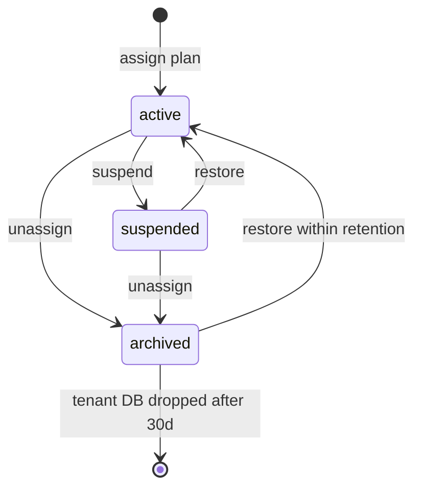

# Single Solution Portal

Company portal for **Single Solution** to manage merchants and register SaaS products. One application, one login page: platform admins and merchants sign in here.

**This repo hosts the platform portal and the ecommerce chatbot product as two separate Vercel deployables in one monorepo.** Other future products remain separate apps/repos and integrate via product access tokens and internal verification endpoints.

## Documentation

- [Setup](docs/setup.md)
- [Deploy](docs/deploy.md)
- [Go-live runbook](docs/go-live.md)
- [Architecture](docs/architecture.md)
- [Engineering handbook](docs/engineering-handbook.md)
- [API overview](docs/api.md) (OpenAPI: [`contracts/openapi.yaml`](contracts/openapi.yaml))
- [Rules alignment audit](docs/rules-audit.md)

## Surfaces

Routes are unified and role-aware (no separate `/admin` or `/merchant` prefixes); what each role sees is restricted by permission.

| Route | Who | Purpose |
| --- | --- | --- |
| `/login` | Everyone | Shared sign-in |
| `/accept-invite` | Invited users | Set a password from a one-time invite link |
| `/recover-account` | Invited recovery | Set a new password from a one-time recovery link |
| `/` | All signed-in users | Redirects to the canonical role-aware dashboard |
| `/dashboard` | All signed-in users | Admin operational KPIs and attention items; merchant spend, sites, products, and usage |
| `/merchants` | Platform admin | Searchable merchant grid, onboarding, invite state, site/subscription counts, and MRR |
| `/merchants/{id}` | Platform admin | Merchant overview, sites/products, billing, team, offboarding, and activity |
| `/products` | Platform admin | Register products, define plans, scopes, and quotas; activate/deactivate |
| `/products/{slug}` | Platform admin | Product plans, configuration, subscribers, connection diagnostics, and advanced-dashboard SSO |
| `/sites` | All signed-in users | Shared searchable site directory; admins see merchant identity and all sites |
| `/sites/{siteId}` | All signed-in users | Canonical site control plane: products, keys, usage, billing, config status, domain verification, and conversations |
| `/sites/{siteId}/products/{slug}/conversations` | Authorized users | Site-scoped product conversation inbox |
| `/settings` | All signed-in users | Account settings: update name, change password, sign out current or all sessions |

## Domain

1. **Users** - platform admins and merchant accounts (email + password, session cookie). Status: `invited` (no password yet) or `active`. `sessionVersion` bumps invalidate all outstanding sessions.
2. **Merchants** - tenants; slug is globally unique. Each merchant can be assigned multiple products. Lifecycle: `active` -> `offboarding` -> deleted after retention. There is no organization concept.
3. **Sites** - deployments under a merchant (name + optional `primaryDomain`); slug unique within the merchant. Every merchant gets a "Default site" at onboarding. Domain verification checks DNS reachability of `primaryDomain`.
4. **Products** - catalog of isolated SaaS products, registered and managed by platform admins. Each product defines its own plans, access scopes, and per-metric quotas. Products remain fully isolated (own repo path, own runtime, per-subscription tenant databases); the platform only manages access, usage, and billing.
5. **Subscriptions** - one per (merchant + product + site): the selected plan, lifecycle status, optional scope/quota overrides, and `dataDbName` (dedicated tenant database). A site with no subscription for a product sees it as `unassigned`.
6. **Product access tokens** - issued per (site + product); shown once at creation. A token both proves entitlement and is the runtime credential the product application verifies. Token scopes are captured from the plan at issue time.
7. **Product usage** - monthly aggregate per (site + product + metric). Products report usage events to the platform with an **idempotency key**; the platform meters against plan quotas and shows the estimated monthly cost.
8. **Audit logs** - merchant-scoped actions (product plan changes, token issue/revoke/rotate, site changes, offboarding, SSO, config publish).

## Subscription lifecycle

Statuses: `active`, `suspended`, `archived`.

| From | To | Who | Side effects |
| --- | --- | --- | --- |
| `active` | `suspended` | Platform admin | Tokens remain but verification fails for suspended subscriptions |
| `active` | `archived` | Platform admin (unassign) | Active tokens revoked; `deletionEligibleAt` = now + 30 days |
| `suspended` | `active` | Platform admin (restore) | Requires valid `planCode`; tenant DB ensured |
| `suspended` | `archived` | Platform admin (unassign) | Active tokens revoked; `deletionEligibleAt` = now + 30 days |
| `archived` | `active` | Platform admin (restore) | Clears `deletionEligibleAt`; requires valid plan |

**Rule:** `active` without `planCode` is treated as legacy drift and reconciled to `archived`.

**Rule:** Assigning a removed plan code archives the subscription during reconciliation.

**Retention:** Archived subscriptions keep tenant data for **30 days** (`deletionEligibleAt`). After retention expires, the daily tenant-database cron drops the tenant DB and clears `dataDbName` on the subscription. Embedded legacy message arrays are never deleted by the message migration script.



## Merchant teams

| Role | Invite users | Change roles | View keys/usage | Reply in inbox | Edit config |
| --- | --- | --- | --- | --- | --- |
| Owner | Yes | Yes (not owner) | Yes | Yes | No |
| Admin | Yes | Yes (member only) | Yes | Yes | No |
| Member | No | No | Yes | Read-only | No |

- **Invite:** platform admin or merchant owner/admin invites by email; issues 7-day one-time token; email queued in `EmailOutbox` (idempotent per user+token hash).
- **Accept:** `/accept-invite?token=...` sets password, activates account, bumps `sessionVersion`, clears token.
- **Recovery:** platform admin triggers password recovery for merchant owner; 24-hour one-time token; email queued with idempotency key `recovery:{userId}:{tokenHash}`.
- **Rule:** Owner email is globally unique (409 on clash). Invited users cannot sign in until acceptance.

## Merchant offboarding

Platform admin only, from merchant detail.

1. **Start offboarding** - suspends all active subscriptions, revokes all active tokens, sets merchant `lifecycleStatus: offboarding`, `deletionEligibleAt` = now + **30 days**.
2. **Export** - queues `ExportOutbox` job (idempotent key per request); status visible on offboarding panel.
3. **Restore** - while within retention, reverses offboarding: merchant back to `active`, clears `deletionEligibleAt` (subscriptions stay suspended until manually restored).
4. **Delete** - after retention elapses, hard-deletes merchant data when no blocking subscriptions/tokens remain.

## Products (access, usage, billing)

Products are isolated: they live in separate deployables with per-subscription tenant databases and are never imported by the portal. The portal is the control plane.

**Roles**

| Action | Platform admin | Merchant owner/admin | Merchant member |
| --- | --- | --- | --- |
| Onboard merchants | Yes | No | No |
| Create or edit sites | Yes | No | No |
| Register product / edit plans / activate | Yes | No | No |
| Assign or change a product's plan on a site | Yes | No | No |
| Suspend / resume / unassign / restore | Yes | No | No |
| Issue / revoke / rotate access tokens | Yes | No | No |
| View and copy access keys | Yes | Yes | Yes |
| View usage and billing estimate | Yes | Yes | Yes |
| Read product conversations (agent inbox) | Yes | Yes | Yes |
| Reply to product conversations | Yes | Yes | No |
| Edit / publish product config | Yes | No | No |
| Enforce a default across all sites | Yes | No | No |
| Preview draft config / run test harness | Yes | No | No |
| Open product's advanced dashboard (SSO) | Yes | No | No |
| Verify site primary domain | Yes | No | No |
| Merchant team / recovery / offboarding | Yes | No | No |

**Rules**

- A plan must be assigned (`planCode` set) and the subscription `active` before tokens can be issued.
- Suspending a subscription or revoking a token stops the product from verifying immediately.
- Token scopes are frozen from the plan at issue time; changing the plan later does not rewrite existing tokens.
- **Every token carries an embed-domain allowlist.** A token with **no** domains is blocked from every origin (secure by default); domains support exact hosts (`shop.com`) and wildcards (`*.shop.com`). Domains are set at issue time; reissue or rotate to change them.
- **Optional expiry:** `expiresInDays` (1-3650) at issue or rotation sets `expiresAt`; expired tokens fail verification.
- **Rotation:** `rotate` issues a new token, optionally revokes the previous (default true), copies domain allowlist unless overridden.
- Usage is aggregated per calendar month (`YYYY-MM`, UTC). A metric is over quota when `used > limit`; metrics with no plan quota are always within quota.
- **Usage idempotency:** `POST /api/internal/product-usage` requires `idempotencyKey` (8-120 chars). Duplicate keys return the original result without double-counting. Over-quota attempts are recorded as denied events.
- Estimated cost is the plan's `priceMonthly` in the plan currency (metering-only; no payment provider yet).

## Agent inbox

- Admins and merchant owners/admins read and reply at `/sites/{siteId}/products/{slug}/conversations`; merchant members are read-only.
- The portal calls the product's internal conversation endpoints over HTTP using `INTERNAL_API_SECRET`, addressing the product at its catalog `baseUrl`. Tenant binding (`dataDbName`) is resolved by the platform and passed to the product bridge.
- Replies post as an `agent` message, pause the product's assistant, and increment the visitor's unread counter.

## Product configuration

Each product declares a **config schema** (sections of typed fields), pulled into the catalog when an admin runs "Test connection". Config exists at two scopes, both with `draft` and `published` copies:

- **Product defaults** (one per product): baseline values every site inherits.
- **Per-site overrides** (per subscription): only stores fields actually overridden.

**Field types:** `string`, `text`, `number`, `boolean`, `select`, `color`, `url`, `secret`, `list`.

**Draft -> publish:** admins edit draft; the product reads **published** only. "Publish" copies draft to published, bumps `version`, writes audit log.

**Inheritance & precedence:** enforced product default > per-site value > product default > schema default.

**Enforce:** admin can lock a product default so no site can override it.

**Delivery:** effective published values ride in the token verification response (pull-based, within verification cache TTL).

**Secrets at rest:** `secret` fields are encrypted with AES-256-GCM envelopes (`CONFIG_ENCRYPTION_KEYS`, `CONFIG_ENCRYPTION_ACTIVE_KEY_ID`). Write-only in the portal UI (masked as `{ set }`). Decryption requires matching AAD context (scope, product slug, site, field key). Re-encrypt with `npm run migrate:config-secrets` when rotating keys.

**Rule:** In production, config encryption env vars are required before saving or delivering secrets. Missing encryption returns `503 CONFIG_ENCRYPTION_UNAVAILABLE`.

## Advanced product dashboard (one-time SSO)

Deep product operations run inside the product, reached by admin-only SSO from the product page:

1. Portal mints a **one-time exchange code** (~2 min TTL), stored hashed in `SsoExchange`.
2. Browser opens `{{baseUrl}}/admin/sso?code=...&siteId=...`.
3. Product exchanges code server-to-server with platform (`POST /api/internal/sso/exchanges`), receives signed admin session claims.
4. Product sets ~8h httpOnly admin cookie signed with `SSO_SIGNING_SECRET` (must match on both deployables in production).
5. Code is consumed atomically; replay fails.

**Rule:** Only platform admins may mint dashboard SSO. Merchant users cannot open the product admin.

**Site switcher:** product lists subscribed sites via `GET /api/internal/product-sites` and scopes every view to selected `siteId`.

## Embedding the widget (merchant sites)

Merchants add one line to their site:

```html
<script
  src="https://YOUR-PRODUCT-HOST/embed.js"
  data-product-token="pk_live_xxx"
  async
></script>
```

- `embed.js` injects a floating iframe (`/embed?token=...`) hosted by the product.
- **Framing is gated per token:** embedding host must be in the token's allowed domains. Fails closed in production when host is missing or not allowed.
- **Embed visitor sessions:** after token verification, the product mints a 30-minute bearer session (`EMBED_SIGNING_SECRET`) binding `visitorId`, `siteId`, `productSlug`, `originHost`, and product token. Widget API calls present this bearer instead of re-sending the publishable token.
- React direct-mount uses the same domain allowlist via `Origin`/CORS.

## Message storage (dual-read migration)

Chatbot conversations historically embedded messages in the `Conversation` document. Migration backfills a separate `Message` collection per tenant:

- **Read path:** if `messagesMigratedAt` is set, messages load from `Message`; otherwise from embedded array (dual-read).
- **Write path:** new messages write to `Message` when migrated; otherwise embedded.
- **Migration script:** `npm run migrate:conversation-messages` (dry-run default). `--apply` upserts `Message` rows and sets `messagesMigratedAt` only; **never clears embedded arrays** in the first pass.

## Outbox pattern

Reliable async side effects use Mongo-backed outboxes processed by Vercel crons (Bearer `CRON_SECRET`):

| Outbox | Deployable | Cron | Purpose |
| --- | --- | --- | --- |
| `EmailOutbox` | Platform | every 5 min | Invite and recovery email delivery |
| `ExportOutbox` | Platform | (on-demand queue) | Merchant data export jobs |
| `UsageOutbox` | Product (per tenant) | every 5 min | Mirror usage to platform with idempotency |
| `WebhookOutbox` | Product (per tenant) | every 5 min | Signed webhook delivery retries |

Outbox processors use bounded batches, lease-based claiming, exponential backoff, and sanitized error messages (no credentials in logs).

## Product integration (internal endpoints)

Product applications authenticate server-to-server with `Authorization: Bearer {INTERNAL_API_SECRET}`.

| Endpoint | Purpose |
| --- | --- |
| `POST /api/internal/product-tokens/verifications` | Verify token; returns merchant, site, plan, scopes, quotas, usage, `withinQuota`, published `config`, `dataDbName` |
| `POST /api/internal/product-usage` | Report usage with `{ token, metric, quantity, idempotencyKey }` |
| `POST /api/internal/product-config` | Resolve draft config for preview token |
| `GET /api/internal/product-sites?slug=` | List sites for product dashboard site switcher |
| `POST /api/internal/sso/exchanges` | Exchange one-time SSO code for admin session claims |

Portal -> product (same secret, product `baseUrl`): conversations, config-schema sync, test harness.

## Tenant binding authority

The **platform** is authoritative for `Subscription.dataDbName`. Products must not invent tenant database names. Resolution flow:

1. Token verification or internal bridge call hits platform/subscription record.
2. `resolveTenantBinding` ensures DB exists (`ensureSubscriptionDataDb`) and returns `dataDbName`.
3. Product binds Mongoose models to that database via `getTenantModels(dataDbName)`.

## Redis and rate limits

Production requires **Upstash Redis** (`UPSTASH_REDIS_REST_URL`, `UPSTASH_REDIS_REST_TOKEN`) on both deployables for distributed rate limiting and entitlement caching. Development falls back to in-process counters.

## Observability

- Structured JSON logs with `X-Request-ID` correlation on every API response.
- `LOG_LEVEL` controls verbosity; `ERROR_TRACKING_DSN` optional (noop when unset).
- `GET /api/health` on each deployable: Mongo ping, Redis ping; product also checks platform reachability.

## Bootstrap

On first API request, if the users collection is empty and `BOOTSTRAP_ADMIN_EMAIL` + `BOOTSTRAP_ADMIN_PASSWORD` are set, a platform admin user is created.

## Migrations and reconciliation

All scripts are **dry-run by default**; pass `--apply` to write. Each reports verification counts and uses bounded batches.

| Script | npm command | Purpose |
| --- | --- | --- |
| `migrate-to-merchants-sites.mjs` | `migrate:merchants` | Legacy organization -> merchant+site model |
| `migrate-config-secrets.mjs` | `migrate:config-secrets` | Encrypt plaintext config secrets |
| `migrate-conversation-messages.mjs` | `migrate:conversation-messages` | Backfill Message collection (preserves embedded) |
| `reconcile-subscriptions.mjs` | `reconcile:subscriptions` | Repair subscription/token drift |

**Recommended order:** merchants (if legacy) -> config-secrets -> conversation-messages -> reconcile-subscriptions.

## Limits

| Item | Limit |
| --- | --- |
| Merchant slug | 2-80 chars, lowercase kebab-case, globally unique |
| Site slug | 2-80 chars, unique per merchant |
| Session | 7 days, httpOnly cookie |
| Product / plan / scope code | 2-80 chars, lowercase kebab-case |
| Plan scopes / quotas | up to 50 scopes, 30 quotas per plan |
| Product access token name | 1-80 chars |
| Token allowed domains | up to 20 entries |
| Token expiry | 1-3650 days optional |
| Usage report quantity | 1 to 1,000,000 per event |
| Usage idempotency key | 8-120 chars |
| Config fields per save | 120 max |
| Encryption keys in rotation set | 5 max |
| Retention (archived subscription / offboarding) | 30 days |
| Embed visitor session TTL | 30 minutes |
| SSO exchange code TTL | ~2 minutes |
| Admin SSO cookie TTL | ~8 hours |
| Preview token TTL | 15 minutes |
