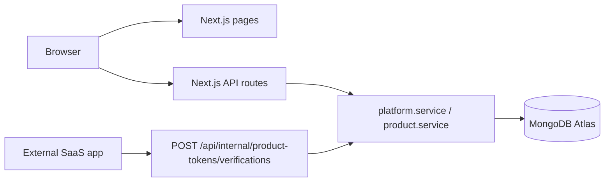
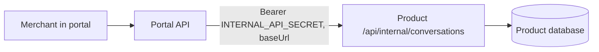
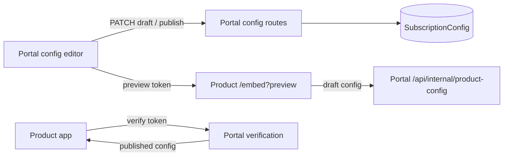
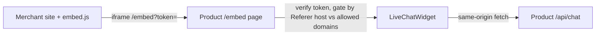

# Architecture

Single deployable: **Next.js App Router** portal for Single Solution operations.

## What lives here

- Merchant management (merchants, sites)
- Product registry metadata and per-site subscriptions
- Platform admin view of all merchants
- Internal API for external SaaS apps to verify product access tokens and report usage

## What does not live here

- SaaS product UIs or business logic
- Product-specific databases (those apps use their own storage)
- Multiple deployables or monorepo apps

## Stack

| Layer     | Choice                                       |
| --------- | -------------------------------------------- |
| Framework | Next.js 15 (App Router)                      |
| UI        | React 19, client components for dashboards   |
| API       | Next.js Route Handlers (`app/api/[...path]`) |
| Database  | MongoDB Atlas via Mongoose                   |
| Auth      | Email/password, JWT in httpOnly cookie       |

## Folder layout

```
app/
  login/              Shared sign-in + public demo entry
  (portal)/
    dashboard/        Role-aware operational overview
    merchants/        Admin merchant directory and details
    sites/            Shared, scope-filtered site directory and details
    products/         Admin product catalog and details
    settings/         Shared account settings
  api/[...path]/      REST API (auth, merchants, sites, products, audit)
components/           Shared client components (AuthProvider, products/*)
lib/
  db/                 Mongoose models + connection
  services/           Business logic
  api/                Router, auth helpers, browser client
scripts/              One-off migrations
docs/
```

## Request flow



## Auth model

- **Platform admin**: `User.isPlatformAdmin === true`
- **Merchant**: user with `MerchantMembership`
- Same `/login` page; `/` redirects signed-in users to `/dashboard`, which renders admin or merchant content based on role
- Merchants and sites use shared canonical routes. Authorization is encoded in API query scope rather than duplicated admin/merchant route trees.
- Only platform admins mutate merchants, sites, catalog products, plans, subscriptions, tokens, and configuration. Merchants see their scoped sites, existing key metadata, usage, billing, and allowed conversations.

## Data model

There is no organization concept. A **merchant** is a tenant; it owns **sites**; each (merchant + product + site) is a **subscription** with its own plan, tokens, usage, and billing.

| Collection             | Purpose                                                                                                                                                |
| ---------------------- | ------------------------------------------------------------------------------------------------------------------------------------------------------ |
| `Merchant`             | Tenant: globally unique slug                                                                                                                           |
| `MerchantMembership`   | Links a user to a merchant with a role (`owner`/`admin`/`member`)                                                                                      |
| `Site`                 | Deployment under a merchant: name + `primaryDomain`; slug unique per merchant                                                                          |
| `Product`              | Catalog: slug, status, `baseUrl`, `availableScopes`, embedded `plans[]`                                                                                |
| `Subscription`         | Per (merchant + product + site): `planCode`, `status`, optional scope/quota overrides, and `dataDbName` (the tenant's dedicated product data database) |
| `ProductAccessToken`   | Hashed token per (site + product) with frozen scopes and domain allowlist; shown once                                                                  |
| `ProductUsage`         | Monthly aggregate per (site + product + metric)                                                                                                        |
| `SubscriptionConfig`   | Per (site + product) `draft`/`published` override values + `lockedFields`; unique on `siteId+productSlug`                                              |
| `ProductDefaultConfig` | Per product `draft`/`published` default values + `lockedFields` (enforced across sites); unique on `productSlug`                                       |
| `AuditLog`             | Merchant-scoped actions                                                                                                                                |

`Product` also carries a `configSchema` (sections of typed fields the portal renders generically) and `testActions` (dry-run harness actions), both synced from the product via `GET /api/internal/config-schema`.

### Per-tenant product databases

A product has two kinds of database:

- **Permanent (shared) DB** - the platform control plane (`single-solution-saas`) and the product's own base connection. Holds the registry, admin config, and the authoritative billing usage counters.
- **Tenant data DB** - one **dedicated database per subscription** (merchant + site + product), on the same cluster, named dynamically (e.g. `t-northwin-storef-ecommerc-<id>`, capped at 38 bytes for Atlas). It is provisioned when the admin assigns the product to a site, its name is stored on the `Subscription` (`dataDbName`), and it is the only place a tenant's runtime data lives - so tenants are physically isolated, not just filtered by `siteId`.

The product resolves its tenant DB at request time from the name the platform delivers: in the token-verification response for widget traffic, and passed explicitly on internal (agent inbox) and admin-dashboard calls. All product models bind to that tenant connection (`lib/db/tenant.ts`).

Inside each **tenant data DB** the product owns: `Conversation` (chat threads + messages), `SiteSettings` (per-site advanced automation + webhook config), `WebhookDelivery` (outbound delivery log), and `Usage` (a local mirror of the metered counter; the platform's `ProductUsage` stays authoritative for billing).

## Multi-tenancy

| Scope                        | Key                                |
| ---------------------------- | ---------------------------------- |
| Merchant                     | `merchantId`                       |
| Site                         | `siteId` (belongs to one merchant) |
| Subscription / token / usage | `siteId` + `productSlug`           |

Platform admins bypass merchant membership checks for support operations.

## External product integration

Products are isolated apps (separate repo, separate database). The portal is the control plane for access, usage, and billing only.

**Product access tokens** (per site+product; entitlement + runtime credential):

1. Platform admin registers the product with plans, scopes, and quotas at `/products` (persisted in the `Product` collection).
2. A platform admin assigns a plan to a product on a site, creating a `Subscription` and provisioning its tenant database.
3. The platform admin issues a domain-bound product access token for that site+product; scopes are frozen from the plan. Merchants can view existing key metadata but cannot issue or revoke keys.
4. Product app calls `POST /api/internal/product-tokens/verifications` (Bearer `INTERNAL_API_SECRET`) to resolve merchant, site, plan, scopes, quotas, current usage, and `withinQuota`.
5. Product app reports usage via `POST /api/internal/product-usage`, incrementing the current-month `ProductUsage` aggregate.

**Agent inbox** (portal -> product, reverse direction):

1. Merchant opens the inbox for a subscribed product on a site.
2. Portal resolves the product's `baseUrl` from the `Product` catalog and calls the product's own internal endpoints with Bearer `INTERNAL_API_SECRET`: `GET/POST /api/internal/conversations[...]`, scoped by `siteId`.
3. The portal holds no product data; the product stays the source of truth. Replies post as an `agent` message and pause the product's assistant.



## Product configuration control plane

This is a **hybrid** model. The portal owns admin-only configuration (`lib/services/productConfig.service.ts`, `components/products/ProductConfigEditor.tsx`); deep operations live in the product's own admin dashboard reached by SSO. Merchants are read-only (stats, keys, billing).

**Store & schema.** Products declare a `configSchema` (synced via `GET /api/internal/config-schema`). Config lives at two scopes: `ProductDefaultConfig` (one per product) and `SubscriptionConfig` (per site + product), each with `draft`/`published` copies and `lockedFields`. Validation is dynamic (against the product's schema).

**Editing (admin only).** Product defaults are edited at `GET/PATCH /api/admin/products/{slug}/config` + `POST .../config/publish`; per-site overrides at `GET/PATCH /api/sites/{siteId}/products/{slug}/config` + publish. The same `ProductConfigEditor` renders both via a `scope` prop. A site stores only overridden fields; `clearKeys` resets a field to inherit. `saveProductConfigDraft` skips fields enforced by the product default. `secret` fields are write-only (blank keeps stored value; masked as `{ set }`).

**Resolution (`resolveEffectiveConfig`).** Effective value per field: enforced default > per-site value > product default > schema default.

**Delivery (pull-based).** Effective published values are folded into the token verification response (`verifyProductToken`), so the product receives config on the same server-to-server call it already makes; no push. The chatbot layers this over `CHAT_SETTINGS_DEFAULTS` in `getChatSettings(config)`, then merges per-site `SiteSettings` (advanced automation) before driving `generateAssistantReplies`.

**Advanced dashboard (SSO).** Admins open `POST /api/admin/products/{slug}/dashboard-session` -> a ~2-min HS256 token -> browser redirect to the product's `GET /admin/sso`, which mints an ~8h httpOnly admin cookie. The product dashboard (overview, moderation, assistant tuning, webhook diagnostics, raw data) is guarded by that cookie and uses `GET /api/internal/product-sites` for its site switcher. Webhook dispatch (signed HMAC) and its delivery log are product-owned.

**Preview.** `POST /api/sites/{siteId}/products/{slug}/preview` mints a short-lived JWT (signed with `INTERNAL_API_SECRET`, 15 min) and returns `{{baseUrl}}/embed?preview={{token}}`. The product's `/embed` page calls the platform's `POST /api/internal/product-config` with that token to fetch **draft** config and renders an appearance-only preview (no persistence). The portal shows it in an iframe.

**Harness.** `POST /api/sites/{siteId}/products/{slug}/test` proxies a declared `testAction` to the product's `POST /api/internal/test` with the site's draft config; the product runs a dry-run (e.g. the chatbot's `assistant-reply`) and returns a result. Nothing is stored.

**Connections/integrations** are `configSchema` sections of `kind: connection`/`integration` using `url`/`secret` fields; secrets are write-only in the API and only reach the product over the verification/config channel. Encryption-at-rest for secrets is a follow-up.



## Merchant onboarding

No public sign-up. `POST /api/admin/merchants` (platform admin only) creates an invited owner `User` (no password, `status: "invited"`) + `Merchant` + owner `MerchantMembership` + a **Default site** in one flow (`createMerchant`), then emails the owner a one-time invite link and returns the token. The admin never sets a password. If SMTP or `APP_URL` is not configured, the email is skipped and the admin relays the `/accept-invite?token=...` link manually. While the owner is still `invited`, `POST /api/admin/merchants/{id}/invitation` reissues the token and re-sends it.

Invite tokens are SHA-256 hashed at rest with a 7-day expiry. `GET /api/auth/invitations/{token}` (public, rate-limited) resolves the invitee for display; `POST /api/auth/invitations/acceptance` (public, rate-limited) sets the chosen password, flips `status` to `active`, bumps `sessionVersion`, clears the token, and issues the session cookie. Invited users are rejected by `authenticateUser` until acceptance. The merchant slug is auto-generated from the name and de-duplicated server-side (numeric suffix on clash); site slugs are auto-generated per merchant; owner email is unique (409 on clash).

## Portal UI system

- The portal uses a floating, wide top-navigation shell with no permanent sidebar. Admin navigation exposes Dashboard, Merchants, Sites, and Products as equal entries; merchant navigation exposes Dashboard and Sites.
- Search/filter/view/tab/pagination state uses URL query parameters. `Cmd/Ctrl+K` opens global navigation search by merchant, owner email, site/domain, or product.
- Shared primitives under `components/ui` provide semantic controls, modal focus trapping/restoration, keyboard tabs, dropdown menus, resource cards, data tables, progress semantics, and loading/error/empty page states.
- Quick edits and guided workflows use center modals. Destructive lifecycle changes explain runtime and token consequences before confirmation.
- The standalone chatbot admin applies the same light-indigo semantic language, accessible controls, reduced-motion handling, responsive states, and page-state patterns while retaining product-specific navigation.

## Public demo sandbox

The chatbot exposes `/public-demo` for a dedicated restricted demo subscription. `scripts/seed-demo.mjs` issues the publishable demo token with a product-host/localhost domain allowlist and marks its token metadata as the demo credential. The chatbot server receives that token through `PUBLIC_DEMO_PRODUCT_TOKEN`; the platform login reaches it through `ECOMMERCE_CHATBOT_PUBLIC_URL`.

- Public demo requests use stricter rate limits and cannot enter internal or product-admin APIs.
- The page falls back to a non-interactive sample when no demo token is configured.
- `/demo?token=...` remains the explicit token-testing route for operators; `/public-demo` never accepts privileged platform credentials.
- Guest demo and admin tenant preview are labeled separately: guest sandbox uses the restricted tenant, while **Test site** mints a short-lived preview for the selected real subscription.

## Widget embedding



- `embed.js` (static, in `public/`) injects a floating iframe and resizes it via `postMessage` from the widget (closed bubble vs open panel).
- `/embed` verifies the token server-side and blocks framing when the iframe `Referer` host is not in the token's allowed domains (fails closed in production).
- Widget API calls are same-origin to the product; `resolveChatCaller` allows same-origin and applies the domain allowlist only to cross-origin (direct-mount) callers.

## Embeddable widget security

The chatbot widget is embedded in merchant sites, so its product token (`pk_live_...`) is a **publishable key** visible in page source. Defense in depth on the product's widget endpoints:

| Control           | Mechanism                                                                                                                                                                                           |
| ----------------- | --------------------------------------------------------------------------------------------------------------------------------------------------------------------------------------------------- |
| Domain binding    | Each token has an allowlist; requests are checked by `Origin` (fallback `Referer`) host. No domains configured = blocked (secure by default); supports `*.example.com`.                             |
| CORS              | Widget endpoints reflect the caller origin for cross-origin embeds; the domain allowlist (not CORS) is the security boundary.                                                                       |
| Per-IP rate limit | All widget requests capped per IP; conversation creation and message sending have tighter per-IP caps on top of the per-visitor cap (a self-asserted `visitorId` cannot be rotated to bypass them). |
| Quota             | Server-enforced plan quota blocks messages once exhausted, capping the merchant's cost from a leaked token.                                                                                         |
| Tenant isolation  | Each subscription's runtime data lives in its own database (`Subscription.dataDbName`); within it, reads/writes are scoped by `siteId` + `visitorId`. No cross-visitor or cross-tenant access.      |
| Internal secret   | `INTERNAL_API_SECRET` compared in constant time on both platform and product internal endpoints.                                                                                                    |

## Migration

`scripts/migrate-to-merchants-sites.mjs` (run via `npm run migrate:merchants`) migrates legacy organization-model data: it renames collections (`organizations` -> `merchants`, `organizationmemberships` -> `merchantmemberships`, `organizationproducts` -> `subscriptions`), renames `organizationId` -> `merchantId`, creates one default site per merchant, backfills `siteId` on subscriptions/tokens/usage, and remaps chatbot conversations from `organizationId` to `siteId`. Idempotent.
