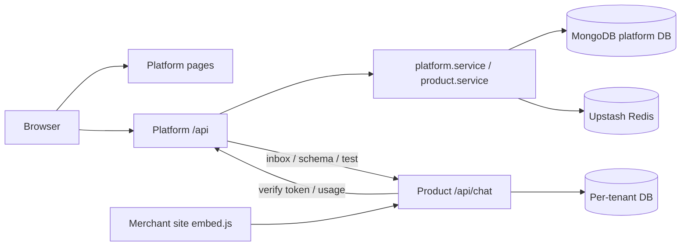
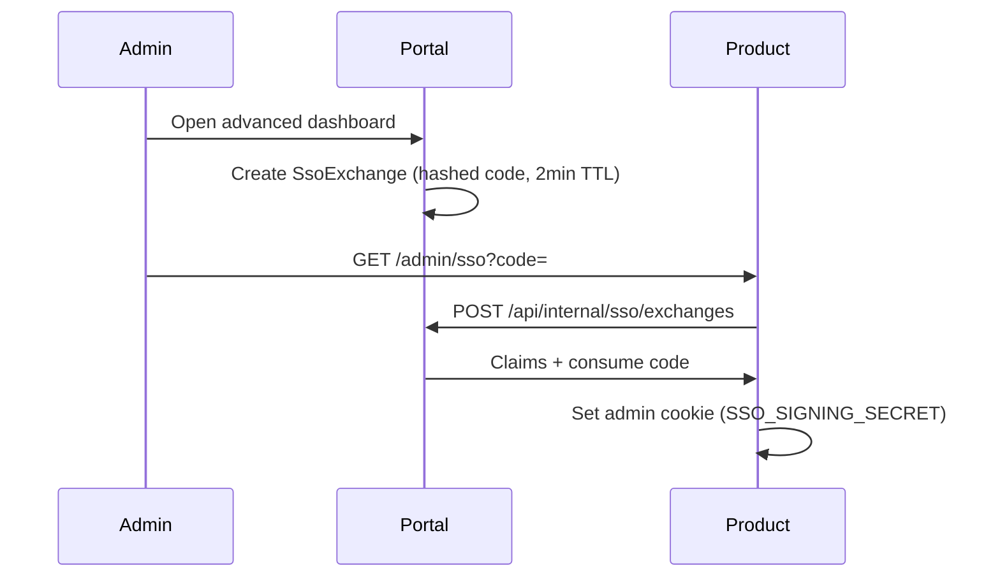

# Architecture

Two deployable **Next.js App Router** applications in one repository:

| Deployable | Root directory | Purpose |
| --- | --- | --- |
| Platform portal | `.` | Merchant/site/product control plane, billing, config, SSO minting |
| Ecommerce chatbot | `products/ecommerceChatBot` | Widget, embed, product admin, tenant runtime data |

Each is a separate Vercel project with its own `vercel.json` cron schedule.

## What lives in the platform

- Merchant management (merchants, sites, teams, offboarding)
- Product registry metadata and per-site subscriptions
- Platform admin view of all merchants
- Internal API for products to verify tokens, report usage, exchange SSO codes
- Config editor, preview tokens, agent inbox bridge
- Email and export outboxes

## What lives in the product

- Widget (`/embed`, `embed.js`, visitor sessions)
- Chat API (`/api/chat/*`)
- Product admin dashboard (`/admin/*`) after SSO exchange
- Per-tenant databases: conversations, messages, site settings, webhooks, usage mirrors, usage/webhook outboxes
- Demo sandbox and retention cleanup

## Stack

| Layer | Choice |
| --- | --- |
| Framework | Next.js 15 for both deployables |
| UI | React 19, client components for dashboards |
| API | Next.js Route Handlers |
| Database | MongoDB Atlas via Mongoose |
| Cache / rate limits | Upstash Redis (required in production) |
| Auth | Email/password JWT cookie (portal); HS256 SSO/embed sessions (product) |
| Observability | Structured logs, optional error-tracking DSN |

## Folder layout

```
app/                          Platform pages and API
components/                   Portal UI
lib/
  db/                         Platform Mongoose models
  services/                   Business logic
  api/                        Router, auth, cron handlers
  redis/                      Upstash client and rate limits
  security/                   Config encryption, auth secrets, outbound URL policy
  outbox/                     Shared outbox utilities
products/ecommerceChatBot/    Product app (mirror structure)
contracts/openapi.yaml        Combined API contract
scripts/                      Idempotent migrations (dry-run default)
docs/                         Operational documentation
```

## Request flow



## Auth model

- **Platform admin**: `User.isPlatformAdmin === true`
- **Merchant**: user with `MerchantMembership` (`owner` / `admin` / `member`)
- Same `/login` page; role-aware dashboard and API scope
- Only platform admins mutate merchants, sites, catalog, subscriptions, tokens, config, offboarding
- Merchants see scoped sites, key metadata, usage, billing, allowed conversations

## Data model (platform DB)

| Collection | Purpose |
| --- | --- |
| `merchants` | Tenant; `lifecycleStatus`, `deletionEligibleAt` for offboarding |
| `merchantmemberships` | User-to-merchant role |
| `sites` | Deployment under merchant; `primaryDomain`, domain verification timestamps |
| `products` | Catalog: slug, `baseUrl`, plans, `configSchema`, `testActions` |
| `subscriptions` | Per (merchant + product + site): `planCode`, status, `dataDbName`, `lifecycleHistory`, `deletionEligibleAt` |
| `productaccesstokens` | Hashed token, scopes, domain allowlist, optional `expiresAt` |
| `productusages` | Monthly aggregate per (site + product + metric) |
| `productusageevents` | Idempotent usage ledger (`idempotencyKey` unique) |
| `subscriptionconfigs` / `productdefaultconfigs` | Draft/published config with encrypted secrets |
| `ssoexchanges` | One-time hashed SSO codes |
| `emailoutboxes` / `exportoutboxes` | Platform async jobs |
| `auditlogs` | Merchant-scoped actions |

## Per-tenant product databases

**Authority:** the platform owns `Subscription.dataDbName`. Products resolve it via `resolveTenantBinding` / token verification — never self-assign DB names.

- Provisioned on product assignment (`ensureSubscriptionDataDb`)
- Named dynamically (max 38 chars for Atlas), stored on subscription
- Dropped by platform cron after archived subscription passes 30-day retention

Inside each **tenant data DB**:

| Collection | Purpose |
| --- | --- |
| `conversations` | Chat threads; may still hold embedded `messages[]` during migration |
| `messages` | Split storage after `messagesMigratedAt` backfill |
| `sitesettings` | Advanced automation + webhook config |
| `webhookdeliveries` | Delivery audit log |
| `webhookoutboxes` / `usageoutboxes` | Async delivery to merchants / platform |
| `usages` | Local usage mirror (platform `productusages` authoritative for billing) |

`getTenantModels(dataDbName)` in `products/ecommerceChatBot/lib/db/tenant.ts` binds models per request.

## Message dual migration

1. Legacy: messages embedded on `Conversation`.
2. Migration script inserts parallel `Message` documents with `clientMessageId: legacy:{conversationId}:{messageId}`.
3. Sets `messagesMigratedAt` on conversation; **does not delete** embedded arrays.
4. Runtime dual-read in `messageStorage.ts` until all conversations migrated.

## Redis

Both deployables use Upstash REST for:

- Distributed API rate limits (`lib/redis/rateLimit.ts`)
- Product entitlement / verification cache (`products/ecommerceChatBot/lib/redis/entitlementCache.ts`)

Production boot fails without Redis env vars.

## Outboxes and crons

| Job | Deployable | Schedule | Handler |
| --- | --- | --- | --- |
| Email outbox | Platform | `*/5 * * * *` | `app/api/crons/email-outbox` |
| Subscription reconciliation | Platform | `0 3 * * *` | `app/api/crons/subscription-reconciliations` |
| Tenant DB cleanup | Platform | `30 4 * * *` | `app/api/crons/tenant-databases` |
| Webhook outbox | Product | `*/5 * * * *` | `products/ecommerceChatBot/app/api/crons/webhook-outbox` |
| Usage outbox | Product | `*/5 * * * *` | `products/ecommerceChatBot/app/api/crons/usage-outbox` |
| Demo cleanup | Product | `0 5 * * *` | `products/ecommerceChatBot/app/api/crons/demo-cleanups` |

Cron auth: `Authorization: Bearer {CRON_SECRET}` via `lib/api/cronAuth.ts`.

## SSO exchange



## Config encryption

- AES-256-GCM envelopes in config documents (`lib/security/configEncryption.ts`)
- AAD binds scope, product slug, site id, field key
- Up to 5 keys in `CONFIG_ENCRYPTION_KEYS`; `CONFIG_ENCRYPTION_ACTIVE_KEY_ID` selects writer
- Portal decrypts for verification delivery; products receive plaintext only over S2S channel

## Observability

- `lib/logging/logger.ts` — structured JSON, request context, redaction
- `lib/observability/errorTracking.ts` — optional DSN adapter
- Health routes aggregate Mongo, Redis, and (product) platform checks

## External product integration

See README **Product integration** and `docs/api.md`. Tenant binding flows through verification and `productBridge.ts`.

## Widget security

| Control | Mechanism |
| --- | --- |
| Domain binding | Token allowlist on Origin/Referer host |
| Embed session | Short-lived bearer signed with `EMBED_SIGNING_SECRET` |
| Rate limits | Redis-backed per-IP and per-visitor caps |
| Quota | Platform-enforced via usage API + idempotency |
| Tenant isolation | Physical DB per subscription |

## Migrations

All under `scripts/`, dry-run by default, `--apply` for writes. See `docs/setup.md` for commands and order.
